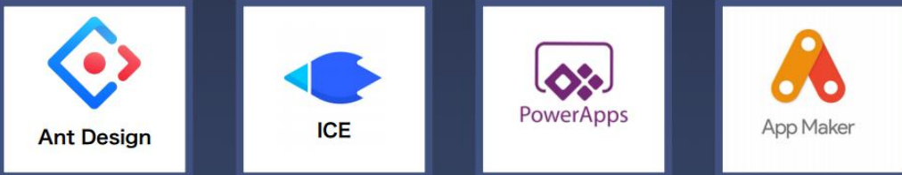

# Low-code Development Platform
## What?
### 1. Concept
[Low-code Development Platform](https://en.wikipedia.org/wiki/Low-code_development_platform)

### 2. Examples

- [antDesign](https://ant.design/index-cn)
- [ICE](https://ice.work/)
- [powerApps](https://docs.microsoft.com/zh-cn/powerapps/powerapps-overview)
- [appMaker]()

## Why?
- shorten the development cycle
- flexible applications & customization

## How?
> Our Solution
- IDE:[Docs]()
- web Application: [Docs]()
- Data service: [Docs]()
- flow Engine: [Docs]()
- Data visualization: [Docs]()
