# 入门篇

[[TOC]]

> 以南昌 6C 综合分析，鸟害按线分布展示为例。

## 报表展示效果

### 1. 定义数据库连接

> 服务器 ->定义数据连接

### 2. 新增工作簿

> 文件 ->新建工具簿

### 3. 新增模板数据集

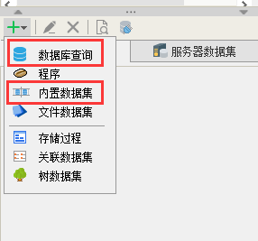

#### 3.1. 数据集中最常用的是数据库查询、内置数据集。

##### 3.1.1. 数据库查询数据集

> 开发报表的主数据 sql、选择组件的 sql、字典的 sql

##### 3.1.2. 内置数据集

> 数据库里的数据不能满足业务需求，如按业务字段排序

### 4. 选择组件

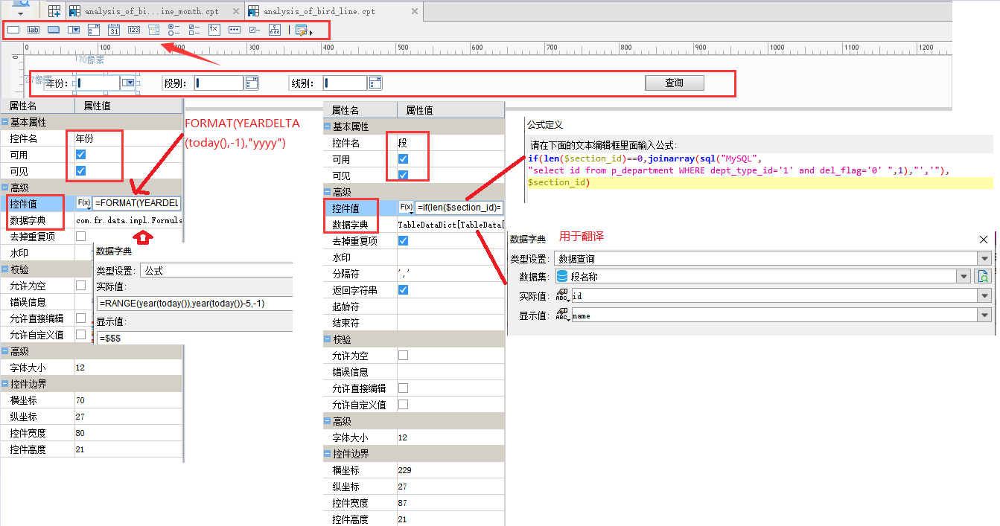

#### 4.1. 日期组件

> 格式可以自己定义

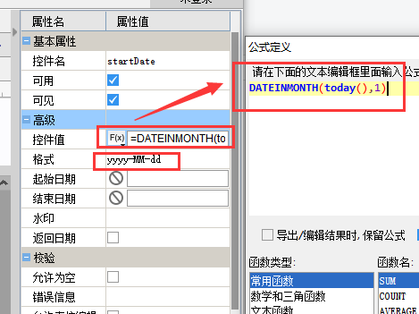

#### 4.2. 段别

#### 4.3. 模板数据集参数接收

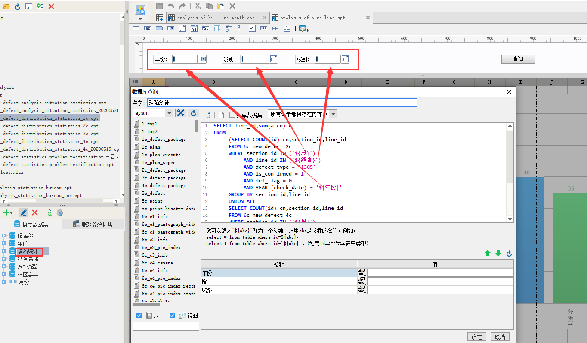

### 5. 报表开发

#### 5.1. 表格

> 将数据集中字段拖到对应的表格中。数据设置中有分组、列表、汇总

> 分组：相同 id 合并展示

> 列表：按列表详细展示

> 汇总：用于数学计算

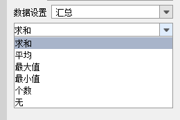

##### 5.1.1. 表格字段设置

###### 5.1.1.1. 扩展属性

> 用于展示数据的扩展方向(横向、纵向)，可以自定义随哪个单元格扩展。

###### 5.1.1.2. 样式

> 可以设置单元格数据字体大小、颜色、边框、百分比、小数点几位等

###### 5.1.1.3. 形态

> 用于翻译单元格中的数据，普遍用字典。因为单元格中的字段普遍是数据库中的 id,用字典翻译展示。

###### 5.1.1.4. 其他属性

> 单元格显示的大小可以固定，也可以随单元格中的内容改变

###### 5.1.1.5. 数据列操作

> 双击单元格

###### 5.1.1.5.1. 过滤

> 对单元格中字段再次进行调节过滤

###### 5.1.1.5.2. 高级

> 对单元格中的值进行处理，如：

###### 5.1.1.6. 条件属性

> 鼠标右击，条件属性

###### 5.1.1.7. 固定标题

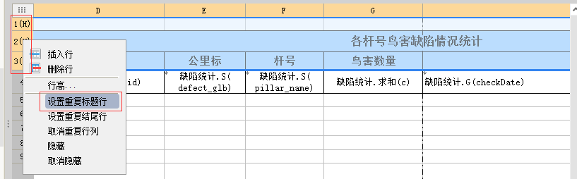

#### 5.2. 图表

##### 5.2.1. 饼状图

###### 5.2.1.1. 效果图

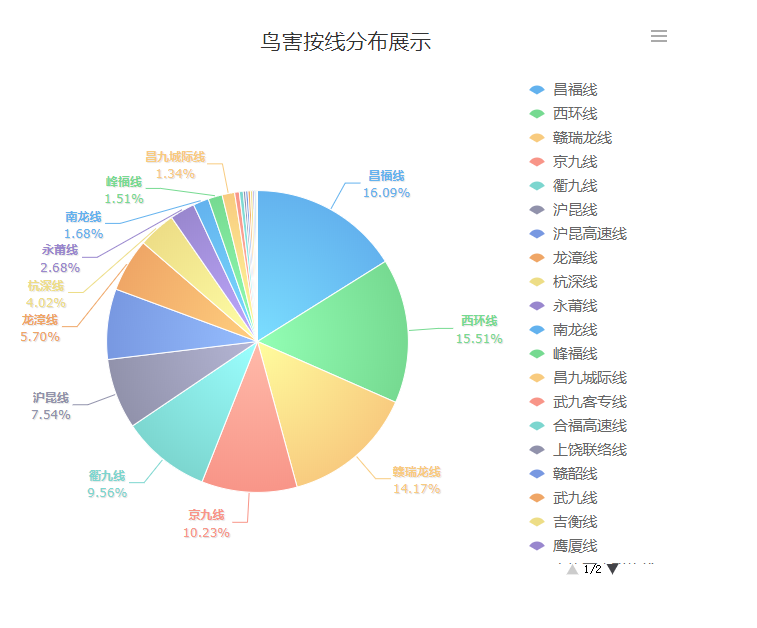

###### 5.2.1.2. 图表属性表-数据

> 数据来源：数据集数据(来源于模板数据集)、单元格数据(表格中的某个单元格)。

> 系列名：饼状效果图右边的线路。在形态中可以设置字典，用于法师系列名。

> 值：数据集数据对应的是某个字段，单元格数据对应的是某个单元格。

###### 5.2.1.3. 图表属性边-样式

> 主要设置是标签和提示

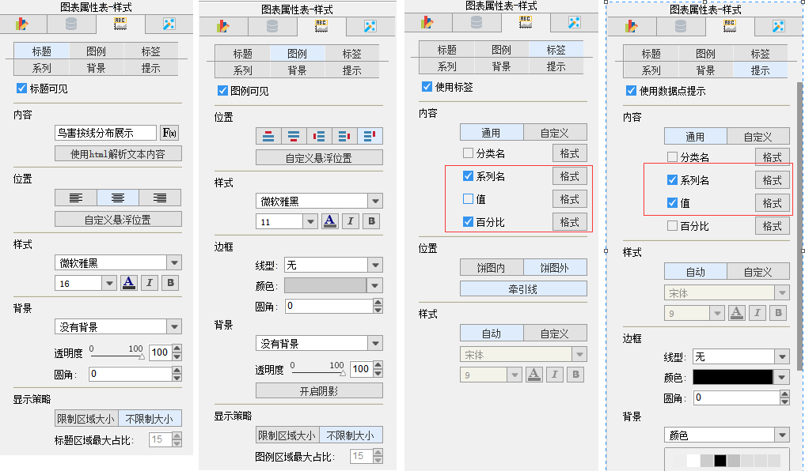

##### 5.2.2. 柱状图

###### 5.2.2.1. 效果图

###### 5.2.1.2. 图表属性表-数据

> 数据来源：数据集数据(来源于模板数据集)、单元格数据(表格中的某个单元格)。

> 系列名：饼状效果图右边的线路。在形态中可以设置字典，用于法师系列名。

> 值：数据集数据对应的是某个字段，单元格数据对应的是某个单元格。

###### 5.2.1.3. 图表属性边-样式

> 主要设置是标签、坐标轴、提示

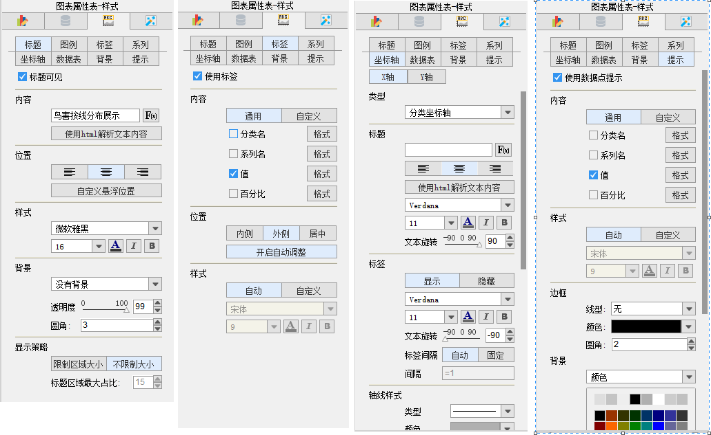

#### 5.3. 预览

> 对应 3 中预览方式：数据分析、分页预览、填报预览。使用最多是数据分析、其次分页预览。不同预览方式，对应请求 URL 是不一样的，预览效果也不同。

##### 5.3.1.数据分析

##### 5.3.2.分页预览

> 用于数据量比较大时，浏览器不至于崩溃。

> 一页显示的数量可以设置，模板 --> 表报引擎属性。但是一般不用，使用这个会影响模板的一些功能。可以手动设置

> 模板数据列较多时，分页显示不全，可以在 URL 上加：&**bypagesize**=false 这个属性。

#### 5.4. 自定义模板

> 模板 - -> 模板 Web 属性

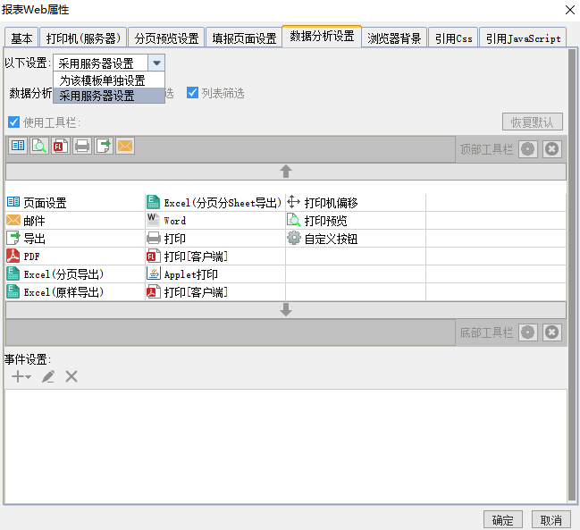

> 配置想要的模板

#### 5.5. 导出数据

#### 5.6. 菜单配置

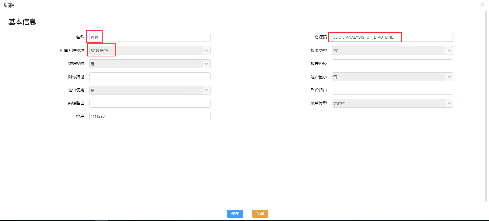

##### 5.6.1. 系统表报效果

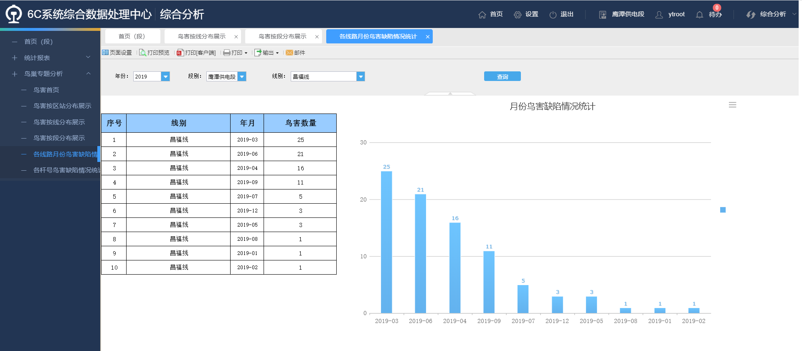

### 5.7. 调试

> 开发时，使用 debug 模式,可以快速定位错误问题。

