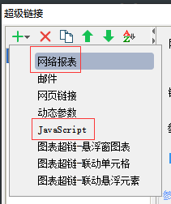
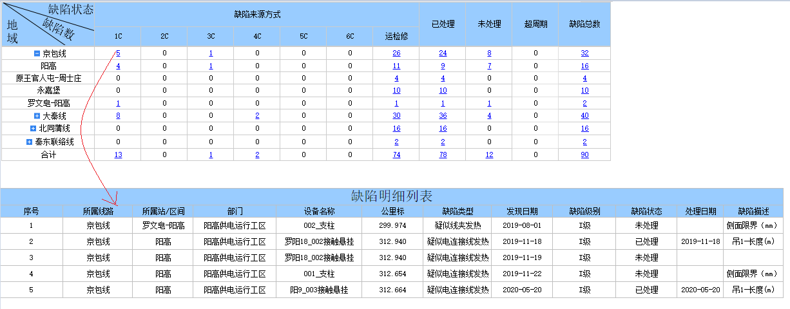
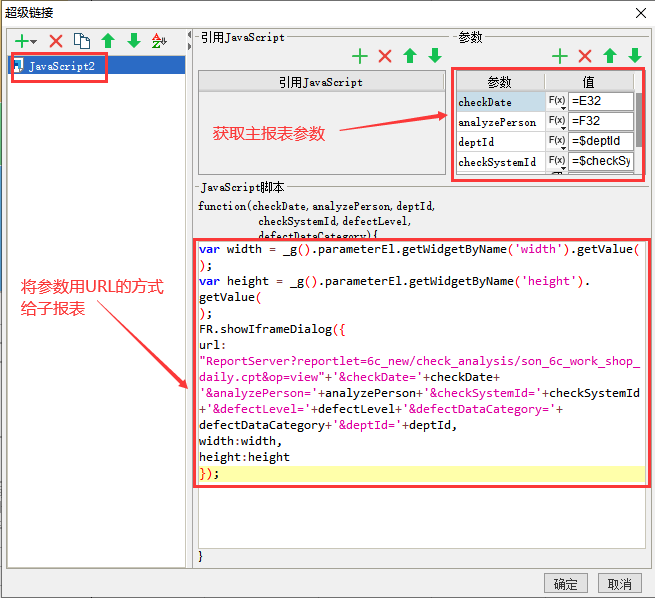

# 进阶篇

### 1. 超链接

1.1. 方式：网络表报(大西使用)、JavaScript(沈阳使用)

1.2. 网络表报展示效果

点击 5 跳转到一个新的明细页面

1.2.1. 设置

选中需要加超链接的单元格，右击鼠标，选中超级链接。

1.3. JavaScript 展示效果

点击 5 跳转到一个新的明细页面

1.3.1. 设置

选中需要加超链接的单元格，右击鼠标，选中超级链接。

2. JS

   2.1. 效果

   点击搜索时，报错误提示信息

   

   2.2.校验代码

   

2.3. 给组件赋值

