# 后端开发手册

## 1.EMIS8000 系统

### 1.1 系统架构

​ 应用软件平台采用微服务体系架构，建设以 SpringCloud、Docker、Jenkins 软件为基础的一套可以自动配置、注册、发布、服务、测试的可持续集成服务容器平台。应用平台软件架构如下图。


### 1.2 软件环境

| 名称              | 版本          | 用途            | 备注 |
| ----------------- | ------------- | --------------- | ---- |
| togest-nginx 镜像 | 1.12.1        | 代理            |      |
| togest-redis 镜像 | 4.0.2         | 缓存            |      |
| togest-mq 镜像    | 3.6.10        | rabbit 消息队列 |      |
| Mysql             | 5.7.19        | 数据库          |      |
| JDK               | 1.8.144       |                 |      |
| docker            | 17.09 社区版  |                 |      |
| centos            | 7.3           |                 |      |
| springcloud       | Dalston.SR1   |                 |      |
| springboot        | 1.5.4.RELEASE |                 |      |

## 2.平台支撑

### 2.1 元数据

​ 元数据定义了所有业务的元数据模型，比如人员管理，定义了人员管理的属性及扩展属性。整个平台以元数据为驱动，前端用元数据实现 CRUD, 后端用元数据实现数据聚合、封装、导入及导出。元数据主要有元数据主表、元数据属性构成，数据模型及 UI 如下：

**元数据**

| 序号 | 属性       | 描述             |
| ---- | ---------- | ---------------- |
| 1    | 名称       | 元数据名称       |
| 2    | 自定义编码 | 自定义编码       |
| 3    | 编码       | 编码             |
| 4    | 表名       | 物理结构表名     |
| 5    | 排序       | 决定列表显示顺序 |
| 6    | 上级父类   |                  |


**元数据明细**


| 序号 | 属性           | 描述                                                   |
| ---- | -------------- | ------------------------------------------------------ |
| 1    | 名称           | 属性名称                                               |
| 2    | 编码           |                                                        |
| 3    | 自定编码       | 系统自动生成                                           |
| 4    | 组件类型       | 决定前端展现，字典                                     |
| 5    | 数据类型       | 数据字典布尔/文本/字符/长整形/浮点/整形/精确计算/日期  |
| 6    | 数据字段       | 数据表列                                               |
| 7    | 属性名         | 后台实体中文显示属性                                   |
| 8    | 主键属性       | 后台实体属性                                           |
| 9    | 属性描述       | 属性额外扩展，一般配置字典名称、小数位数               |
| 11   | 字段分组       | 数据字典                                               |
| 12   | 排序           | 显示顺序                                               |
| 13   | 格式化器       | 时间格式配置，例如 yyyy-MM-dd HH:mm:ss                 |
| 14   | 查询方式       | 数据字典，LIKE/IN/BETTWEN/OR/=，对于元数据驱动查询有效 |
| 15   | 表达式         | 后端用于聚合，JSON 格式                                |
| 16   | 允许多值       | 是/否                                                  |
| 17   | 判重条件       | 是/否                                                  |
| 18   | 新增状态       | 正常/禁用/只读/隐藏                                    |
| 19   | 详情状态       | 正常/禁用                                              |
| 20   | 编辑状态       | 正常/禁用/只读/隐藏                                    |
| 21   | 是否启用       | 是否                                                   |
| 22   | 是否必填       | 是否，必填校验                                         |
| 23   | 是否表格字段   | 是否，表格显示                                         |
| 24   | 是否可搜索     | 是否，查询条件                                         |
| 25   | 是否下拉可搜索 | 是否，下拉框可搜索                                     |
| 26   | 是否排序项     | 是否，表头可点击排序                                   |
| 27   | 是否导出       | 是否                                                   |
| 28   | 自定义扩展     | 针对列动态，用于 nosql 模式                            |
| 29   | 档案扩展       | 数据字典，无/常规/动态/静态                            |
| 30   | 表格宽度       | 预留                                                   |
| 31   | 拓展配置       | 预留                                                   |
| 32   | 输入提示       | 预留                                                   |
| 33   | UI 校验器      | 预留                                                   |
| 34   | 默认值         | 预留                                                   |

**1.数据类型**：对于精确计算，后台实体需要使用 BigDecimal，浮点/精确计算前端需结合属性描述里面配置的精确位数一起使用

**2.组件类型：**年月日日期、年月日时分秒、日期月份、文本域(teaxtArea)、文本(text)、数值、布尔、文件、图片、文件上传、大文件上传、字典、字典多选、下拉、JSON 编辑器、隐藏、一些业务定制组件等

### 2.2 CRUD

​ 平台的增删改查使用的 Mybatis 框架，针对数据库的操作我们开发了 togest-domain、togest-persist、togest-cms-crud、togest-cms-crud-web 模块。

#### 2.2.1 togest-domain

​ togest-domain 定义通用的些实体，包括 BaseCommonEntity、DataCommonEntity、TreeCommonEntity、Page、PageData、DeleteVo、UpdateVo、InsertVo、QueryVo 等，另外 IdGen 也在此模块中，完成 UUID 生成。

#### 2.2.2 togest-persist

​ CRUD 骨架，定义了单表操作(SingleDao)、CrudCommonDao、TreeCommonDao、ICrudCommService、ITreeCommService、CrudCommService、TreeCommonService。

​ CRUD 接口定义如下，业务可继承：

```java
public interface ICrudCommonService<T> {
     T get(String id);
     List<T> getByIds(List<String> ids);
     T get(T entity);
     List<T> findList(T entity);
     List<T> findAllList();
     Page<T> findPage(Page<T> page, T entity);
     int save(T entity);
     int delete(T entity);
     int delete(String id);
     boolean unique(T entity);}
```

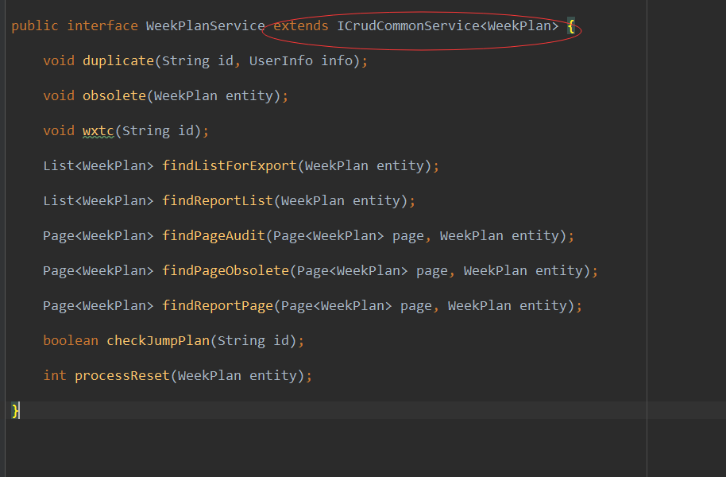

CRUD Dao 接口定义如下，业务 dao 可继承：

```java
public interface CrudCommonDao<T>
{
  T getByKey(@Param("id")String id);
  List<T> getListByKeys(@Param("ids")List<String> ids);
  T getByEntity(T entity);
  List<T> findList(T entity);
  List<T> findAllList();
  int insert(T entity);
  int update(T entity);
  int delete(T entity);
  int deleteByKey(@Param("id") String id);
}
```

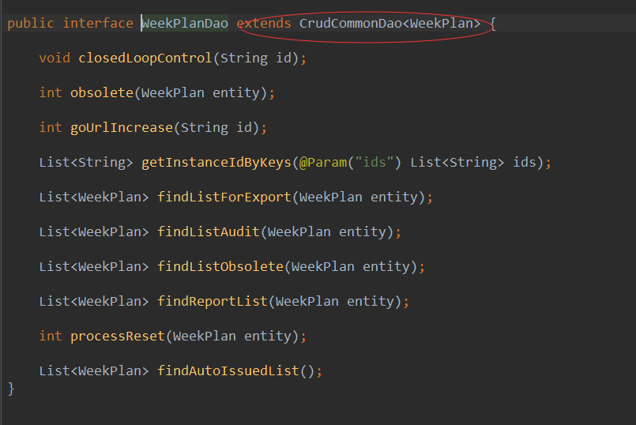

CRUD 通用的实现类如下，业务可继承，对于分页由 pagehelper 插件完成，对于性能有要求的，对于 count 建议单独书写。

```java
public class CrudCommonService<D extends CrudCommonDao<T>, T extends DataCommonEntity> implements ICrudCommonService<T> {

	@Autowired
	protected D dao;

	public T get(String id) {
		return dao.getByKey(id);
	}

	public List<T> getByIds(List<String> ids) {
		return dao.getListByKeys(ids);
	}

	public T get(T entity) {
		return dao.getByEntity(entity);
	}

	public List<T> findList(T entity) {
		return dao.findList(entity);
	}

	public List<T> findAllList() {
		return dao.findAllList();
	}

	public Page<T> findPage(Page<T> page, T entity) {
		return findPage(page, entity, true);
	}

	public Page<T> findPage(Page<T> page, T entity, boolean count) {
		PageUtils.setPage(page, count);
		return PageUtils.buildPage(dao.findList(entity));
	}

	@Transactional
	public int save(T entity) {
		if (entity.getIsNewRecord()) {
			entity.preInsert();
			return dao.insert(entity);
		} else {
			entity.preUpdate();
			return dao.update(entity);
		}
	}

	@Transactional
	public int delete(T entity) {
		entity.preDelete();
		return dao.delete(entity);
	}

	@Transactional
	public int delete(String id) {
		return dao.deleteByKey(id);
	}

	@Override
	public boolean unique(T entity) {
		try{
			T dto = dao.getByEntity(entity);
			if(StringUtil.isEmpty(dto)||dto.getId().equals(entity.getId())){
				return true;
			}
		}catch (Exception e) {
			return false;
		}
		return false;
	}

}

```


​ 对于树形业务的框架，通过 TreeCommonDao、ITreeCommService、TreeCommonService 来实现业务的框架。

```java
public interface ITreeCommonService<T> extends ICrudCommonService<T>{
	 T findChildsByParent(String id);
}

```

```java

public interface TreeCommonDao<T> extends CrudCommonDao<T>{
	 List<T> findByParentIdsLike(T entity);
	 int updateParentIds(T entity);
}
```

```java


public class TreeCommonService<D extends TreeCommonDao<T>, T extends TreeCommonEntity<T>>
		extends CrudCommonService<D, T> implements ITreeCommonService<T> {

	@SuppressWarnings("unchecked")
	@Transactional
	public int save(T entity) {
		Class<T> entityClass = ReflectHelper.getClassGenricType(getClass(), 1);
		if (StringUtil.isBlank(entity.getParentId())) {
			entity.setParentId("0");
			entity.setParentIds("0,");
		}
		String oldParentIds = entity.getParentIds();
		entity.setParentIds((super.get(entity.getParentId()) == null ? ""
				: super.get(entity.getParentId()).getParentIds() == null ? ""
						: super.get(entity.getParentId()).getParentIds())
				+ entity.getParentId() + ",");
		if ("0".equalsIgnoreCase(entity.getId())) {
			entity.setParentId(null);
			entity.setParentIds(null);
		}
		int result = super.save(entity);
		T o = null;
		try {
			o = entityClass.newInstance();
		} catch (Exception e) {
			throw new ServiceException(e);
		}
		o.setParentIds("%," + entity.getId() + ",%");
		List<T> list = dao.findByParentIdsLike(o);
		for (T e : list) {
			if (e.getParentIds() != null && oldParentIds != null) {
				e.setParentIds(e.getParentIds().replace(oldParentIds, entity.getParentIds()));
				preUpdateChild(entity, e);
				dao.updateParentIds(e);
			}
		}
		return result;
	}


	@Transactional
	protected void preUpdateChild(T entity, T childEntity) {

	}

	public void setTree(T parent, List<T> children) {
		if (parent == null)
			return;

		List<T> nodes = new ArrayList<T>();
		for (int i = 0; i < children.size(); i++) {
			T child = children.get(i);
			if (parent.getId().equals(child.getParentId())) {
				nodes.add(child);
				children.remove(i);
				i--;
			}
		}
		nodes.sort((c1,c2)->c1.getSort().compareTo(c2.getSort()));
		parent.setNodes(nodes);
		if (nodes.size() > 0) {
			for (T node : nodes) {
				setTree(node, children);
			}
		}
	}

	public T findChildsByParent(String id) {
		if (StringUtil.isNotBlank(id)) {
			T entity = get(id);
			List<T> t = dao.findByParentIdsLike(entity);
			t.remove(entity);
			setTree(entity, t);
			return entity;
		}
		return null;
	}

	@Override
	public int delete(T entity) {
		List<String> ids = getChildIds(entity.getId());
		if (StringUtil.isNotEmpty(ids)) {
			entity.setId(CollectionUtils.convertToString(ids, ","));
		}
		return super.delete(entity);
	}

	@Override
	public int delete(String id) {
		List<String> ids = getChildIds(id);
		if (StringUtil.isNotEmpty(ids)) {
			id = CollectionUtils.convertToString(ids, ",");
		}
		return super.delete(id);
	}

	public List<String> getChildIds(String id) {
		List<String> ids = new ArrayList<String>();
		T t = dao.getByKey(id);
		if (StringUtil.isNotEmpty(t)) {
			t.setParentIds(t.getParentIds() + id + ",");
			List<T> list = dao.findByParentIdsLike(t);
			if (StringUtil.isNotEmpty(list)) {
				ids = CollectionUtils.distinctExtractToList(list, "id", String.class);
			}
		}
		ids.add(id);
		return ids;
	}
}

```

​ 某些简单业务无需通过书写 XML 完成 CRUD，可基于 SingleDao 来完成 CRUD，业务可直接注入@Autowired

```java
public interface SingleDao {
	 void save(InsertVO obj);
	 void update(UpdateVO obj);
	 void delete(DeleteVO obj);
	 List<PageData> list(Object obj);
	 List<PageData> page(QueryVO obj);
	 PageData get(QueryVO obj);
	 List<PageData> listBySql(@Param("value") String value);
	 PageData unique(QueryVO obj);
	 void saveBatch(InsertBatchVO vo);
}

```

#### 2.2.3 togest-cms-crud

​ togest-cms-crud 实现了基于元数据的单表的 MAP 的 CRUD。包括 CommonCrudService、CommonCrudServiceImpl、CommonImportService、CommonImportServiceImpl

​ CommonCrudService 定义接口如下，CommonCrudServiceImpl 为实现类，实现类依赖 SingleDao.业务可分继承该类,达到通过元数据配置的方式动态实现 CRUD，而无需书写 dao、domain 等。对于查询是通过元数据的查询方式属性列的配置实现 like、in 、or、between、=操作


​ 业务使用该框架完成变电 24 种设备的 CRUD，24 种设备的属性各不同，从而达到较少开发工作量。工程师可定义元数据，后台简单继承下框架就好。

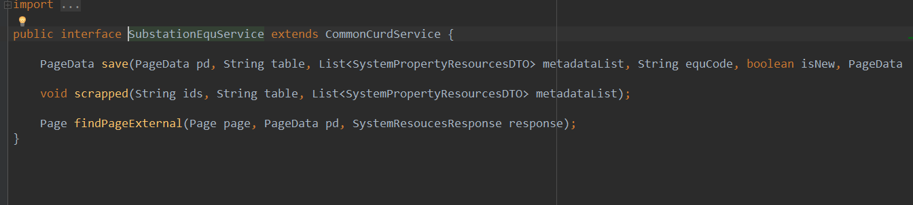


#### 2.2.4 togest-cms-crud-web

​ togest-cms-crud-web 主要功能如下：

1. 针对 2.2.3 封装了 WEB 层，抽象了 CommonResource，业务可继承。WEB 层收到请求之后，会将请求根据元数据编码获取业务逻辑服务，获取不到则用通用的 CommonCrudServiceImpl

   ```Java
   public abstract class CommonResource  {
   	@RequestMapping(value = "/dynamic/{resourceCode}/pages", method=RequestMethod.GET)
   	@ApiOperation(value = "获取数据分页")
   	public RestfulResponse<Page<PageData>> findPage(Page<PageData> page,
   			@PathVariable("resourceCode") String resourceCode, String authCode)

   	@RequestMapping(value = "/dynamic/{resourceCode}/list", method =RequestMethod.GET)
   	@ApiOperation(value = "获取数据集合")
   	public RestfulResponse<List<PageData>> findList(@PathVariable("resourceCode")

   	@RequestMapping(value ="/dynamic/{resourceCode}/delete",method=RequestMethod.POST)
   	@ApiOperation(value = "根据id删除数据")
   	public RestfulResponse<Boolean> deleteData(String id,@PathVariable("resourceCode") String resourceCode,String deleteIp)

   	@RequestMapping(value = "dynamic/{resourceCode}", method = RequestMethod.GET)
   	@ApiOperation(value = "根据id获取数据")
   	public RestfulResponse<PageData> getData(String id, @PathVariable("resourceCode") String resourceCode) throws Exception

   	@RequestMapping(value = "dynamic/{resourceCode}/unique",method=RequestMethod.POST)
   	@ApiOperation(value = "唯一性判重")
   	public RestfulResponse<Boolean> unique(@PathVariable("resourceCode") String resourceCode) throws Exception

   	@SuppressWarnings("unchecked")
   	@RequestMapping(value = "dynamic/{resourceCode}/enclosure", method = RequestMethod.GET)
   	@ApiOperation(value = "去往编辑页面")
   	public RestfulResponse<Map<String, List<Map<String, Object>>>> enclosure(String id,@PathVariable("resourceCode") String resourceCode) throws Exception

   	@RequestMapping(value = "/dynamic/{resourceCode}", method = RequestMethod.POST)
   	@ApiOperation(value = "保存数据")
   	public RestfulResponse<Boolean> saveData(@PathVariable("resourceCode") String resourceCode)

   	@RequestMapping(value = "dynamic/{resourceCode}/export/template", method = RequestMethod.GET)
   	@ApiOperation(value = "模板导出")
   	public ResponseEntity<Resource> exportByTemplate(String templateId, @PathVariable("resourceCode") String resourceCode,String authCode) throws Throwable

   	@RequestMapping(value = "dynamic/{resourceCode}/export/custom", method = RequestMethod.GET)
   	@ApiOperation(value = "用户自定义导出")
   	public ResponseEntity<Resource> exportByCustom(String userId, @PathVariable("resourceCode") String resouceCode,String authCode) throws Throwable

   	@RequestMapping(value = "dynamic/{resourceCode}/export/preparation", method = RequestMethod.GET)
   	@ApiOperation(value = "插件导出")
   	public ResponseEntity<Resource> exportByPreparation(@PathVariable("resourceCode") String resourceCode,String authCode) throws Throwable

   	@RequestMapping(value="dynamic/{resourceCode}/importExcel",method=RequestMethod.POST)
   	@ApiOperation(value = "模板导入")
   	public RestfulResponse<Map<String, Object>> importExcel(MultipartFile file, String templateId,@PathVariable("resourceCode") String resourceCode, String fileName, String createIp) throws Exception

   ```

2) 针对 togest-persist 定义了抽象的 WEB 层，包括 AbstractBaseController(部门控制权限)、AbstractController(支持导入导出)、AbstractBaseSectionController(段控制权限)、AbstractSectionController(段控制权限，支持导入导出)

   ```java
   public abstract class AbstractBaseSectionController<T extends DataCommonEntity, S extends ICrudCommonService<T>> {

       @Autowired
       protected S service;
       @Autowired
       protected MetadataUtil metadataUtil;
       @Autowired
       protected MetadataConfigClient metadataConfigClient;
       @Autowired
       protected PolymerizeDataService polymerizeDataService;


       @RequestMapping(value = "get", method = RequestMethod.GET)
       @ApiOperation(value = "查看信息")
       public RestfulResponse<T> get(String id) {
           if (StringUtil.isBlank(id)) {
               Shift.fatal(StatusCode.DATA_CONDITION_EMPTY);
           }
           T entity = service.get(id);
           if (StringUtil.isEmpty(entity)) {
               Shift.fatal(StatusCode.ID_DATA_EMPTY);
           }
           polymerizeDataService.setNamesByIds(entity, getResourceCode());
           return new RestfulResponse<>(entity);
       }


       @AddDataPut
       @RequestMapping(value = "save", method = RequestMethod.POST)
       @ApiOperation(value = "保存信息")
       public RestfulResponse<Boolean> save(T entity) {
           service.save(entity);
           return new RestfulResponse<>(true);
       }


       @RequestMapping(value = "unique", method = RequestMethod.POST)
       @ApiOperation(value = "唯一性判重")
       public RestfulResponse<Boolean> unique(T entity) {
           return new RestfulResponse<>(service.unique(entity));
       }


       @SuppressWarnings("unchecked")
       @RequestMapping(value = "enclosure", method = RequestMethod.GET)
       @ApiOperation(value = "配置信息")
       public RestfulResponse<Map<String, List<Map<String, Object>>>> enclosure(String id) {
           if (StringUtil.isBlank(id)) {
               Shift.fatal(StatusCode.DATA_CONDITION_EMPTY);
           }
           T entity = service.get(id);
           if (StringUtil.isEmpty(entity)) {
               Shift.fatal(StatusCode.ID_DATA_EMPTY);
           }
           SystemResoucesResponse response = OptionalUtils.map(metadataConfigClient.getSystemResources(getResourceCode()));
           if (StringUtil.isEmpty(response)) {
               Shift.fatal(StatusCode.EXCEPTION);
           }
           polymerizeDataService.setNamesByIds(entity, response.getProps());
           Map<String, Object> map = (Map<String, Object>) ObjectUtils.objectToMap(entity);
           Map<String, List<Map<String, Object>>> maps = metadataUtil.enclosure(map, response.getProps());
           return new RestfulResponse<>(maps);
       }


       @RequestMapping(value = "delete", method = RequestMethod.POST)
       @DeleteDataPut
       @ApiOperation(value = "假删除信息")
       public RestfulResponse<Boolean> delete(T entity) {
           if (StringUtil.isBlank(entity.getId())) {
               Shift.fatal(StatusCode.DATA_CONDITION_EMPTY);
           }
           service.delete(entity);
           return new RestfulResponse<>(true);
       }


       @DataControlSectionPut
       @RequestMapping(value = "list", method = RequestMethod.GET)
       @ApiOperation(value = "查看列表")
       public RestfulResponse<List<T>> findList(T entity) {
           List<T> list = service.findList(entity);
           if (StringUtil.isNotEmpty(list)) {
               polymerizeDataService.setNamesByIds(list, getResourceCode());
           }
           return new RestfulResponse<>(list);
       }


       @DataControlSectionPut
       @RequestMapping(value = "page", method = RequestMethod.GET)
       @ApiOperation(value = "查看分页列表")
       public RestfulResponse<Page<T>> findPage(Page<T> page, T entity) {
           Page<T> pg = service.findPage(page, entity);
           if (StringUtil.isNotEmpty(pg.getList())) {
               polymerizeDataService.setNamesByIds(pg.getList(), getResourceCode());
           }
           return new RestfulResponse<>(pg);
       }


       public abstract String getResourceCode();

}

```

```java
public abstract class AbstractController<T extends DataCommonEntity, S extends ICrudCommonService<T>, I extends ConfigExcelImportService<T>>
     extends AbstractBaseController<T, S>
     implements ExportExtend<T>, ImportExtend<T> {

 @Autowired
 protected I importService;
 @Autowired
 protected ExportClient exportClient;

 @RequestMapping(value = "import", method = RequestMethod.POST)
 @ApiOperation(value = "数据导入")
 public RestfulResponse<Map<String, Object>> imports(T entity, MultipartFile file, String templetId, String fileName) throws Exception {
     if (StringUtil.isBlank(templetId)) {
         Shift.fatal(StatusCode.TEMPLATE_ID_EMPTY);
     }
     if (fileName == null) {
         fileName = file.getOriginalFilename();
     }
     UserInfo info = TokenUtil.getUser(ServletContextHolder.getRequest());
     Map<String, Object> propMap = new HashMap<>();
     propMap.put(PropFieldConstant.createIp.getStatus(), IpUtil.getRealIP(ServletContextHolder.getRequest()));
     propMap.put(PropFieldConstant.createBy.getStatus(), info.getId());
     propMap.put(PropFieldConstant.sectionId.getStatus(), info.getSectionId());
     Optional.ofNullable(extraParameter(entity)).ifPresent(propMap::putAll);
     Map<String, Object> map = importService.importData(fileName, file.getInputStream(), templetId, getEntityClass(), propMap);
     return new RestfulResponse<>(map);
 }


 @UserDataScope
 @RequestMapping(value = "export", method = RequestMethod.GET)
 @ApiOperation(value = "数据导出")
 public ResponseEntity<Resource> export(T entity, String templateId) throws Exception {
     if (StringUtil.isBlank(templateId)) {
         Shift.fatal(StatusCode.TEMPLATE_ID_EMPTY);
     }
     List<T> list = service.findList(entity);
     if (StringUtil.isNotEmpty(list)) {
         polymerizeDataService.setNamesByIds(list, getResourceCode());
     }
     byte[] b = exportClient.exportDataByTemplet(list, templateId);
     return FileDownload.fileDownload(b, getFullName(getExportName(entity), templateId));
 }

 @Override
 public String getFileSuffix(String templateId) {
     Objects.requireNonNull(templateId);
     return OptionalUtils.map(metadataConfigClient.getFileSuffix(templateId));
 }

 @SuppressWarnings("unchecked")
 private Class<T> getEntityClass() {
     return (Class<T>) ((ParameterizedType) this.getClass().getGenericSuperclass()).getActualTypeArguments()[0];
 }

}

```

3.业务继承 AbstractController


### 2.3 聚合

​ 对于数据之间的聚合我们使用元数据的方式来实现，聚合典型场景为通过名字找 ID、通过 ID 找名字。目前系统支持的方式如下：

1. 表达式 HTTP 方式聚合：通过微服务调用方式实现服务聚合
2. 表达式 SQL 方式聚合：通过 SQL 直接查询方式
3. 字典方式聚合：字典聚合通过调用字典服务聚合

#### 2.3.1 聚合表达式配置

| 属性                          | 属性描述                                                     |
| ----------------------------- | ------------------------------------------------------------ |
| http                          | http 方式                                                    |
| http.import                   | 导入聚合                                                     |
| http.import.requestUrl        | http api                                                     |
| http.import.requestMethod     | 请求方式 POSG/GET                                            |
| http.import.requestParam      | 请求参数，键值对 JSON 格式，请求参数与实体 BEAN 属性对应关系 |
| http.import.isBatch           | 是否批量获取                                                 |
| http.import.isObject          | 是否提交对象                                                 |
| http.import.responseCheckData | 响应数据匹配属性 JSON 格式，响应数据与实体 BEAN 属性对应关系 |
| http.import.responseDataProp  | 响应数据设置属性 JSON 格式，响应数据与实体 BEAN 属性对应关系 |
| http.export                   | 导出                                                         |
| http.export.requestUrl        | http api                                                     |
| http.export.requestMethod     | 请求方式 POSG/GET                                            |
| http.export.requestParam      | 请求参数，键值对,JSON 格式                                   |
| http.export.isBatch           | 是否批量获取                                                 |
| http.export.isObject          | 是否提交对象                                                 |
| http.export.responseCheckData | 响应数据匹配属性 JSON 格式，响应数据与实体 BEAN 属性对应关系 |
| http.import.responseDataProp  | 响应数据设置属性 JSON 格式,响应数据与实体 BEAN 属性对应关系  |
| sql                           | SQL 方式                                                     |
| sql.import                    | 导入聚合                                                     |
| sql.import.sql                | SQL 语句                                                     |
| sql.import.variable           | 变量，SQL 参数与实体 BEASN 属性对应关系                      |
| sql.import.responseCheckData  | 响应数据匹配属性 JSON 格式，查询结果与实体 BEAN 对应关系     |
| sql.import.responseDataProp   | 响应数据设置属性 JSON 格式，查询结果与实体 BEAN 对应关系     |
| sql.export                    | 导出聚合                                                     |
| sql.export.sql                | 变量，SQL 参数与实体 BEASN 属性对应关系                      |
| sql.export.variable           | 变量，SQL 参数与实体 BEASN 属性对应关系                      |
| sql.export.responseCheckData  | 响应数据匹配属性 JSON 格式，查询结果与实体 BEAN 对应关系     |
| sql.export.responseDataProp   | 响应数据设置属性 JSON 格式，查询结果与实体 BEAN 对应关系     |

**GET**

```json
{
  "http": {
    "import": {
      "requestUrl": "http://base-service/dept/names/ids?name={name}&sectionId={sectionId}",
      "rquestMethod": "get",
      "requestParam": {
        "name": "deptName",
        "sectionId": "sectionId"
      },
      "isBatch": true,
      "isObject": false,
      "responseCheckData": {
        "name": "deptName"
      },
      "responseDataProp": {
        "id": "deptId"
      }
    },
    "export": {
      "requestUrl": "http://base-service/dept/ids/names?id={id}",
      "rquestMethod": "get",
      "requestParam": {
        "id": "deptId"
      },
      "isBatch": true,
      "isObject": false,
      "responseCheckData": {
        "id": "deptId"
      },
      "responseDataProp": {
        "name": "deptName"
      }
    }
  }
}
```

**POST**

```json
{
  "http": {
    "import": {
      "requestUrl": "http://base-service/dept/names/ids",
      "rquestMethod": "post",
      "requestParam": {
        "name": "deptName",
        "sectionId": "sectionId"
      },
      "isBatch": true,
      "isObject": false,
      "responseCheckData": {
        "name": "deptName"
      },
      "responseDataProp": {
        "id": "deptId"
      }
    },
    "export": {
      "requestUrl": "http://base-service/dept/ids/names",
      "rquestMethod": "post",
      "requestParam": {
        "id": "deptId"
      },
      "isBatch": true,
      "isObject": false,
      "responseCheckData": {
        "id": "deptId"
      },
      "responseDataProp": {
        "name": "deptName"
      }
    }
  }
}
```

**SQL**

```json
{
  "sql": {
    "import": {
      "sql": "select id,name from goods_factory where name in  (Filter_IN_name) and del_flag=0",
      "variable": {
        "Filter_IN_name": "madeFactoryName"
      },
      "responseCheckData": {
        "name": "madeFactoryName"
      },
      "responseDataProp": {
        "id": "madeFactoryId"
      }
    },
    "export": {
      "sql": "select  id,name from goods_factory  where id in (Filter_IN_id) and del_flag=0",
      "variable": {
        "Filter_IN_id": "madeFactoryId"
      },
      "responseCheckData": {
        "id": "madeFactoryId"
      },
      "responseDataProp": {
        "name": "madeFactoryName"
      }
    }
  }
}
```

#### 2.3.2 聚合工具接口

​ 聚合工具 togest-cms-core 模块下，聚合工具接口类具体的定义如下，PolymerizeDataServiceImpl 实现该接口类。需要时可直接用@Autowired 注入


#### 2.3.3 字典配置

​ 通过字典配置实现字典聚合的方式目前系统有两种，分别为元数据定义、注解定义。注解使用在字典的属性上面。目前大部分页面可以通过元数据配置的方式实现，对于某部分业务可通过注解方式实现。

**元数据定义**

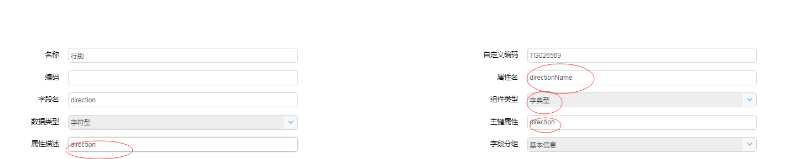

| 序号 | 属性     | 描述             |
| ---- | -------- | ---------------- |
| 1    | 名称     | 元数据描述       |
| 2    | 属性名   | 用于显示的属性   |
| 3    | 组件类型 | 字典             |
| 4    | 属性描述 | 使用的字典名称。 |
| 5    | 主键属性 | 字典值           |

​ 注意字典值存储方式有两种方式，一种是字典项 ID、另外一种是字典项编码值。两种方式通过字典名称区分，使用字典编码值的统一使用"busy\_"开头。

**字典属性注解定义，用于实体中字典属性列上**

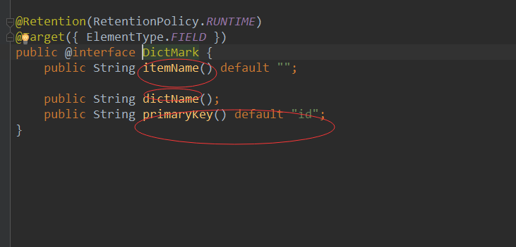

​

| 属性       | 描述                          |
| ---------- | ----------------------------- |
| itemName   | 字典属性名,对应元数据主键属性 |
| dictName   | 字典名称，对应元数据属性描述  |
| primaryKey | 默认“id”                      |

​ 注意字典值存储方式有两种方式，一种是字典项 ID、另外一种是字典项编码值。注解 primaryKey 取值为 id/code。默认使用 id

**字典聚合注解定义，用于 Service 中，利用 DictMark 及切面实现字典名称的自动聚合**

```java
@Retention(RetentionPolicy.RUNTIME)
@Target({ ElementType.METHOD })
public @interface DictAggregation {}
```

#### 2.4.2 字典工具

​ 字典工具 togest-cms-dict-client 模块下，聚合工具接口类具体的定义如下，DictionaryCliet 类。需要时可直接用@Autowired 注入

1、功能描述：聚合名称。通过类字典属性注解@DictMark 实现

输入：集合

输出：无

```java
public <T> void setByName(List<T> data) throws Exception
```

2、 功能描述：聚合名称。通过字典定义类

输入：集合，字典定义类

输出：无

```java
public <T> void setByName(List<T> data, List<DictAnntation> annotationList) throws Exception
```

3、功能描述：聚合 ID 或 CODE，由 DictMark 的 primaryKey 决定。通过类字典属性注解@DictMark 实现

输入：集合

输出：无

```java
public <T> void setById(List<T> data) throws Exception
```

4、 功能描述：聚合 ID 或 CODE，由 DictAnntation 的 label 决定。

输入：集合

输出：无

```java
public <T> void setById(List<T> data, List<DictAnntation> annotationList)
```

5、 功能描述：获取字典的字典项配置

输入：字典名称聚合

输出：按照字典名组成的 MAP，VALUE 中存储的是按照 CODE、NAME 组成的 MAP

```java
public Map<String, Map<String, String>> fetchItemCodeByDictName(Collection<String> dictList)
```

6、 功能描述：获取字典的字典项配置

输入：字典名称集合

输出：按照字典名组成的 MAP

```java
public Map<String, List<DictionaryItemDTO>> fetchItemByDictName(Collection<String> dictList)
```

7、功能描述：字典注解转换字典定义

输入：实体 Class

输出：字典定义集合

```java
public List<DictAnntation> getAnnotationInfo(Class<?> c)
```

8、功能描述：字典定义 DictAnntation

| 序号 | 属性名称     | 描述                                                                                      |
| ---- | ------------ | ----------------------------------------------------------------------------------------- |
| 1    | dictName     | 字典名称,对应元数据配置的属性描述列，对应注解的 dictName                                  |
| 2    | dictProp     | 字典值属性，对应元数据主键属性，对应注解的 itemName                                       |
| 3    | dictShowProp | 字典显示属性,对应元数据显示属性，对于直接在 dictProp 基础上最后拼接"Name"，形成显示属性名 |
| 4    | label        | 标签。使用 busy\_开头字典项，自动设置“code”，否则“id”                                     |

9、功能描述：字典注解实现字典名称自动聚合


### 2.4 导入导出

​ 平台导入导出实现方案有以下三种：

​ 1)基于元数据，上传模板，动态解析 excel，计算出列与属性关系

​ 2)自定义模板。通过占位符的方式配置导入导出模板

​ 3)word 模板。通过 ftl 方式上传模板

#### 2.4 .1 数据模型

**excel 模板主表**

| 序号 | 列                        | 描述                                                                     |
| ---- | ------------------------- | ------------------------------------------------------------------------ |
| 1    | id                        |                                                                          |
| 2    | name                      | 模板名称                                                                 |
| 3    | file_id                   | 附件 ID                                                                  |
| 4    | association_resources_ids | 关联多个元数据 ID。不关联资源时，表现为自定义模板,自定义模板不创建明细表 |
| 5    | association_data          | 关联业务元数据编码                                                       |
| 6    | tag                       | 列表/详情                                                                |
| 6    | data_tag                  | 导入/导出/导入导出                                                       |

**excel 模板明细**

| 序号 | 列                     | 描述                |
| ---- | ---------------------- | ------------------- |
| 1    | import_excel_config_id | 模板 ID             |
| 2    | excel_name             | 列中元数据属性编码  |
| 3    | coordinates            | 模板中 excel 行、列 |
| 4    | property_resources_id  | 关联元数据属性 ID   |
| 5    | table_header_name      | 列标题              |

**excel 模板配置**

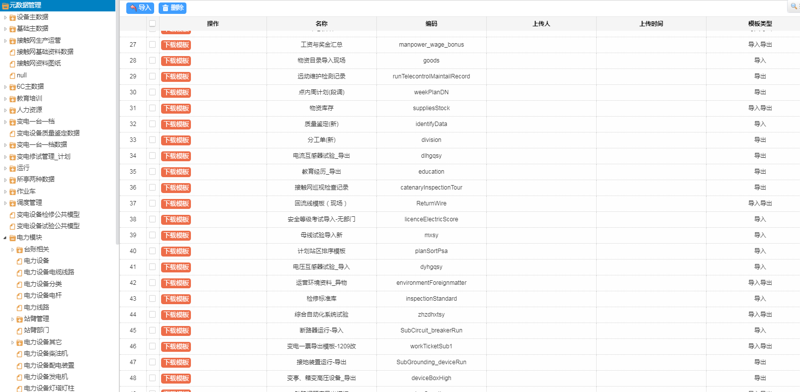

**excel 自定义模板配置**

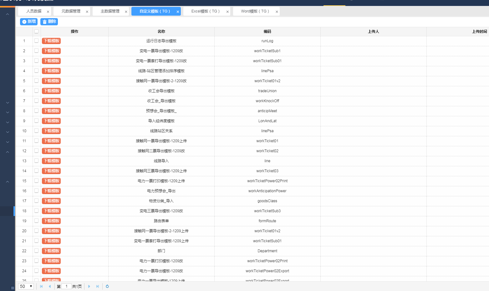

**word 模板**

| 序号 | 列               | 属性           |
| ---- | ---------------- | -------------- |
| 1    | name             | ftl 模板名称   |
| 2    | file_id          | 附件 ID        |
| 3    | sys_resources_id | 关联元数据 ID  |
| 4    | code             | 关联元数据编码 |

**Word 模板配置**

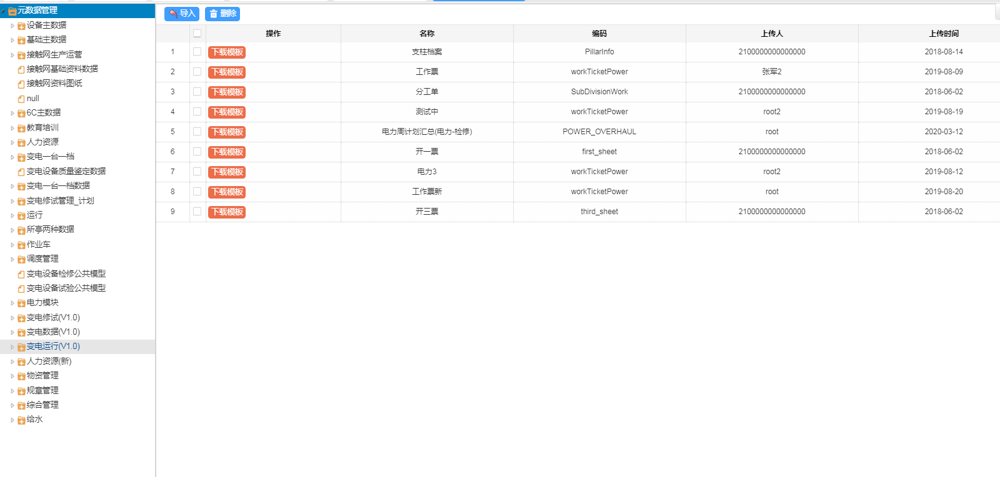

#### 2.4 .2 导入

​ 平台业务导入通过针对某一元数据上传 EXCEL 模板，建立一个模板与元数据的关联关系，前端通过选择模板及上传的导入附件一起带入到后台，输入到导入业务逻辑中。

​ 针对平台的导入应用我们设计并开发了通用的 ConfigExcelImportService、ConfigExcelImportServiceImpl，供业务继承。ConfigExcelImportServiceImpl 导入的思想如下：

1. 利用 ImportClient 实现文件到 MAP 集合的解析。如果解析出错，则给出提示
2. 解析 EXCEL 中是否有图片列
3. MAP 至实体转换
4. 设置实体的一些其它需要设置的属性。业务可重载
5. 通过元数据属性表达式，关联聚合其它属性，一般业务会出现名字转换 ID 过程。业务可重载
6. 校验。通过元数据的属性必填，校验数据是否空，返回 QualitityData 集合数据，业务可重载
7. 设置 QualitityData 的行和列，采用 EXCEL 中原数据行和列，业务可重载
8. 唯一性判断。通过元数据的判重字段，进行唯一性判断，业务可重载。如果唯一性判断存在，则会将 ID 附上值，用于更新操作
9. 上传图片。针对 2 中的结果，进行图片上传处理
10. 生成提示。业务可重载
11. 调用子类保存方法，业务可重载
12. 生成错误提示，业务可重载

​ togest-cms-core 模块中定义了导入 ConfigExcelImportService、ConfigExcelImportServiceImpl 类，详细的定义如下：

```Java
public interface ConfigExcelImportService<T> {

    /**
     * 导入接口
     *
     * @param originalFilename 文件名
     * @param inputStream      文件流
     * @param templetId        模板id
     * @param clazz            转换的类
     * @param propValue        往数据中封装的数据
     */
    Map<String, Object> importData(String originalFilename, InputStream inputStream, String templetId, Class<T> clazz, Map<String, Object> propValue);

    /**
     * 压缩文件导入接口
     * @param originalFilename
     * @param inputStream
     * @param templetId
     * @param clazz
     * @param propValue
     * @return
     */
    Map<String, Object> importCompressData(String originalFilename, InputStream inputStream, String templetId, Class<T> clazz, Map<String, Object> propValue);

    /**
     * 压缩文件导入接口
     * @param originalFilename
     * @param inputStream
     * @param templetId
     * @param clazz
     * @param propValue
     * @return
     */
    Map<String, Object> importCompressData(String originalFilename, InputStream inputStream, String templetId, Class<T> clazz, Map<String, Object> propValue, boolean isResource);

    /**
     * 导入接口
     *
     * @param originalFilename 文件名
     * @param inputStream      文件流
     * @param templetId        模板id
     * @param clazz            转换的类
     * @param propValue        往数据中封装的数据
     * @param isResource       是否补充资源项，默认是false
     */
    Map<String, Object> importData(String originalFilename, InputStream inputStream, String templetId, Class<T> clazz, Map<String, Object> propValue, boolean isResource);

    /**
     * 导入接口
     */
    Map<String, Object> importData(String originalFilename, InputStream inputStream, String templetId, Class<T> clazz);

    /**
     * 导入接口
     * @param isResource	是否补充资源项，默认是false
     */
    Map<String, Object> importData(String originalFilename, InputStream inputStream, String templetId, Class<T> clazz, boolean isResource);

    /**
     * 聚合数据
     */
    void associate(List<T> dataList, SystemResoucesResponse resourcesResponse);

    /**
     * 设置数据
     */
    void setPropData(List<T> dataList, Map<String, Object> propValue);

    /**
     * 配置检测数据
     */
    List<QualitityData<T>> check(List<T> dataList, SystemResoucesResponse resourcesResponse);

    /**
     * 通过资源配置判重条件进行基础的校验判重
     */
    List<QualitityData<T>> unique(List<QualitityData<T>> dataList, SystemResoucesResponse resourcesResponse);

    /**
     * 导出错误数据和数据提示
     */
    byte[] report(List<QualitityData<T>> qualitityList, String templetId, Map<Integer, List<FileBatchData>> photoMap, String errorMsg);

    /**
     * 数据保存
     */
    void save(List<QualitityData<T>> dataList, SystemResoucesResponse resourcesResponse);

    Boolean save(List<QualitityData<T>> dataList, SystemResoucesResponse resources, Map<String, Object> map);

}

```

​ togest-cms-code-client 模块中定义了 ImportClient 类，完成模板的解析及 MAP 集合的封装。togest-code-client 依赖 togest-cms-code-util 模块

```Java

@Service
public class ImportClient {

	@Autowired
	private ImportConfigClient configClient;
	@Autowired
	private MetadataConfigClient metadataClient;

	/**
	 * 通过模板解析数据
	 *
	 * @param fileName
	 * @param in
	 * @param importExcelConfigId
	 *            模板id
	 * @return
	 * @throws Exception
	 */
	public List<Map<String, Object>> analyzeExcelData(String fileName, InputStream in, String importExcelConfigId)
			throws Exception {
		return this.analyzeExcelData(fileName, in, importExcelConfigId,0);
	}
	public List<Map<String, Object>> analyzeExcelData(String fileName, InputStream in, String importExcelConfigId,boolean isPhotoLink)
			throws Exception {
		return this.analyzeExcelData(fileName, in, importExcelConfigId, 0, isPhotoLink);
	}

	/**
	 * 通过模板解析数据
	 *
	 * @param fileName
	 * @param in
	 * @param importExcelConfigId
	 *            模板id
	 * @param sheetIndex
	 *            从sheet的值开始解析
	 * @return
	 * @throws Exception
	 */

	public List<Map<String, Object>> analyzeExcelData(String fileName, InputStream in, String importExcelConfigId,
			int sheetIndex) throws Exception {
		return analyzeExcelData(fileName, in, importExcelConfigId, false);
	}
	public List<Map<String, Object>> analyzeExcelData(String fileName, InputStream in, String importExcelConfigId,
			int sheetIndex, boolean isPhotoLink) throws Exception{
		RestfulResponse<ImportExcelConfigResponse> config = configClient
				.getImportExcelConfigResponse(importExcelConfigId);
		if (config != null && config.getData() != null) {
			return ExcelImportUtil.analyzeExcelData(fileName, in, config.getData().getCof(), config.getData().getList(),
					sheetIndex,isPhotoLink);
		} else {
			return null;
		}
	}
	/**
	 * 通过模板解析数据对数据封装
	 *
	 * @param fileName
	 * @param in
	 * @param importExcelConfigId
	 *            模板id
	 * @param sheetIndex
	 *            从sheet的值开始解析
	 * @return
	 * @throws Exception
	 */
	public ParseDataResponse pareseData(String fileName, InputStream in, String importExcelConfigId, int sheetIndex)
			throws Exception {
		RestfulResponse<ImportExcelConfigResponse> config = configClient
				.getImportExcelConfigResponse(importExcelConfigId);
		if (config != null && config.getData() != null) {
			return ExcelImportUtil.pareseData(fileName, in, config.getData().getCof(), config.getData().getList(), 0);
		} else {
			return null;
		}
	}

	/**
	 * 通过定义属性解析封装数据
	 *
	 * @param properties
	 * @param fileName
	 * @param in
	 * @param startRow（从某行开始解析）
	 * @return
	 */
	public List<Map<String, Object>> importBaseData(List<String> properties, String fileName, InputStream in,
			int startRow) {
		return ExcelImportUtil.importBaseData(properties, fileName, in, startRow);
	}

	public List<Map<String, Map<String, Object>>> analyzeExcelDetailMoreData(String fileName, InputStream in,
			String importExcelConfigId) throws Exception {
		RestfulResponse<ImportExcelConfigResponse> configResult = configClient
				.getImportExcelConfigResponse(importExcelConfigId);
		if (configResult != null && configResult.getData() != null) {
			ImportExcelConfigResponse config = configResult.getData();
			RestfulResponse<List<SystemResourcesDTO>> resouces = metadataClient
					.getSystemPropertyResources(StringUtil.stringToList(config.getCof().getAssociationResourcesIds()));

			return ExcelImportUtil.analyzeExcelDetailMoreData(fileName, in, config.getCof(), config.getList(),
					resouces.getData());
		} else {
			return null;
		}
	}
	public List<List<Map<String, Object>>> analyzeExcelData(String fileName, InputStream in,
			List<String> importExcelConfigIds,int startSheet) throws Exception {
		RestfulResponse<List<ImportExcelConfigResponse>> config = configClient
				.getImportExcelConfigResponse(importExcelConfigIds);
		if (config != null && config.getData() != null) {
			return ExcelImportUtil.analyzeExcelData(fileName, in, config.getData());
		} else {
			return null;
		}
	}
	public List<List<Map<String, Object>>> analyzeExcelData(String fileName, InputStream in,
			List<String> importExcelConfigIds) throws Exception {
		return analyzeExcelData(fileName, in, importExcelConfigIds, 0);
	}

}

```

​ 给水专业日计划导入，继承了通用导入接口及实现类，并重写了 save 方法

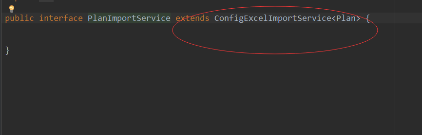


#### 2.4 .3 导出

​ EXCEL 导出支持元数据模板、占位符自定义模板两种导出方式，Word 导出通过 ftl 模板引擎导出。在 togest-cms-code-client 中定义了 ExportClient 类，实现 Excel 的导出。

| 序号 | 方法                                           | 描述                                                                 |
| ---- | ---------------------------------------------- | -------------------------------------------------------------------- |
| 1    | ExportClient.exportByConfigure                 | 用户自定义配置导出                                                   |
| 2    | ExportClient.exportByMapConfigure              | 用户自定义配置导出（Map）                                            |
| 3    | ExportClient.exportByMapDynamicData            | 动态表头列表数据导出(模板中需要标记表头开始位置数据要以 TG 开头)     |
| 4    | ExportClient.exportByMapDynamicMerge           | 动态合并表头列表数据导出(模板中需要标记表头开始位置数据要以 TG 开头) |
| 5    | ExportClient.exportByMapPlugIn                 | 前端插件选项导出（Map）                                              |
| 6    | ExportClient.exportByPlugIn                    | 前端插件选项导出                                                     |
| 7    | ExportClient.exportConfigData                  | 用户自定义导出 不处理图片                                            |
| 8    | ExportClient.exportCoustomDataByTemplate       | 自定义数据导出                                                       |
| 9    | ExportClient.exportDataByMapLocalTemplet       | 模板导出(图片本地服务下载)                                           |
| 10   | ExportClient.exportDataByMapTemplet            | 导出列表数据（Map）                                                  |
| 11   | ExportClient.exportDataByTemplet               | 导出列表数据                                                         |
| 12   | ExportClient.exportDataDetailByTemplet         | 详情数据导出                                                         |
| 13   | ExportClient.exportDataDetailColumnByTemplet   | 导出列表和详情数据                                                   |
| 14   | exportDataDetailColumnMoreSheetByTemplet       | 导出列表数据（多 sheet）                                             |
| 15   | ExportClient.exportDataMoreSheetByMapTemplet   | 导出列表数据（多 sheet）（Map）                                      |
| 16   | ExportClient.exportDataMoreSheetByTemplet      | 导出列表数据（多 sheet）                                             |
| 17   | ExportClient.exportDataMoreSheetTitleByTemplet | 导出多个 sheet 列表数据                                              |
| 18   | ExportClient.exportDetailByTemplet             | 详情数据导出(多个 sheet)                                             |
| 19   | ExportClient.exportFilePathByMapLocalTemplet   | 模板导出(图片本地服务下载)（Map）                                    |
| 20   | ExportClient.exportFilePathByTemplet           | 模板导出(图片本地服务下载)                                           |
| 21   | ExportClient.wordDocxExport                    | wordDocx 文档导出                                                    |
| 22   | ExportClient.wordExport                        | word 文档导出                                                        |

**1、功能描述：用户自定义配置导出**

**输入：**

| 属性                | 类型      | 描述                                        | 是否必填 |
| :------------------ | --------- | ------------------------------------------- | -------- |
| entityList          | `List<T>` | 集合（实体）                                | 必填     |
| systemResourcesCode | String    | 资源码                                      | 必填     |
| userId              | String    | 用户 Id（用户没有配置，默认资源配置的导出） | 必填     |

**输出：**byte[] 字节数组

```java
public <T> byte[] exportByConfigure(List<T> entityList, String systemResourcesCode, String userId);
```


**2、功能描述：用户自定义配置导出（Map）**

**输入：**

| 属性                | 类型                        | 描述                                        | 是否必填 |
| ------------------- | --------------------------- | ------------------------------------------- | -------- |
| list                | `List<Map<String, Object>>` | 集合（map）                                 | 必填     |
| systemResourcesCode | String                      | 资源码                                      | 必填     |
| userId              | String                      | 用户 Id（用户没有配置，默认资源配置的导出） | 必填     |

**输出：**byte[] 字节数组

```java
public <T> byte[] exportByMapConfigure(List<Map<String, Object>> list, String systemResourcesCode, String userId);
```


**3、功能描述：动态表头列表数据导出(模板中需要标记表头开始位置数据要以 TG 开头)**

**输入：**

| 属性       | 类型                        | 描述             | 是否必填 |
| ---------- | --------------------------- | ---------------- | -------- |
| templetId  | String                      | 模板 id          | 必填     |
| entityList | `List<Map<String, Object>>` | 集合（map）      | 必填     |
| headerList | `List<ExcelHeaderData>`     | 集合（表头实体） | 必填     |

ExcelHeaderData 实体属性描述

| 属性       | 类型   | 描述                                                     |
| ---------- | ------ | -------------------------------------------------------- |
| headerName | String | 表头名称（必填）                                         |
| fieldName  | String | 表数据对应的字段属性（即是 Map 对象中的 key 值）（必填） |
| flag       | String | 处理图片数据对应值：photo（选填）                        |

MyPictureData 图片数据对象

| 属性        | 类型   | 描述             |
| ----------- | ------ | ---------------- |
| pictureData | byte[] | 图片数据（必填） |
| row         | int    | 行号（选填）     |
| column      | int    | 列号（选填）     |
| width       | int    | 宽度（选填）     |
| height      | int    | 高度（选填）     |
| fileName    | String | 文件名（必填）   |

**输出：**byte[] 字节数组

```java
public <T> byte[] exportByMapDynamicData(String templetId, List<Map<String, Object>> entityList,List<ExcelHeaderData> headerList);
```

**模板+结果**

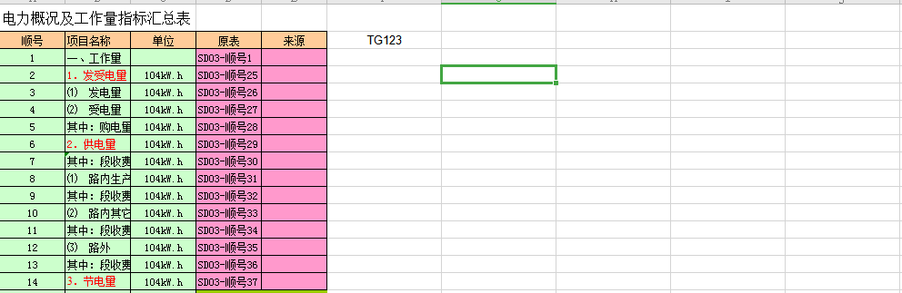


**4、功能描述：动态合并表头列表数据导出(模板中需要标记表头开始位置数据要以 TG 开头)**

**输入：**

| 属性       | 类型                        | 描述                   | 是否必填 |
| ---------- | --------------------------- | ---------------------- | -------- |
| templetId  | String                      | 模板 id                | 必填     |
| entityList | `List<Map<String, Object>>` | 集合（map）            | 必填     |
| headerList | `List<ExcelHeaderModel>`    | 集合（表头实体）       | 必填     |
| sheetIndex | int                         | sheet 的位置（默认 0） |          |
| fontSize   | Short                       | 字体大小               |          |

ExcelHeaderModel 实体属性描述

| 属性       | 类型                     | 描述                                                     |
| ---------- | ------------------------ | -------------------------------------------------------- |
| headerName | String                   | 表头名称（必填）                                         |
| fieldName  | String                   | 表数据对应的字段属性（即是 Map 对象中的 key 值）（必填） |
| headers    | `List<ExcelHeaderModel>` | 表头数据（子类目前只支持一层）                           |

**输出：**byte[] 字节数组

```java
public <T> byte[] exportByMapDynamicMerge(String templetId, List<Map<String, Object>> entityList,List<ExcelHeaderModel> headerList);

public <T> byte[] exportByMapDynamicMerge(String templetId, List<Map<String, Object>> entityList,List<ExcelHeaderModel> headerList, int sheetIndex, Short fontSize);
```

**模板+结果**


**5、功能描述：前端插件选项导出（Map）**

**输入：**

| 属性       | 类型                        | 描述             | 是否必填 |
| ---------- | --------------------------- | ---------------- | -------- |
| entityList | `List<Map<String, Object>>` | 集合（map）      | 必填     |
| headerList | `List<ExcelHeaderData>`     | 集合（表头实体） | 必填     |

ExcelHeaderData 实体属性描述

| 属性       | 类型   | 描述                                                     |
| ---------- | ------ | -------------------------------------------------------- |
| headerName | String | 表头名称（必填）                                         |
| fieldName  | String | 表数据对应的字段属性（即是 Map 对象中的 key 值）（必填） |
| flag       | String | 处理图片数据对应值：photo（选填）                        |

MyPictureData 图片数据对象

| 属性        | 类型   | 描述             |
| ----------- | ------ | ---------------- |
| pictureData | byte[] | 图片数据（必填） |
| row         | int    | 行号（选填）     |
| column      | int    | 列号（选填）     |
| width       | int    | 宽度（选填）     |
| height      | int    | 高度（选填）     |
| fileName    | String | 文件名（必填）   |

**输出：**byte[] 字节数组

```java
public <T> byte[] exportByMapPlugIn(List<Map<String, Object>> entityList, List<ExcelHeaderData> headerList);
```


**6、功能描述：前端插件选项导出**

**输入：**entityList 集合（实体）

​ headerList 集合（表头实体）

| 属性       | 类型                    | 描述             | 是否必填 |
| ---------- | ----------------------- | ---------------- | -------- |
| entityList | `List<T>`               | 集合（实体）     | 必填     |
| headerList | `List<ExcelHeaderData>` | 集合（表头实体） | 必填     |

ExcelHeaderData 实体属性描述

| 属性       | 类型   | 描述                                                     |
| ---------- | ------ | -------------------------------------------------------- |
| headerName | String | 表头名称（必填）                                         |
| fieldName  | String | 表数据对应的字段属性（即是 Map 对象中的 key 值）（必填） |
| flag       | String | 处理图片数据对应值：photo（选填）                        |

MyPictureData 图片数据对象

| 属性        | 类型   | 描述             |
| ----------- | ------ | ---------------- |
| pictureData | byte[] | 图片数据（必填） |
| row         | int    | 行号（选填）     |
| column      | int    | 列号（选填）     |
| width       | int    | 宽度（选填）     |
| height      | int    | 高度（选填）     |
| fileName    | String | 文件名（必填）   |

**输出：**byte[] 字节数组

```java
public <T> byte[] exportByPlugIn(List<T> entityList, List<ExcelHeaderData> headerList);
```


**7、功能描述：用户自定义导出(不处理图片)**

**输入：**

| 属性                | 类型                        | 描述                                        | 是否必填 |
| :------------------ | --------------------------- | ------------------------------------------- | -------- |
| list                | `List<Map<String, Object>>` | 集合（map）                                 | 必填     |
| systemResourcesCode | String                      | 资源码                                      | 必填     |
| userId              | String                      | 用户 Id（用户没有配置，默认资源配置的导出） | 必填     |

**输出：**byte[] 字节数组

```java
public byte[] exportConfigData(List<Map<String, Object>> list,
                               String systemResourcesCode, String userId, String title);
```


**8、功能描述：自定义数据导出;支持多个列表**

**输入：**

| 属性       | 类型                  | **描述**                                                     | 是否必填 |
| ---------- | --------------------- | ------------------------------------------------------------ | -------- |
| map        | `Map<String, String>` | map （列表数据序转成 json 数组的字符串，key 值要以 SV 开头） | 必填     |
| templateId | String                | 模板 id                                                      | 必填     |

**输出：**byte[] 字节数组

```java
public byte[] exportCoustomDataByTemplate(Map<String, String> map, String templateId) throws Exception;
```

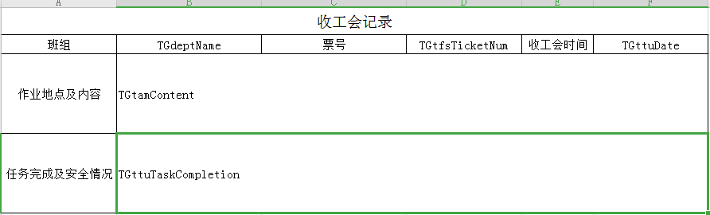

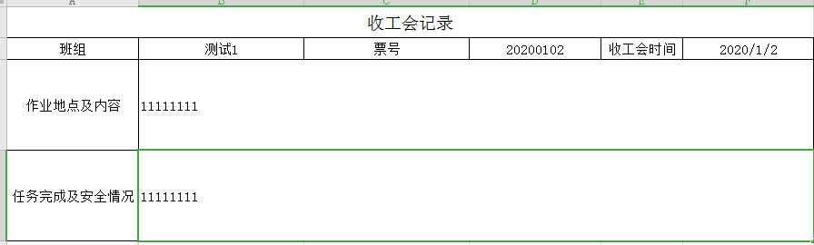

**9、功能描述：模板导出(图片本地服务下载)**

**输入：**

| 属性              | 类型                        | **描述**                   | 是否必填 |
| ----------------- | --------------------------- | -------------------------- | -------- |
| list              | `List<Map<String, Object>>` | 集合（map）                | 必填     |
| templetId         | String                      | 模板 id                    | 必填     |
| errorMsg          | String                      | 错误消息（在最后一行添加） |          |
| fileHandleService | FileHandleService           | 文件服务                   | 必填     |

**输出：**byte[] 字节数组

```java
public byte[] exportDataByMapLocalTemplet(List<Map<String, Object>> list,
                                          String templetId,
                                          FileHandleService fileHandleService);

public byte[] exportDataByMapLocalTemplet(List<Map<String, Object>> list,
                                          String templetId, String errorMsg,
                                          FileHandleService fileHandleService);
```


**10、功能描述：导出列表数据(Map)**

**输入：**

| 属性       | 类型                        | **描述**                                   | 是否必填 |
| ---------- | --------------------------- | ------------------------------------------ | -------- |
| list       | `List<Map<String, Object>>` | 集合（map）                                | 必填     |
| templetId  | String                      | 模板 id                                    | 必填     |
| errorMsg   | String                      | 错误消息（在最后一行添加）                 |          |
| sortColumn | Integer                     | 是否添加序号（不为空时，在第一列添加序号） |          |
| isImg      | Boolean                     | 是否添加图片                               |          |

**输出：**byte[] 字节数组

```java
public byte[] exportDataByMapTemplet(List<Map<String, Object>> list, String templetId);

public byte[] exportDataByMapTemplet(List<Map<String, Object>> list, String templetId, String errorMsg);

public byte[] exportDataByMapTemplet(List<Map<String, Object>> list, String templetId, String errorMsg, Integer sortColumn);

public byte[] exportDataByMapTemplet(List<Map<String, Object>> list, String templetId, String errorMsg, Integer sortColumn, Boolean isImg);
```


**11、功能描述：导出列表数据**

**输入：**

| 属性       | 类型      | **描述**                                   | 是否必填 |
| ---------- | --------- | ------------------------------------------ | -------- |
| list       | `List<T>` | 集合（实体）                               | 必填     |
| templetId  | String    | 模板 id                                    | 必填     |
| errorMsg   | String    | 错误消息（在最后一行添加）                 |          |
| sortColumn | Integer   | 是否添加序号（不为空时，在第一列添加序号） |          |

**输出：**byte[] 字节数组

```java
public <T> byte[] exportDataByTemplet(List<T> entityList, String templetId);

public <T> byte[] exportDataByTemplet(List<T> entityList, String templetId,
                                      String errorMsg);

public <T> byte[] exportDataByTemplet(List<T> entityList, String templetId,
                                      String errorMsg, Integer sort);
```


**12、功能描述：导出详情数据**

**输入：**

| 属性      | 类型                  | **描述**     | 是否必填 |
| --------- | --------------------- | ------------ | -------- |
| map       | `Map<String, Object>` | 数据         | 必填     |
| templetId | String                | 模板 id      | 必填     |
| isStyle   | Boolean               | 是否添加样式 |          |

**输出：**byte[] 字节数组

```java
public byte[] exportDataDetailByTemplet(Map<String, Object> map, String templetId);

public byte[] exportDataDetailByTemplet(Map<String, Object> map, String templetId,
                                        Boolean isStyle);
```


**13、功能描述：导出列表和详情数据**

**输入：**

| 属性          | 类型                        | **描述**                        | 是否必填 |
| ------------- | --------------------------- | ------------------------------- | -------- |
| detailMap     | `Map<String, Object>`       | 详情数据                        | 必填     |
| columnMaps    | `List<Map<String, Object>>` | 列表数据 1 (以 SV 开头的标记)   | 必填     |
| column2Maps   | `List<Map<String, Object>>` | 列表数据 2 (以 SVR\_开头的标记) |          |
| templetId     | String                      | 模板 id                         | 必填     |
| isSort        | Boolean                     | 是否添加序号                    |          |
| isStyle       | Boolean                     | 是否设置样式                    |          |
| detailIsStyle | Boolean                     | 是否设置列表样式                |          |

**输出：**byte[] 字节数组

```java
public byte[] exportDataDetailColumnByTemplet(Map<String, Object> detailMap, List<Map<String, Object>> columnMaps,String templetId, Boolean isSort);

public byte[] exportDataDetailColumnByTemplet(Map<String, Object> detailMap, List<Map<String, Object>> columnMaps,String templetId, Boolean isSort, Boolean isStyle);

public byte[] exportDataDetailColumnByTemplet(Map<String, Object> detailMap, List<Map<String, Object>> columnMaps, String templetId, Boolean isSort, Boolean isStyle, Boolean detailIsStyle);

public byte[] exportDataDetailColumnByTemplet(Map<String, Object> detailMap, List<Map<String, Object>> columnMaps, String templetId, Boolean isSort, CellStyle style);

public byte[] exportDataDetailColumnByTemplet(Map<String, Object> detailMap, List<Map<String, Object>> columnMaps, String templetId, Boolean isSort, CellStyle detailStyle, CellStyle columnStyle);

public byte[] exportDataDetailColumnByTemplet(Map<String, Object> detailMap,
List<Map<String, Object>> columnMaps, List<Map<String, Object>> column2Maps,
 String templetId, Boolean isSort, Boolean isStyle,Boolean detailIsStyle);

```


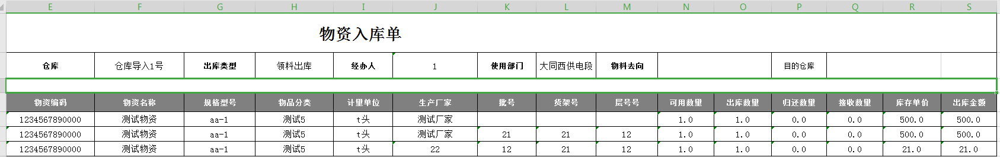

**13-1、功能描述：导出列表和详情数据(固定列的数据)**

**输入：**

| 属性            | 类型                        | **描述**               | 是否必填 |
| --------------- | --------------------------- | ---------------------- | -------- |
| detailMap       | `Map<String, Object>`       | 详情数据               | 必填     |
| columnMaps      | `List<Map<String, Object>>` | 列表数据               | 必填     |
| templetId       | String                      | 模板 id                | 必填     |
| isSort          | Boolean                     | 是否添加序号           |          |
| mergedRowNum    | Integer                     | 合并行数               | 必填     |
| fixedColumn     | Integer                     | 固定列的数据复制并赋值 | 必填     |
| startRowNum     | Integer                     | 数据解析的开始行数     | 必填     |
| remarkColumnNum | Integer                     | 备注要合并单元格固定列 |          |
| remark          | String                      | 备注填写数据           |          |

**输出：**byte[] 字节数组

```java
public byte[] exportDataDetailColumnByTemplet(Map<String, Object> detailMap, List<Map<String, Object>> columnMaps, String templetId, Boolean isSort, Integer mergedRowNum, Integer fixedColumn, Integer startRowNum, Integer remarkColumnNum,
String remark);
```


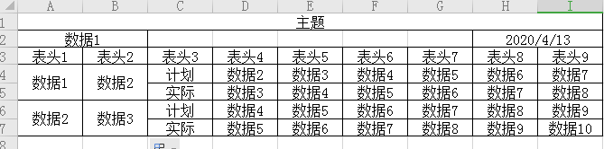

**14、功能描述：导出列表和详情多个 sheet 数据**

**输入：**

| 属性            | 类型                           | **描述**                  | 是否必填 |
| --------------- | ------------------------------ | ------------------------- | -------- |
| listDatas       | `List<ExportMoreSheetRequest>` | 详情、列表和 sheet 名数据 | 必填     |
| templetId       | String                         | 模板 id                   | 必填     |
| isSort          | Boolean                        | 是否添加序号              |          |
| fixedColumn     | Integer                        | 固定列的数据复制并赋值    | 必填     |
| startRowNum     | Integer                        | 数据解析的开始行数        | 必填     |
| remarkColumnNum | Integer                        | 备注要合并单元格固定列    |          |
| remark          | String                         | 备注填写数据              |          |

ExportMoreSheetRequest 实体属性描述

| 属性      | 类型                       | **描述** |
| --------- | -------------------------- | -------- |
| title     | String                     | 主题     |
| sheetName | String                     | sheet 名 |
| headers   | `List<ExcelHeaderData>`    | 表头     |
| datas     | `List<Map<String,Object>>` | 列表数据 |
| details   | `Map<String,Object>`       | 详情数据 |

ExcelHeaderData 实体属性描述

| 属性       | 类型   | 描述                                                     |
| ---------- | ------ | -------------------------------------------------------- |
| headerName | String | 表头名称（必填）                                         |
| fieldName  | String | 表数据对应的字段属性（即是 Map 对象中的 key 值）（必填） |
| flag       | String | 处理图片数据对应值：photo（选填）                        |

MyPictureData 图片数据对象

| 属性        | 类型   | 描述             |
| ----------- | ------ | ---------------- |
| pictureData | byte[] | 图片数据（必填） |
| row         | int    | 行号（选填）     |
| column      | int    | 列号（选填）     |
| width       | int    | 宽度（选填）     |
| height      | int    | 高度（选填）     |
| fileName    | String | 文件名（必填）   |

**输出：**byte[] 字节数组

```java
public byte[] exportDataDetailColumnMoreSheetByTemplet(List<ExportMoreSheetRequest> listDatas, String templetId, Boolean isSort, Integer mergedRowNum, Integer fixedColumn, Integer startRowNum, Integer remarkColumnNum, String remark);
```

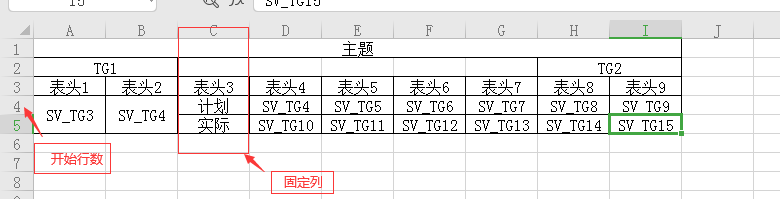


**15、功能描述：导出列表数据（多 sheet）**

**输入：**

| 属性      | 类型                              | **描述**     | 是否必填 |
| --------- | --------------------------------- | ------------ | -------- |
| list      | `List<List<Map<String, Object>>>` | 集合（map）  | 必填     |
| templetId | String                            | 模板 id      | 必填     |
| sort      | Integer                           | 是否添加序号 |          |

**输出：**byte[] 字节数组

```java
public byte[] exportDataMoreSheetByMapTemplet(List<List<Map<String, Object>>> list, String templetId);

public byte[] exportDataMoreSheetByMapTemplet(List<List<Map<String, Object>>> list, String templetId, Integer sort);


```


**16、功能描述：导出多个 sheet 列表数据**

**输入：**

| 属性       | 类型            | **描述**     | 是否必填 |
| ---------- | --------------- | ------------ | -------- |
| entityList | `List<List<T>>` | 集合（实体） | 必填     |
| sheetNames | `List<String>`  | sheet 名集合 | 必填     |
| templetId  | String          | 模板 id      | 必填     |
| sort       | Integer         | 是否添加序号 |          |
| fontSize   | Short           | 字体大小     |          |

**输出：**byte[] 字节数组

```java
public <T> byte[] exportDataMoreSheetByTemplet(List<List<T>> entityList,
                                               String templetId);

public <T> byte[] exportDataMoreSheetByTemplet(List<List<T>> entityList,
                                               String templetId, Integer sort);

public <T> byte[] exportDataMoreSheetByTemplet(List<List<T>> entityList, List<String> sheetNames, String templetId, Integer sort, Short fontSize);
```


**17、功能描述：导出多个 sheet 列表数据**

**输入：**

| 属性       | 类型                   | **描述**                                | 是否必填 |
| ---------- | ---------------------- | --------------------------------------- | -------- |
| entityList | `List<List<T>>`        | 集合（实体）                            | 必填     |
| sheetNames | `List<TitleSheetName>` | sheet 名+主题                           | 必填     |
| templetId  | String                 | 模板 id                                 | 必填     |
| sort       | Integer                | 是否添加序号                            |          |
| fontSize   | Short                  | 字体大小                                |          |
| landscape  | boolean                | 打印方向，true：横向，false：纵向(默认) |          |

TitleSheetName 实体属性描述

| 属性      | 类型   | **描述** |
| --------- | ------ | -------- |
| titleName | String | 主题     |
| sheetName | String | sheet 名 |

**输出：**byte[] 字节数组

```java
public <T> byte[] exportDataMoreSheetTitleByTemplet(List<List<T>> entityList, List<TitleSheetName> sheetNames, String templetId, Integer sort);

public <T> byte[] exportDataMoreSheetTitleByTemplet(List<List<T>> entityList, List<TitleSheetName> sheetNames, String templetId, Integer sort, Short fontSize);

public <T> byte[] exportDataMoreSheetTitleByTemplet(List<List<T>> entityList, List<TitleSheetName> sheetNames, String templetId, Integer sort, Short fontSize,
boolean landscape);
```


**18、功能描述：详情数据导出**

**输入：**

| 属性       | 类型                  | **描述** | 是否必填 |
| ---------- | --------------------- | -------- | -------- |
| templetId  | String                | 模板 id  | 必填     |
| detailMaps | `Map<String, Object>` | map 数据 | 必填     |

**输出：**byte[] 字节数组

```java
public byte[] exportDetailByTemplet(String templetId, Map<String, Object> detailMaps);
```


**18-1、功能描述：详情数据导出(多个 sheet)**

**输入：**

| 属性       | 类型                        | **描述**    | 是否必填 |
| ---------- | --------------------------- | ----------- | -------- |
| templetId  | String                      | 模板 id     | 必填     |
| detailMaps | `List<Map<String, Object>>` | 集合（map） | 必填     |

**输出：**byte[] 字节数组

```java
public byte[] exportDetailByTemplet(String templetId,
                                    List<Map<String, Object>> detailMaps);
```


**19、功能描述：模板导出(图片本地服务下载)**

**输入：**

| 属性              | 类型                        | \*_描述_    | 是否必填 |
| ----------------- | --------------------------- | ----------- | -------- |
| list              | `List<Map<String, Object>>` | 集合（map） | 必填     |
| templetId         | String                      | 模板 id     | 必填     |
| errorMsg          | String                      | 错误提示    |          |
| fileHandleService | FileHandleService           | 文件服务    | 必填     |

**输出：**字符串（文件本地路径）

```java
public String exportFilePathByMapLocalTemplet(List<Map<String, Object>> list,
String templetId,FileHandleService fileHandleService);

public String exportFilePathByMapLocalTemplet(List<Map<String, Object>> list,
String templetId, String errorMsg, FileHandleService fileHandleService);
```


**20、功能描述：导出数据**

**输入：**

| 属性      | 类型      | \*_描述_     | 是否必填 |
| --------- | --------- | ------------ | -------- |
| list      | `List<T>` | 集合（实体） | 必填     |
| templetId | String    | 模板 id      | 必填     |
| errorMsg  | String    | 错误提示     |          |

**输出：**字符串（文件本地路径）

```java
public <T> String exportFilePathByTemplet(List<T> entityList, String templetId);

public <T> String exportFilePathByTemplet(List<T> entityList, String templetId,
                                          String errorMsg);
```

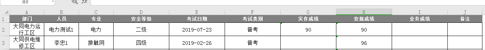

**21、功能描述：wordDocx 文档导出**

**输入：**

| 属性   | 类型                  | \*_描述_ | 是否必填 |
| ------ | --------------------- | -------- | -------- |
| map    | `Map<String, Object>` | 数据     | 必填     |
| mapPic | `Map<String, Object>` | 图片数据 |          |

**输出：**byte[] 字节数组

```java
public byte[] wordDocxExport(Map<String, Object> map, Map<String, Object> mapPic);
```


**22、功能描述：word 文档导出**

**输入：**

| 属性 | 类型                  | \*_描述_ | 是否必填 |
| ---- | --------------------- | -------- | -------- |
| map  | `Map<String, Object>` | 数据     | 必填     |

**输出：**byte[] 字节数组

```java
public byte[] wordExport(Map<String, Object> map);
```


### 2.5 缓存

​ 平台缓存使用的是 Redis 框架，开发了 togest-cache 模块。


com.togest.config:实例化 RedisTemplate、RedisCacheAspect、RedisService、RedisUtils

con.togest.aspect:切面类，处理基于 RedisCacheable、RedisCacheEvict、RedisCachePut 注解的缓存查询、更新、删除

con.togest.annotation:定义缓存注解

com.togest.common:缓存常量定义

com.togest.service:Redis 操作包，主要定义了 RedisService、RedisUtils、RedisLockService、单据号实现

#### 2.5.1 缓存注解

**RedisCacheable -查询注解**

| 方法                    | 描述                                                           |
| ----------------------- | -------------------------------------------------------------- |
| String cacheName()      | 缓存开头 KEY                                                   |
| Class entityClass()     | 实体 CLASS                                                     |
| StorageFormat storage() | 存储方式，枚举，包括 SERIALIZE(0), JSON(1), JSONLIST(3),MAP(2) |
| String key()            | 定义 key，以#开头，后跟参数。如果对象则#obj.prop               |
| long expire() default 0 | 过期时间                                                       |
| TimeUnit timeUnit();    | 过期单位                                                       |

**RedisCachePut -更新注解**

| 方法                    | 描述                                                           |
| ----------------------- | -------------------------------------------------------------- |
| String cacheName()      | 缓存开头 KEY                                                   |
| StorageFormat storage() | 存储方式，枚举，包括 SERIALIZE(0), JSON(1), JSONLIST(3),MAP(2) |
| String key()            | 定义 key，以#开头，后跟参数。如果对象则#obj.prop               |
| long expire() default 0 | 过期时间                                                       |
| TimeUnit timeUnit();    | 过期单位                                                       |

**RedisCacheEvict -删除注解**

| 方法               | 描述                                             |
| ------------------ | ------------------------------------------------ |
| String cacheName() | 缓存开头 KEY                                     |
| String key()       | 定义 key，以#开头，后跟参数。如果对象则#obj.prop |

**注解使用举例**


#### 2.5.2 缓存 API

**RedisService 方法如下，** 使用时，可以直接@Autowired

```java
void delete(String key);
<T> List<T> getListJson(String key, Class<T> c);
void setMap(String key, Object obj, Long expireTime);
void delete(String... key);
void deleteByPrex(String prex);
Object get(String key);
 <T> T get(String key, boolean retain, Class<T> clazz);
 <T> T get(String key, Class<T> clazz);
 void expire(String key, Long expireTime);
 void setJson(String key, Object value, Long expireTime);
 <T> T getJson(String key, Class<T> c);
 void set(String key, Object value, Long expireTime);
 void set(String key, Object value);
 <T> List<T> getMulti(Collection<String> keys, Class<T> clazz);
 void setMulti(Map<String, Object> objects);
 <T> void setMap(String key, Map<Object, T> map, Long expireTime);
 <T> void setMap(String key, Map<String, T> map);
 void setMap(String key, String field, String value);
 <T> Map<String, T> getMap(String key, Class<T> clazz);
 <T> T getMapField(String key, String field, Class<T> clazz);
 void deleteMapField(String key, String... field);
 void set(String key, String... value);
 void delete(String key, String... value);
 <T> List<T> getMapByPipelined(final List<String> keys, Class<T> clazz);
 <T> List<T> getByPipelined(final List<String> keys, Class<T> clazz);
 <T> List<T> setMapByPipelined(
			final List<Map<String, Object>> values, Class<T> clazz);
 <T> List<T> set(final Map<String, Object> values, Class<T> clazz);
 <T> List<T> getMapByPipelined(final List<String> keys,
			final String[] fields, Class<T> clazz);
 <T> T rightProp(String key,int timeout, Class<T> clazz);
 <T> long leftPush(String key, T data);
```

**RedisUtil 方法如下，** 该类针对 RedisTemplate 做了简单封装，使用时，可以直接@Autowired

```java
    public void delete(String key);
	/**
	 * 批量删除key
	 *
	 * @param keys
	 */
	public void delete(Collection<String> keys) ;
	/**
	 * 序列化key
	 *
	 * @param key
	 * @return
	 */
	public byte[] dump(String key) ;
	/**
	 * 是否存在key
	 *
	 * @param key
	 * @return
	 */
	public Boolean hasKey(String key);
	/**
	 * 设置过期时间
	 *
	 * @param key
	 * @param timeout
	 * @param unit
	 * @return
	 */
	public Boolean expire(String key, long timeout, TimeUnit unit) ;

	/**
	 * 设置过期时间
	 *
	 * @param key
	 * @param date
	 * @return
	 */
	public Boolean expireAt(String key, Date date) ;

	/**
	 * 查找匹配的key
	 *
	 * @param pattern
	 * @return
	 */
	public Set<String> keys(String pattern) ;
	/**
	 * 将当前数据库的 key 移动到给定的数据库 db 当中
	 *
	 * @param key
	 * @param dbIndex
	 * @return
	 */
	public Boolean move(String key, int dbIndex) ;
	/**
	 * 移除 key 的过期时间，key 将持久保持
	 *
	 * @param key
	 * @return
	 */
	public Boolean persist(String key) ;
	/**
	 * 返回 key 的剩余的过期时间
	 *
	 * @param key
	 * @param unit
	 * @return
	 */
	public Long getExpire(String key, TimeUnit unit) ;
	/**
	 * 返回 key 的剩余的过期时间
	 *
	 * @param key
	 * @return
	 */
	public Long getExpire(String key) ;
	/**
	 * 从当前数据库中随机返回一个 key
	 *
	 * @return
	 */
	public String randomKey() ;
	/**
	 * 修改 key 的名称
	 *
	 * @param oldKey
	 * @param newKey
	 */
	public void rename(String oldKey, String newKey);

	/**
	 * 仅当 newkey 不存在时，将 oldKey 改名为 newkey
	 *
	 * @param oldKey
	 * @param newKey
	 * @return
	 */
	public Boolean renameIfAbsent(String oldKey, String newKey);
	/**
	 * 返回 key 所储存的值的类型
	 *
	 * @param key
	 * @return
	 */
	public DataType type(String key) ;

	/** -------------------string相关操作--------------------- */

	/**
	 * 设置指定 key 的值
	 * @param key
	 * @param value
	 */
	public void set(String key, String value) ;
	/**
	 * 获取指定 key 的值
	 * @param key
	 * @return
	 */
	public Object get(String key);

	/**
	 * 返回 key 中字符串值的子字符
	 * @param key
	 * @param start
	 * @param end
	 * @return
	 */
	public String getRange(String key, long start, long end);

	/**
	 * 将给定 key 的值设为 value ，并返回 key 的旧值(old value)
	 *
	 * @param key
	 * @param value
	 * @return
	 */
	public Object getAndSet(String key, String value) ;

	/**
	 * 对 key 所储存的字符串值，获取指定偏移量上的位(bit)
	 *
	 * @param key
	 * @param offset
	 * @return
	 */
	public Boolean getBit(String key, long offset) ;
	/**
	 * 批量获取
	 *
	 * @param keys
	 * @return
	 */
	public List multiGet(Collection<String> keys);

	/**
	 * 设置ASCII码, 字符串'a'的ASCII码是97, 转为二进制是'01100001', 此方法是将二进制第offset位值变为value
	 *
	 * @param key
	 *            位置
	 * @param value
	 *            值,true为1, false为0
	 * @return
	 */
	public boolean setBit(String key, long offset, boolean value) ;

	/**
	 * 将值 value 关联到 key ，并将 key 的过期时间设为 timeout
	 *
	 * @param key
	 * @param value
	 * @param timeout
	 *            过期时间
	 * @param unit
	 *            时间单位, 天:TimeUnit.DAYS 小时:TimeUnit.HOURS 分钟:TimeUnit.MINUTES
	 *            秒:TimeUnit.SECONDS 毫秒:TimeUnit.MILLISECONDS
	 */
	public void setEx(String key, String value, long timeout, TimeUnit unit);

	/**
	 * 只有在 key 不存在时设置 key 的值
	 *
	 * @param key
	 * @param value
	 * @return 之前已经存在返回false,不存在返回true
	 */
	public boolean setIfAbsent(String key, String value) ;

	/**
	 * 用 value 参数覆写给定 key 所储存的字符串值，从偏移量 offset 开始
	 *
	 * @param key
	 * @param value
	 * @param offset
	 *            从指定位置开始覆写
	 */
	public void setRange(String key, String value, long offset) ;

	/**
	 * 获取字符串的长度
	 *
	 * @param key
	 * @return
	 */
	public Long size(String key) ;

	/**
	 * 批量添加
	 *
	 * @param maps
	 */
	public void multiSet(Map<String, String> maps) ;

	/**
	 * 同时设置一个或多个 key-value 对，当且仅当所有给定 key 都不存在
	 *
	 * @param maps
	 * @return 之前已经存在返回false,不存在返回true
	 */
	public boolean multiSetIfAbsent(Map<String, String> maps);

	/**
	 * 增加(自增长), 负数则为自减
	 *

	 * @return
	 */
	public Long incrBy(String key, long increment);

	/**
	 *
	 * @return
	 */
	public Double incrByFloat(String key, double increment);

	/**
	 * 追加到末尾
	 *
	 * @param key
	 * @param value
	 * @return
	 */
	public Integer append(String key, String value) ;


	/**
	 * 获取所有给定字段的值
	 *
	 * @param key
	 * @param fields
	 * @return
	 */
	public List hMultiGet(String key, Collection fields) ;

	public void hPut(String key, String hashKey, String value) ;

	public void hPutAll(String key, Map<String, String> maps;

	/**
	 * 仅当hashKey不存在时才设置
	 *
	 * @param key
	 * @param hashKey
	 * @param value
	 * @return
	 */
	public Boolean hPutIfAbsent(String key, String hashKey, String value);

	/**
	 * 删除一个或多个哈希表字段
	 *
	 * @param key
	 * @param fields
	 * @return
	 */
	public Long hDelete(String key, Object... fields);

	/**
	 * 查看哈希表 key 中，指定的字段是否存在
	 *
	 * @param key
	 * @param field
	 * @return
	 */
	public boolean hExists(String key, String field) ;

	/**
	 * 为哈希表 key 中的指定字段的整数值加上增量 increment
	 *
	 * @param key
	 * @param field
	 * @param increment
	 * @return
	 */
	public Long hIncrBy(String key, Object field, long increment);

	/**
	 * 为哈希表 key 中的指定字段的整数值加上增量 increment
	 *
	 * @param key
	 * @param field
	 * @param delta
	 * @return
	 */
	public Double hIncrByFloat(String key, Object field, double delta);

	/**
	 * 获取所有哈希表中的字段
	 *
	 * @param key
	 * @return
	 */
	public Set<Object> hKeys(String key);

	/**
	 * 获取哈希表中字段的数量
	 *
	 * @param key
	 * @return
	 */
	public Long hSize(String key);

	/**
	 * 获取哈希表中所有值
	 *
	 * @param key
	 * @return
	 */
	public List<Object> hValues(String key) ;

	/**
	 * 迭代哈希表中的键值对
	 *
	 * @param key
	 * @param options
	 * @return
	 */
	public Cursor<Map.Entry<Object, Object>> hScan(String key, ScanOptions options);

	/** ------------------------list相关操作---------------------------- */

	/**
	 * 通过索引获取列表中的元素
	 *
	 * @param key
	 * @param index
	 * @return
	 */
	public Object lIndex(String key, long index) ;
	/**
	 * 获取列表指定范围内的元素
	 *
	 * @param key
	 * @param start
	 *            开始位置, 0是开始位置
	 * @param end
	 *            结束位置, -1返回所有
	 * @return
	 */
	public List<Object> lRange(String key, long start, long end);

	/**
	 * 存储在list头部
	 *
	 * @param key
	 * @param value
	 * @return
	 */
	public Long lLeftPush(String key, String value);

	/**
	 *
	 * @param key
	 * @param value
	 * @return
	 */
	public Long lLeftPushAll(String key, String... value);

	/**
	 *
	 * @param key
	 * @param value
	 * @return
	 */
	public Long lLeftPushAll(String key, Collection<String> value) ;

	/**
	 * 当list存在的时候才加入
	 *
	 * @param key
	 * @param value
	 * @return
	 */
	public Long lLeftPushIfPresent(String key, String value) ;

	/**
	 * 如果pivot存在,再pivot前面添加
	 *
	 * @param key
	 * @param pivot
	 * @param value
	 * @return
	 */
	public Long lLeftPush(String key, String pivot, String value);

	/**
	 *
	 * @param key
	 * @param value
	 * @return
	 */
	public Long lRightPush(String key, String value);

	/**
	 *
	 * @param key
	 * @param value
	 * @return
	 */
	public Long lRightPushAll(String key, String... value);

	/**
	 *
	 * @param key
	 * @param value
	 * @return
	 */
	public Long lRightPushAll(String key, Collection<String> value) ;

	/**
	 * 为已存在的列表添加值
	 *
	 * @param key
	 * @param value
	 * @return
	 */
	public Long lRightPushIfPresent(String key, String value);

	/**
	 * 在pivot元素的右边添加值
	 *
	 * @param key
	 * @param pivot
	 * @param value
	 * @return
	 */
	public Long lRightPush(String key, String pivot, String value);

	/**
	 * 通过索引设置列表元素的值
	 *
	 * @param key
	 * @param index
	 *            位置
	 * @param value
	 */
	public void lSet(String key, long index, String value) ;

	/**
	 * 移出并获取列表的第一个元素
	 *
	 * @param key
	 * @return 删除的元素
	 */
	public Object lLeftPop(String key);

	/**
	 * 移出并获取列表的第一个元素， 如果列表没有元素会阻塞列表直到等待超时或发现可弹出元素为止
	 *
	 * @param key
	 * @param timeout
	 *            等待时间
	 * @param unit
	 *            时间单位
	 * @return
	 */
	public Object lBLeftPop(String key, long timeout, TimeUnit unit);

	/**
	 * 移除并获取列表最后一个元素
	 *
	 * @param key
	 * @return 删除的元素
	 */
	public Object lRightPop(String key) ;

	/**
	 * 移出并获取列表的最后一个元素， 如果列表没有元素会阻塞列表直到等待超时或发现可弹出元素为止
	 *
	 * @param key
	 * @param timeout
	 *            等待时间
	 * @param unit
	 *            时间单位
	 * @return
	 */
	public Object lBRightPop(String key, long timeout, TimeUnit unit);

	/**
	 * 移除列表的最后一个元素，并将该元素添加到另一个列表并返回
	 *
	 * @param sourceKey
	 * @param destinationKey
	 * @return
	 */
	public Object lRightPopAndLeftPush(String sourceKey, String destinationKey);

	/**
	 * 从列表中弹出一个值，将弹出的元素插入到另外一个列表中并返回它； 如果列表没有元素会阻塞列表直到等待超时或发现可弹出元素为止
	 *
	 * @param sourceKey
	 * @param destinationKey
	 * @param timeout
	 * @param unit
	 * @return
	 */
	public Object lBRightPopAndLeftPush(String sourceKey, String destinationKey,
										long timeout, TimeUnit unit) ;

	/**
	 * 删除集合中值等于value得元素
	 *
	 * @param key
	 * @param index
	 *            index=0, 删除所有值等于value的元素; index>0, 从头部开始删除第一个值等于value的元素;
	 *            index<0, 从尾部开始删除第一个值等于value的元素;
	 * @param value
	 * @return
	 */
	public Long lRemove(String key, long index, String value) ;

	/**
	 * 裁剪list
	 *
	 * @param key
	 * @param start
	 * @param end
	 */
	public void lTrim(String key, long start, long end);

	/**
	 * 获取列表长度
	 *
	 * @param key
	 * @return
	 */
	public Long lLen(String key) ;

	/** --------------------set相关操作-------------------------- */

	/**
	 * set添加元素
	 *
	 * @param key
	 * @param values
	 * @return
	 */
	public Long sAdd(String key, String... values) ;

	/**
	 * set移除元素
	 *
	 * @param key
	 * @param values
	 * @return
	 */
	public Long sRemove(String key, Object... values) ;

	/**
	 * 移除并返回集合的一个随机元素
	 *
	 * @param key
	 * @return
	 */
	public Object sPop(String key);

	/**
	 * 将元素value从一个集合移到另一个集合
	 *
	 * @param key
	 * @param value
	 * @param destKey
	 * @return
	 */
	public Boolean sMove(String key, String value, String destKey) ;

	/**
	 * 获取集合的大小
	 *
	 * @param key
	 * @return
	 */
	public Long sSize(String key) ;

	/**
	 * 判断集合是否包含value
	 *
	 * @param key
	 * @param value
	 * @return
	 */
	public Boolean sIsMember(String key, Object value);

	/**
	 * 获取两个集合的交集
	 *
	 * @param key
	 * @param otherKey
	 * @return
	 */
	public Set sIntersect(String key, String otherKey) ;

	/**
	 * 获取key集合与多个集合的交集
	 *
	 * @param key
	 * @param otherKeys
	 * @return
	 */
	public Set sIntersect(String key, Collection<String> otherKeys) ;

	/**
	 * key集合与otherKey集合的交集存储到destKey集合中
	 *
	 * @param key
	 * @param otherKey
	 * @param destKey
	 * @return
	 */
	public Long sIntersectAndStore(String key, String otherKey, String destKey);

	/**
	 * key集合与多个集合的交集存储到destKey集合中
	 *
	 * @param key
	 * @param otherKeys
	 * @param destKey
	 * @return
	 */
	public Long sIntersectAndStore(String key, Collection<String> otherKeys,
								   String destKey);

	/**
	 * 获取两个集合的并集
	 *
	 * @param key
	 * @param otherKeys
	 * @return
	 */
	public Set sUnion(String key, String otherKeys);

	/**
	 * 获取key集合与多个集合的并集
	 *
	 * @param key
	 * @param otherKeys
	 * @return
	 */
	public Set sUnion(String key, Collection<String> otherKeys);

	/**
	 * key集合与otherKey集合的并集存储到destKey中
	 *
	 * @param key
	 * @param otherKey
	 * @param destKey
	 * @return
	 */
	public Long sUnionAndStore(String key, String otherKey, String destKey);

	/**
	 * key集合与多个集合的并集存储到destKey中
	 *
	 * @param key
	 * @param otherKeys
	 * @param destKey
	 * @return
	 */
	public Long sUnionAndStore(String key, Collection<String> otherKeys,
							   String destKey);

	/**
	 * 获取两个集合的差集
	 *
	 * @param key
	 * @param otherKey
	 * @return
	 */
	public Set sDifference(String key, String otherKey) ;

	/**
	 * 获取key集合与多个集合的差集
	 *
	 * @param key
	 * @param otherKeys
	 * @return
	 */
	public Set sDifference(String key, Collection<String> otherKeys);

	/**
	 * key集合与otherKey集合的差集存储到destKey中
	 *
	 * @param key
	 * @param otherKey
	 * @param destKey
	 * @return
	 */
	public Long sDifference(String key, String otherKey, String destKey);

	/**
	 * key集合与多个集合的差集存储到destKey中
	 *
	 * @param key
	 * @param otherKeys
	 * @param destKey
	 * @return
	 */
	public Long sDifference(String key, Collection<String> otherKeys,
							String destKey) ;


	public Set setMembers(String key) ;

	/**
	 * 随机获取集合中的一个元素
	 *
	 * @param key
	 * @return
	 */
	public Object sRandomMember(String key) ;

	/**
	 * 随机获取集合中count个元素
	 *
	 * @param key
	 * @param count
	 * @return
	 */
	public List sRandomMembers(String key, long count);

	/**
	 * 随机获取集合中count个元素并且去除重复的
	 *
	 * @param key
	 * @param count
	 * @return
	 */
	public Set sDistinctRandomMembers(String key, long count) ;

	/**
	 *
	 * @param key
	 * @param options
	 * @return
	 */
	public Cursor sScan(String key, ScanOptions options);

	/**------------------zSet相关操作--------------------------------*/

	/**
	 * 添加元素,有序集合是按照元素的score值由小到大排列
	 *
	 * @param key
	 * @param value
	 * @param score
	 * @return
	 */
	public Boolean zAdd(String key, String value, double score);

	/**
	 *
	 * @param key
	 * @param values
	 * @return
	 */
	public Long zAdd(String key, Set<ZSetOperations.TypedTuple<Object>> values);

	/**
	 *
	 * @param key
	 * @param values
	 * @return
	 */
	public Long zRemove(String key, Object... values);

	/**
	 * 增加元素的score值，并返回增加后的值
	 *
	 * @param key
	 * @param value
	 * @param delta
	 * @return
	 */
	public Double zIncrementScore(String key, String value, double delta) ;

	/**
	 * 返回元素在集合的排名,有序集合是按照元素的score值由小到大排列
	 *
	 * @param key
	 * @param value
	 * @return 0表示第一位
	 */
	public Long zRank(String key, Object value);

	/**
	 * 返回元素在集合的排名,按元素的score值由大到小排列
	 *
	 * @param key
	 * @param value
	 * @return
	 */
	public Long zReverseRank(String key, Object value) ;

	/**
	 * 获取集合的元素, 从小到大排序
	 *
	 * @param key
	 * @param start
	 *            开始位置
	 * @param end
	 *            结束位置, -1查询所有
	 * @return
	 */
	public Set zRange(String key, long start, long end) ;

	/**
	 * 获取集合元素, 并且把score值也获取
	 *
	 * @param key
	 * @param start
	 * @param end
	 * @return
	 */
	public Set<ZSetOperations.TypedTuple<Object>> zRangeWithScores(String key, long start,
																   long end) ;

	/**
	 * 根据Score值查询集合元素
	 *
	 * @param key
	 * @param min
	 *            最小值
	 * @param max
	 *            最大值
	 * @return
	 */
	public Set zRangeByScore(String key, double min, double max) ;

	/**
	 * 根据Score值查询集合元素, 从小到大排序
	 *
	 * @param key
	 * @param min
	 *            最小值
	 * @param max
	 *            最大值
	 * @return
	 */
	public Set<ZSetOperations.TypedTuple<Object>> zRangeByScoreWithScores(String key,
																		  double min, double max);

	/**
	 *
	 * @param key
	 * @param min
	 * @param max
	 * @param start
	 * @param end
	 * @return
	 */
	public Set<ZSetOperations.TypedTuple<Object>> zRangeByScoreWithScores(String key,
																		  double min, double max, long start, long end) ;

	/**
	 * 获取集合的元素, 从大到小排序
	 *
	 * @param key
	 * @param start
	 * @param end
	 * @return
	 */
	public Set zReverseRange(String key, long start, long end) ;

	/**
	 * 获取集合的元素, 从大到小排序, 并返回score值
	 *
	 * @param key
	 * @param start
	 * @param end
	 * @return
	 */
	public Set<ZSetOperations.TypedTuple<Object>> zReverseRangeWithScores(String key,
																		  long start, long end);

	/**
	 * 根据Score值查询集合元素, 从大到小排序
	 *
	 * @param key
	 * @param min
	 * @param max
	 * @return
	 */
	public Set zReverseRangeByScore(String key, double min,
											double max) ;

	/**
	 * 根据Score值查询集合元素, 从大到小排序
	 *
	 * @param key
	 * @param min
	 * @param max
	 * @return
	 */
	public Set<ZSetOperations.TypedTuple<Object>> zReverseRangeByScoreWithScores(
			String key, double min, double max) ;

	/**
	 *
	 * @param key
	 * @param min
	 * @param max
	 * @param start
	 * @param end
	 * @return
	 */
	public Set zReverseRangeByScore(String key, double min,
											double max, long start, long end) ;

	/**
	 * 根据score值获取集合元素数量
	 *
	 * @param key
	 * @param min
	 * @param max
	 * @return
	 */
	public Long zCount(String key, double min, double max) ;

	/**
	 * 获取集合大小
	 *
	 * @param key
	 * @return
	 */
	public Long zSize(String key);

	/**
	 * 获取集合大小
	 *
	 * @param key
	 * @return
	 */
	public Long zZCard(String key);

	/**
	 * 获取集合中value元素的score值
	 *
	 * @param key
	 * @param value
	 * @return
	 */
	public Double zScore(String key, Object value);

	/**
	 * 移除指定索引位置的成员
	 *
	 * @param key
	 * @param start
	 * @param end
	 * @return
	 */
	public Long zRemoveRange(String key, long start, long end) ;

	/**
	 * 根据指定的score值的范围来移除成员
	 *
	 * @param key
	 * @param min
	 * @param max
	 * @return
	 */
	public Long zRemoveRangeByScore(String key, double min, double max);

	/**
	 * 获取key和otherKey的并集并存储在destKey中
	 *
	 * @param key
	 * @param otherKey
	 * @param destKey
	 * @return
	 */
	public Long zUnionAndStore(String key, String otherKey, String destKey) ;

	/**
	 *
	 * @param key
	 * @param otherKeys
	 * @param destKey
	 * @return
	 */
	public Long zUnionAndStore(String key, Collection<String> otherKeys,
							   String destKey);

	/**
	 * 交集
	 *
	 * @param key
	 * @param otherKey
	 * @param destKey
	 * @return
	 */
	public Long zIntersectAndStore(String key, String otherKey,
								   String destKey);

	/**
	 * 交集
	 *
	 * @param key
	 * @param otherKeys
	 * @param destKey
	 * @return
	 */
	public Long zIntersectAndStore(String key, Collection<String> otherKeys,
								   String destKey) ;

	/**
	 *
	 * @param key
	 * @param options
	 * @return
	 */
	public Cursor<ZSetOperations.TypedTuple<Object>> zScan(String key, ScanOptions options);

	public Object eval(final String script, final List<String> keys, final List<String> args) ;
	public String set(final String key, final String value, final String nx, final String ex, final long time) ;
```

#### 2.5.3 缓存防并发

​ 我们开发经常会碰到表单点击重复提交场及相同资源并发，导致数据错误的问题。一般我们使用数据库的乐观锁(只能降低并发率)、悲观锁、唯一索引、Java 的单服务器的同步机制，Redis 锁，处理该问题。本文以接触网工作票上面开分工单为例，我们经常碰到前端分工单重复提交，导致后台 get 时找到多条的异常。

​ **1.乐观锁**。我们可以给工作票模型增加一个分工单版本号的属性，后台在处理分工单时，先 select id,版本号 from jcw_work_ticket。在保存时,update jcw_work_ticket 版本号=版本号+1 where id=id and 版本号=当前版本号。在 update 返回结果大于 0 时，再执行插入操作，可降低并发带来的问题，但是规避不了。

​ **2.悲观锁。**我们可以使用悲观锁 中共享锁，锁住工作票，先根据 ID 去锁住该工作票，再执行分工单判重操作，最后根据重复结果执行插入操作。

​ **3.唯一索引。**分工单建模时，添加唯一索引，工作票字段添加唯一索引。把这类并发抛给数据库层面处理，然后由 Advice 捕捉，提示异常给前端。

​ **4.同步关键字、对象锁。**使用 JAVA 的同步关键字、对象锁等机制可以解决并发的问题，但是解决不了分布式系统并发的问题。只能解决单服务器问题，建议不要使用。


​ **5.Redis 分布式锁。**我们可以使用工作票 ID 为 KEY,保存到 Redis 上并锁住一定时间，当对同一分工单提交插入操作时，上次操作未释放，这次操作拿不到锁，即可给前端提示。

**RedisLockService**,方法定义如下，使用时@Autowird 注入即可

```Java
/***
*
*锁住，成功锁住即返回true。超时自动释放
*
*/
public boolean tryLock(String key, String requestId, long expired)
```

```Java
/***
*
*释放锁
*
*/
public boolean unlock(String key, String requestId)
```

**以南昌局电力停电工作票为例，工作票号、计划号生成**


#### 2.5.4 单据号

​ 2.5.3 实现的防并发会出现并发提示，导致提交不成功，对于票据号的产生，目前我们系统的产生有两种方式 1)基于数据库产生，使用共享锁或者排它锁产生 ，在各种专业模块中有应用。2)基于 Redis 的自增产生。对于票据的实现我们设计了 OrderFormNo(票据规则接口类)、IOrderFormNoService(票据接口)、OrderFormNoService。使用时可直接注入@Autowired IOrderFormNoService

**票据接口**

```java
/** *产生单号(全局产生)
* @param orderFormNo
* @return */
String generateFormNo(OrderFormNo orderFormNo);
/*** 产生单号，业务指，（局部，按照部门产生）
* @param  businessKey * @param orderFormNo
* @return */
String generateFormNo(String  businessKey,OrderFormNo orderFormNo);
```

**OrderFormNo 票据规则接口**

| 序号 | 属性              | 类型   | 备注                                                                            |
| ---- | ----------------- | ------ | ------------------------------------------------------------------------------- |
| 1    | getPrefix();      | String | 单据号前缀                                                                      |
| 2    | getDatePattern()  | String | 日期格式，支持年、年月、年月日                                                  |
| 3    | getSerialLength() | int    | 流水号长度                                                                      |
| 4    | getRandomLength() | int    | 随机数长度，不使用可以默认 0                                                    |
| 5    | getTotalLength()  | int    | 总长度=单据号前缀+日期+流水号+随机数长度                                        |
| 6    | getCacheDays()    | int    | 缓存失效天数。注意失效天数，要设置合理。要不会导致 KEY 不存在，导致产生单号重复 |

**业务使用规则实现定义**


### 2.6 权限及相关注解

​ 系统权限分为功能权限、数据权限。功能权限主要表现级别为 BUTTON 的操作，例如增加、删除、修改、审核级别的按钮权限，数据权限指的是查看数据的范围，系统包括部门、部门及下属部门、全段、全局四种数据权限。系统的权限设计比较典型，主要的模型包括功能、角色、功能与角色、用户与角色。

​ 功能权限在前端控制，登录时，取的用户在所有模块的功能权限，我们会对每一个功能权限进行唯一编码控制，前端利用按钮编码确定用户是否有 BUTTON 级别权限。

​ 数据权限则由后台控制，前端或者第三方系统请求数据时，经过 API 网关进行登录校验或者白名单校验，校验通过则放行，进入业务微服务，业务服务通过数据权限编码，进行访问切入，处理部门属性字段。

#### 2.6.1 UserDataScope

​ 部门数据权限切面，属性如下，通过该注解，切面会完成业务查询条件的段别、部门属性字段的封装，部门属性业务在书写 dao 层时注意是逗号拼接的多个部门，段别在启用 section 时，也会存在多个。业务部分需要注意下

| 序号 | 属性          | 描述                                                                                  |
| ---- | ------------- | ------------------------------------------------------------------------------------- |
| 1    | authCode      | 数据权限编码，一般由前端传入。如果没有传，则取该属性配置只，default ""                |
| 2    | deptField     | 业务部门字段，业务统一使用 deptId 属性，default "deptId"                              |
| 3    | operationMode | 获取部门方式，有 service、remote、in 三种，注意 service/remote 等同,default "service" |
| 4    | section       | 全局权限时，是否聚合段别，聚合段别是用多个段别用,拼接。default false                  |

#### 2.6.2 DataControlSectionPut

​ 该注解使用在无部门字段业务，完成段别属性的注入

| 序号 | 属性     | 描述                                                                 |
| ---- | -------- | -------------------------------------------------------------------- |
| 1    | authCode | 数据权限编码，一般由前端传入。如果没有传，则取该属性配置，default "" |

#### 2.6.3 DeleteDataPut

​ 该注解使用在删除方法的控制器上面，完成删除数据时删除人、删除事件、删除 IP 等属性维护

#### 2.6.4 AddDataPut

​ 该注解使用在新增、修改方法的控制器上面，完成创建人、创建时间、创建 IP、修改人、修改时间、修改 IP 属性维护

#### 2.6.5 框架使用

**依赖**

```xml
		<dependency>
			<groupId>com.togest</groupId>
			<artifactId>togest-authority</artifactId>
		  	<version>0.0.1-SNAPSHOT</version>
		</dependency>
```

**注解**


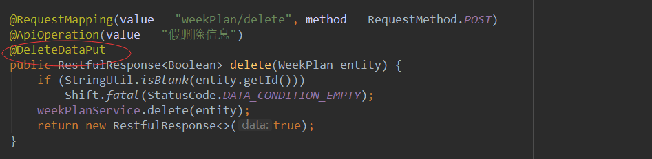

### 2.7 流程引擎

#### 2.7.1 引擎设计

流程引擎数据模型类图如下：

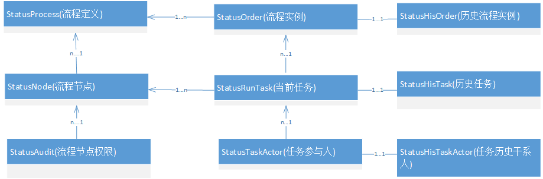

| 序号 | 类名            | 表名                      | 说明           |
| ---- | --------------- | ------------------------- | -------------- |
| 1    | StatusProcess   | sys_status_process        | 流程定义       |
| 2    | StatusNode      | sys_status_node           | 流程节点定义   |
| 3    | StatusAudit     | sys_status_audit          | 流程审核权限   |
| 4    | StatusOrder     | sys_status_order          | 当前流程实例   |
| 5    | StatusHisOrder  | sys_status_his_order      | 历史流程实例   |
| 6    | StatusRunTask   | sys_status_run_task       | 当前任务       |
| 7    | StatusHisTask   | sys_status_his_task       | 历史任务       |
| 8    | StatusTaskActor | sys_status_task_actor     | 当前任务干系人 |
| 9    | StatusHisActor  | sys_status_his_task_actor | 历史任务干系人 |

流程引擎数据模型 SQL 如下：

```sql

CREATE TABLE `sys_status_process` (
  `id` varchar(64) NOT NULL COMMENT '主键',
  `process_key` varchar(255) DEFAULT NULL COMMENT '流程KEY',
  `name` varchar(255) DEFAULT NULL COMMENT '流程名称',
  `business_field` varchar(200) DEFAULT NULL COMMENT '业务状态字段',
  `business_dict` varchar(200) DEFAULT NULL COMMENT '业务状态字典',
  `sort` int(11) NOT NULL AUTO_INCREMENT COMMENT '顺序号',
  `table_name` varchar(60) DEFAULT NULL COMMENT '表名',
  `category_id` varchar(50) DEFAULT NULL COMMENT '分类id',
  `service_gateway` varchar(255) DEFAULT NULL COMMENT '服务网关',
  PRIMARY KEY (`id`),
  KEY `sort` (`sort`)
) ENGINE=MyISAM AUTO_INCREMENT=32 DEFAULT CHARSET=utf8 ROW_FORMAT=DYNAMIC COMMENT='流程定义'
```

```sql
CREATE TABLE `sys_status_node` (
  `id` varchar(32) NOT NULL COMMENT '主键',
  `business_code` varchar(200) DEFAULT NULL COMMENT '业务字典值',
  `business_name` varchar(200) DEFAULT NULL COMMENT '业务字典描述',
  `task_node` varchar(200) DEFAULT NULL COMMENT '任务节点',
  `task_name` varchar(200) DEFAULT NULL COMMENT '任务名称',
  `task_type` varchar(32) DEFAULT NULL COMMENT '任务类型 Start,Task,End',
  `order_no` int(11) NOT NULL AUTO_INCREMENT COMMENT '顺序号',
  `page_route` text COMMENT '页面办理路由',
  `commit_api` text COMMENT '提交API',
  `is_back` int(2) DEFAULT NULL COMMENT '是否能驳回',
  `back_route` text COMMENT '驳回路由',
  `back_commit_api` text COMMENT '驳回提交API',
  `expr` text COMMENT '表达式',
  `decision` text COMMENT '决策',
  `process_id` varchar(64) DEFAULT NULL COMMENT '流程定义ID',
  `variable_name` text COMMENT '变量名称',
  `form_key` varchar(200) DEFAULT NULL COMMENT '表单key',
  `variable_api` text COMMENT '变量路由',
  `perform_type` varchar(10) DEFAULT NULL COMMENT '实现类型',
  `track_route` varchar(255) DEFAULT NULL COMMENT '路由',
  PRIMARY KEY (`id`),
  KEY `sort` (`order_no`)
) ENGINE=MyISAM AUTO_INCREMENT=14 DEFAULT CHARSET=utf8 ROW_FORMAT=DYNAMIC COMMENT='状态节点定义'

```

```sql
CREATE TABLE `sys_status_audit` (
  `id` varchar(50) NOT NULL,
  `key_id` varchar(50) DEFAULT NULL,
  `process_def_id` varchar(100) DEFAULT NULL,
  `node` varchar(50) DEFAULT NULL,
  `description` varchar(100) DEFAULT NULL,
  `section_id` varchar(50) DEFAULT NULL,
  `user_ids` text COMMENT '人员',
  `dept_ids` text COMMENT '部门',
  `positions` text COMMENT '岗位',
  `group_ids` text COMMENT '群组',
  `variable` varchar(200) DEFAULT NULL COMMENT '变量',
  `rule` varchar(10) DEFAULT NULL COMMENT '规则',
  `sort` int(11) unsigned zerofill NOT NULL AUTO_INCREMENT COMMENT '排序',
  `del_flag` smallint(1) DEFAULT '0',
  `create_ip` varchar(50) DEFAULT NULL,
  `create_by` varchar(50) DEFAULT NULL,
  `create_date` datetime DEFAULT NULL,
  `update_ip` varchar(50) DEFAULT NULL,
  `update_by` varchar(50) DEFAULT NULL,
  `update_date` datetime DEFAULT NULL,
  `delete_ip` varchar(50) DEFAULT NULL,
  `delete_by` varchar(50) DEFAULT NULL,
  `delete_date` datetime DEFAULT NULL,
  `personal_type` text COMMENT '人员类型',
  PRIMARY KEY (`id`),
  KEY `sort` (`sort`),
  KEY `del_flag` (`del_flag`)
) ENGINE=InnoDB AUTO_INCREMENT=234 DEFAULT CHARSET=utf8 COMMENT='流程审核'
```

```sql
CREATE TABLE `sys_status_order` (
  `id` varchar(50) NOT NULL COMMENT '任务ID',
  `task_node` varchar(200) DEFAULT NULL COMMENT '任务编号',
  `task_name` varchar(200) DEFAULT NULL COMMENT '任务名称',
  `create_time` datetime DEFAULT NULL COMMENT '创建时间',
  `process_id` varchar(64) DEFAULT NULL COMMENT '流程定义ID',
  `process_name` text COMMENT '流程名称',
  `creator` text COMMENT '创建人',
  `section_id` varchar(32) DEFAULT NULL COMMENT '段别',
  `actor_id` varchar(100) DEFAULT NULL COMMENT '分配人',
  `business_key` varchar(32) DEFAULT NULL COMMENT '业务主键',
  `expire_time` date DEFAULT NULL COMMENT '到期日期',
  `process_key` varchar(255) DEFAULT NULL COMMENT '流程定义KEY',
  `variable` varchar(32) DEFAULT NULL COMMENT '变量',
  `sort` int(11) NOT NULL AUTO_INCREMENT,
  PRIMARY KEY (`id`),
  KEY `sort` (`sort`)
) ENGINE=InnoDB AUTO_INCREMENT=235859 DEFAULT CHARSET=utf8 ROW_FORMAT=DYNAMIC COMMENT='状态实例'
```

```sql
CREATE TABLE `sys_status_his_order` (
  `id` varchar(50) NOT NULL COMMENT '任务ID',
  `task_node` varchar(200) DEFAULT NULL COMMENT '任务编号',
  `task_name` varchar(200) DEFAULT NULL COMMENT '任务名称',
  `create_time` datetime DEFAULT NULL COMMENT '创建时间',
  `process_id` varchar(64) DEFAULT NULL COMMENT '流程定义ID',
  `state` int(2) DEFAULT NULL COMMENT '状态',
  `end_time` date DEFAULT NULL COMMENT '到期日期',
  `process_name` text COMMENT '流程名称',
  `creator` text COMMENT '创建人',
  `section_id` varchar(32) DEFAULT NULL COMMENT '段别',
  `actor_id` varchar(100) DEFAULT NULL COMMENT '分配人',
  `business_key` varchar(32) DEFAULT NULL COMMENT '业务主键',
  `expire_time` date DEFAULT NULL COMMENT '到期日期',
  `process_key` varchar(255) DEFAULT NULL COMMENT '流程定义KEY',
  `variable` varchar(32) DEFAULT NULL COMMENT '变量',
  `sort` int(11) NOT NULL AUTO_INCREMENT,
  PRIMARY KEY (`id`),
  KEY `sort` (`sort`)
) ENGINE=InnoDB AUTO_INCREMENT=244643 DEFAULT CHARSET=utf8 ROW_FORMAT=DYNAMIC COMMENT='历史实例'
```

```sql
CREATE TABLE `sys_status_run_task` (
  `id` varchar(50) NOT NULL COMMENT '任务ID',
  `task_node` varchar(200) DEFAULT NULL COMMENT '任务编号',
  `task_name` varchar(200) DEFAULT NULL COMMENT '任务名称',
  `order_id` varchar(50) DEFAULT NULL COMMENT '实例ID',
  `section_id` varchar(32) DEFAULT NULL COMMENT '段别',
  `actor_id` varchar(100) DEFAULT NULL COMMENT '分配人',
  `state` int(2) DEFAULT NULL COMMENT '状态',
  `business_key` varchar(32) DEFAULT NULL COMMENT '业务主键',
  `create_time` datetime DEFAULT NULL COMMENT '创建时间',
  `expire_time` date DEFAULT NULL COMMENT '到期日期',
  `process_key` varchar(255) DEFAULT NULL COMMENT '流程定义KEY',
  `process_id` varchar(64) DEFAULT NULL COMMENT '流程定义ID',
  `variable` varchar(32) DEFAULT NULL COMMENT '变量',
  `sort` int(11) NOT NULL AUTO_INCREMENT,
  `parent_id` varchar(50) DEFAULT NULL COMMENT '上级任务id',
  `form_key` varchar(200) DEFAULT NULL COMMENT '表单key',
  `suspend` int(2) DEFAULT '0' COMMENT '挂起:默认0未挂起;1挂起',
  PRIMARY KEY (`id`),
  KEY `sort` (`sort`),
  KEY `order` (`order_id`)
) ENGINE=InnoDB AUTO_INCREMENT=352731 DEFAULT CHARSET=utf8 ROW_FORMAT=DYNAMIC COMMENT='当前任务'
```

```sql
CREATE TABLE `sys_status_his_task` (
  `id` varchar(50) NOT NULL COMMENT '任务ID',
  `task_node` varchar(200) DEFAULT NULL COMMENT '任务编号',
  `task_name` varchar(200) DEFAULT NULL COMMENT '任务名称',
  `order_id` varchar(50) DEFAULT NULL COMMENT '实例ID',
  `section_id` varchar(32) DEFAULT NULL COMMENT '段别',
  `actor_id` varchar(100) DEFAULT NULL COMMENT '分配人',
  `state` int(2) DEFAULT NULL COMMENT '状态',
  `business_key` varchar(32) DEFAULT NULL COMMENT '业务主键',
  `create_time` datetime DEFAULT NULL COMMENT '创建时间',
  `expire_time` date DEFAULT NULL COMMENT '到期日期',
  `process_key` varchar(255) DEFAULT NULL COMMENT '流程定义KEY',
  `process_id` varchar(64) DEFAULT NULL COMMENT '流程定义ID',
  `variable` varchar(32) DEFAULT NULL COMMENT '变量',
  `end_time` datetime DEFAULT NULL COMMENT '结束时间',
  `operator` varchar(255) DEFAULT NULL COMMENT '办理人',
  `comment` text COMMENT '办理意见',
  `sort` int(11) NOT NULL AUTO_INCREMENT,
  `parent_id` varchar(50) DEFAULT NULL COMMENT '上级任务id',
  `suspend` int(2) DEFAULT '0' COMMENT '挂起:默认0未挂起;1挂起',
  PRIMARY KEY (`id`),
  KEY `sort` (`sort`),
  KEY `orderId` (`order_id`)
) ENGINE=InnoDB AUTO_INCREMENT=1103469 DEFAULT CHARSET=utf8 ROW_FORMAT=DYNAMIC COMMENT='历史任务'
```

```sql
CREATE TABLE `sys_status_task_actor` (
  `id` varchar(32) DEFAULT NULL COMMENT '任务ID',
  `order_id` varchar(50) NOT NULL COMMENT '流程实例ID',
  `task_id` varchar(50) NOT NULL COMMENT '任务编号',
  `actor_id` varchar(32) NOT NULL COMMENT '任务名称',
  `section_id` varchar(32) DEFAULT NULL COMMENT '段别',
  KEY `actorId` (`actor_id`),
  KEY `taskId` (`task_id`),
  KEY `orderId` (`order_id`)
) ENGINE=InnoDB DEFAULT CHARSET=utf8 ROW_FORMAT=DYNAMIC COMMENT='任务参与者'
```

```sql
CREATE TABLE `sys_status_his_task_actor` (
  `id` varchar(32) NOT NULL COMMENT '任务ID',
  `order_id` varchar(50) NOT NULL COMMENT '流程实例ID',
  `task_id` varchar(50) DEFAULT NULL COMMENT '任务编号',
  `actor_id` varchar(32) DEFAULT NULL COMMENT '任务名称',
  `section_id` varchar(32) DEFAULT NULL COMMENT '段别',
  PRIMARY KEY (`id`),
  KEY `taskId` (`task_id`),
  KEY `orderId` (`order_id`)
) ENGINE=InnoDB DEFAULT CHARSET=utf8 ROW_FORMAT=DYNAMIC COMMENT='任务参与者'

```

流程引擎核心接口类图如下：

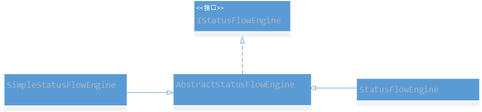

| 序号 | 类名                     | 描述                                                   |
| ---- | ------------------------ | ------------------------------------------------------ |
| 1    | IStatusFlowEngine        | 引擎接口类                                             |
| 2    | AbstractStatusFlowEngine | 抽象流程引擎实现类                                     |
| 3    | StatusFlowEngine         | 流程引擎实现类。                                       |
| 4    | SimpleStatusFlowEngine   | 简单流程引擎实现类。流程引擎只使用当前任务、历史任务表 |

​ 流程引擎核心类依赖的流程处理类图如下：


​

| 序号 | 接口/类名                | 说明                 |
| ---- | ------------------------ | -------------------- |
| 1    | IStatusOrderService      | 当前流程实例接口     |
| 2    | StatusOrderService       | 历史流程实例实现类   |
| 3    | IStatusHisOrderService   | 历史流程实例接口     |
| 4    | StatusHisOrderService    | 历史流程实例实现类   |
| 5    | IStatusRunTaskService    | 当前任务接口         |
| 6    | StatusRunTaskService     | 当前任务实现         |
| 7    | IStatusHisTaskService    | 历史任务接口         |
| 8    | StatusHisTaskService     | 历史任务实现         |
| 9    | IStatusTaskActorService  | 当前任务干系人接口   |
| 10   | StatusTaskActorService   | 当前任务实现         |
| 11   | IStatusHisActorService   | 历史干系人接口       |
| 12   | StatusHisActorService    | 历史干系人实现       |
| 13   | IBusinessService         | 业务操作接口         |
| 14   | BusinessService          | 业务操作实现         |
| 15   | StatusFlowListener       | 流程监听器接口       |
| 16   | GlobalStatusFlowListener | 全局流程监听器实现类 |
| 17   | StatusFlowMQService      | 流程消息推送类       |

流程引擎核心类依赖的流程配置相关的类图如下：


| 序号 | 接口/实现                     | 说明           |
| ---- | ----------------------------- | -------------- |
| 1    | IStatusProcessService         | 流程定义接口   |
| 2    | StatusProcessService          | 流程定义实现   |
| 3    | IStatusNodeService            | 流程节点接口   |
| 4    | StatusNodeService             | 流程节点实现类 |
| 5    | IStatusAuditService           | 流程审批接口   |
| 6    | StatusAuditService            | 流程审批实现   |
| 7    | StatusFlowEngineConfiguration | 流程引擎配置类 |

#### 2.7.2 API 介绍

​ 流程引擎目前支持单个发起、批量发起、单个驳回、批量驳回、单个办理、批量办理、单个召回、批量挂起功能。任务支持 Any 或者 All，All 为会签。流程引擎项目分为 togest-cms-statusflow-engine、togest-cms-statusflow-engine-web 两个模块。如果是 WEB 项目直接引用 togest-cms-statusflow-engine-web

​

```xml
		<dependency>
			<groupId>com.togest</groupId>
			<artifactId>togest-cms-statusflow-engine-web</artifactId>
			<version>0.0.1-SNAPSHOT</version>
		</dependency>
```

如果是 Service 项目直接引用 togest-cms-statusflow-engine

```xml
		<dependency>
			<groupId>com.togest</groupId>
			<artifactId>togest-cms-statusflow-engine</artifactId>
			<version>0.0.1-SNAPSHOT</version>
		</dependency>
```

##### 2.7.2.1 流程引擎核心

​ AbstractStatusFlowEngine 核心流程包括的方法如下：

| 方法名称                 | 输入                 | 输出                    | 功能描述                                                                                     |
| ------------------------ | -------------------- | ----------------------- | -------------------------------------------------------------------------------------------- |
| startProcessAndFinish    | StartModel           | TaskModel               | 单个流程启动                                                                                 |
| startProcessAndFinish    | `List<StartModel>`   | `List<TaskModel>`       | 批量流程启动                                                                                 |
| completeTask             | BatchCompleteModel   | `List<TaskModel>`       | 批量办理                                                                                     |
| rejectTask               | BatchRejectModel     | `List<TaskModel>`       | 批量驳回任务                                                                                 |
| callBackTask             | CallBackModel        | `List<TaskModel>`       | 单个召回                                                                                     |
| suspendTask              | BatchSuspendModel    | int                     | 批量挂起                                                                                     |
| checkTaskIfExistByTaskId | TaskQueryModel       | boolean                 | 检查任务是否存在.输入属性：taskId、processKey                                                |
| getRejectNode            | TaskModel            | `List<RejectNodeModel>` | 查询可驳回的节点。输入属性 orderId、processKey                                               |
| delete                   | `List<StatusOrder>`  | int                     | 批量删除流程实例。输入属性 id、processKey                                                    |
| getProcessProgress       | StatusOrder          | `List<ProcessProgress>` | 查询流程进度.输入属性：id、processKey                                                        |
| getHisTask               | StatusHisTask        | `List<StautsHisTask>`   | 查询流程实例历史。输入属性：orderId、processKey                                              |
| getActorVariable         | BusinessActorModel   | String                  | 查询业务中部门后者人员字段数据。输入属性：processKey、variable、businessKey                  |
| getNextNodeByGateway     | GatewayModel         | StatusNode              | 查询下一个节点。输入属性包括：processKey、srcTaskNode、variable                              |
| getTask                  | Page，TaskQueryModel | `Page<MyTask>`          | 查询我的待办。一般查询条件输入属性：actorId(支持逗号拼接)，queryMethod（可选）、suffix(可选) |
| getOnLineMessage         | TaskQueryModel       | OnLineModel             | 推送最新待办。输入属性：actorId、maxSort、queryMethod（可选）、suffix(可选)                  |

StatusFlowEngine 方法如下：

| 序号 | 方法名             | 输入        | 输出                    | 功能描述     |
| ---- | ------------------ | ----------- | ----------------------- | ------------ |
| 1    | getProcessProgress | StatusOrder | `List<ProcessProgress>` | 获取流程进度 |
| 2    | getOrderService    |             | IStatusOrderService     |              |
| 3    | getHisOrderService |             | IStatusHisOrderService  |              |

##### 2.7.2.2 restful API

StatusFlowEngineResource API 如下：

| 序号 | API                                       | 功能                   | METHOD |
| ---- | ----------------------------------------- | ---------------------- | ------ |
| 1    | statusFlowEngine/start                    | 单个流程启动           | post   |
| 2    | statusFlowEngine/starts                   | 批量流程启动           | post   |
| 3    | statusFlowEngine/complete                 | 批量办理               | post   |
| 4    | statusFlowEngine/reject                   | 批量驳回               | post   |
| 5    | statusFlowEngine/callBack                 | 单个召回，             | post   |
| 6    | statusFlowEngine/suspend                  | 批量挂起               | post   |
| 7    | statusFlowEngine/checkTaskIfExistByTaskId | 检测任务               | get    |
| 8    | statusFlowEngine/getRejectNode            | 获取可驳回节点         | get    |
| 9    | statusFlowEngine/delete                   | 批量删除               | post   |
| 10   | statusFlowEngine/getProcessProgress       | 获取某流程实例进度     | get    |
| 11   | statusFlowEngine/getHisTask               | 获取流程实例的历史任务 | get    |
| 12   | statusFlowEngine/getBusinessActor         | 获取业务中办理人       | get    |
| 13   | statusFlowEngine/getPageTask              | 获取待办               | get    |
| 14   | statusFlowEngine/getOnLineMessage         | 获取在线消息           | get    |

1.  **statusFlowEngine/start**

**输入：**

```json
{
  "actorId": "string",
  "actorType": "string",
  "businessKey": "string",
  "creator": "string",
  "expireTime": "2020-04-03T05:48:47.673Z",
  "processKey": "string",
  "processName": "string",
  "sectionId": "string",
  "variable": "string"
}
```

**输出：**

```json
{
  "data": {
    "actorId": "string",
    "actorType": "string",
    "businessKey": "string",
    "createTime": "2020-04-03T05:48:47.671Z",
    "expireTime": "2020-04-03T05:48:47.671Z",
    "formKey": "string",
    "id": "string",
    "orderId": "string",
    "parentId": "string",
    "processId": "string",
    "processKey": "string",
    "sectionId": "string",
    "sort": 0,
    "state": 0,
    "suspend": 0,
    "taskName": "string",
    "taskNode": "string",
    "variable": "string"
  },
  "errorCode": 10000,
  "msg": "string"
}
```

**2.statusFlowEngine/starts**

**输入：**

```json
[
  {
    "actorId": "string",
    "actorType": "string",
    "businessKey": "string",
    "creator": "string",
    "expireTime": "2020-04-03T05:48:47.673Z",
    "processKey": "string",
    "processName": "string",
    "sectionId": "string",
    "variable": "string"
  }
]
```

**输出：**

```json
{
  "data": {
    "actorId": "string",
    "actorType": "string",
    "businessKey": "string",
    "createTime": "2020-04-03T05:48:47.671Z",
    "expireTime": "2020-04-03T05:48:47.671Z",
    "formKey": "string",
    "id": "string",
    "orderId": "string",
    "parentId": "string",
    "processId": "string",
    "processKey": "string",
    "sectionId": "string",
    "sort": 0,
    "state": 0,
    "suspend": 0,
    "taskName": "string",
    "taskNode": "string",
    "variable": "string"
  },
  "errorCode": 10000,
  "msg": "string"
}
```

**3.statusFlowEngine/complete **

**输入：**

```json
{
  "actorType": "string",
  "comment": "string",
  "operator": "string",
  "processKey": "string",
  "srcTaskNode": "string",
  "tasks": [
    {
      "id": "string",
      "orderId": "string",
      "sectionId": "string",
      "actorId": "string",
      "comment": "string",
      "businessKey": "string"
    }
  ],
  "variable": "string"
}
```

**输出：**

```json
{
  "data": {
    "actorId": "string",
    "actorType": "string",
    "businessKey": "string",
    "createTime": "2020-04-03T05:48:47.671Z",
    "expireTime": "2020-04-03T05:48:47.671Z",
    "formKey": "string",
    "id": "string",
    "orderId": "string",
    "parentId": "string",
    "processId": "string",
    "processKey": "string",
    "sectionId": "string",
    "sort": 0,
    "state": 0,
    "suspend": 0,
    "taskName": "string",
    "taskNode": "string",
    "variable": "string"
  },
  "errorCode": 10000,
  "msg": "string"
}
```

**4.statusFlowEngine/reject **

**输入：**

```json
{
  "comment": "string",
  "operator": "string",
  "processKey": "string",
  "srcNode": "string",
  "targetNode": "string",
  "tasks": [
    {
      "actorId": "string",
      "actorType": "string",
      "businessKey": "string",
      "id": "string",
      "orderId": "string",
      "sectionId": "string"
    }
  ]
}
```

**输出：**

```json
{
  "data": {
    "actorId": "string",
    "actorType": "string",
    "businessKey": "string",
    "createTime": "2020-04-03T05:48:47.671Z",
    "expireTime": "2020-04-03T05:48:47.671Z",
    "formKey": "string",
    "id": "string",
    "orderId": "string",
    "parentId": "string",
    "processId": "string",
    "processKey": "string",
    "sectionId": "string",
    "sort": 0,
    "state": 0,
    "suspend": 0,
    "taskName": "string",
    "taskNode": "string",
    "variable": "string"
  },
  "errorCode": 10000,
  "msg": "string"
}
```

**5.statusFlowEngine/callBack**

**输入：**

```json
{
  "actorId": "string",
  "processKey": "string",
  "businessKey": "string",
  "id": "string",
  "orderId": "string",
  "sectionId": "string"
}
```

**输出：**

```json
{
  "data": {
    "actorId": "string",
    "actorType": "string",
    "businessKey": "string",
    "createTime": "2020-04-03T05:48:47.671Z",
    "expireTime": "2020-04-03T05:48:47.671Z",
    "formKey": "string",
    "id": "string",
    "orderId": "string",
    "parentId": "string",
    "processId": "string",
    "processKey": "string",
    "sectionId": "string",
    "sort": 0,
    "state": 0,
    "suspend": 0,
    "taskName": "string",
    "taskNode": "string",
    "variable": "string"
  },
  "errorCode": 10000,
  "msg": "string"
}
```

**6.statusFlowEngine/suspend**

**输入：**

```json
{
  "comment": "string",
  "operator": "string",
  "processKey": "string",
  "suspend": 0,
  "tasks": [
    {
      "businessKey": "string",
      "id": "string",
      "orderId": "string",
      "sectionId": "string"
    }
  ]
}
```

**输出：**

```json
   {
  "data": 0
  "errorCode": 10000,
  "msg": "string"
}
```

**7.statusFlowEngine/checkTaskIfExistByTaskId**

**输入：**

```json
{

    "taskId":"string"
    "processKey":"string"
}
```

**输出：**

```json
   {
  "data": true
  "errorCode": 10000,
  "msg": "string"
}
```

**8.statusFlowEngine/getRejectNode**

**输入：**

```json
{
  "orderId": "string", //tod必填
  "processKey": "string"
}
```

**输出：**

```json
{
  "data": [
    {
      "orderNo": 0,
      "taskName": "string",
      "taskNode": "string"
    }
  ],
  "errorCode": 10000,
  "msg": "string"
}
```

**9.statusFlowEngine/delete**

**输入：**

```json
[
  {
    "id": "string",
    "processKey": "string"
  }
]
```

**输出：**

```json
{
  "data": 0,
  "errorCode": 10000,
  "msg": "string"
}
```

**10.statusFlowEngine/getProcessProgress**

**输入：**

```json
[
  {
    "id": "string",
    "processKey": "string"
  }
]
```

**输出：**

```json
{
  "data": [
    {
      "progress": 0,
      "suspend": 0,
      "taskName": "string",
      "taskNode": "string",
      "taskType": "string"
    }
  ],
  "errorCode": 10000,
  "msg": "string"
}
```

**11.statusFlowEngine/getHisTask**

**输入：**

```json
[
  {
    "orderId": "string",
    "processKey": "string"
  }
]
```

**输出：**

```json
{
  "data": [
    {
      "actorId": "string",
      "actorType": "string",
      "businessKey": "string",
      "comment": "string",
      "createTime": "2020-04-03T05:48:47.588Z",
      "dueTime": "string",
      "endTime": "2020-04-03T05:48:47.588Z",
      "expireTime": "2020-04-03T05:48:47.588Z",
      "formKey": "string",
      "id": "string",
      "operator": "string",
      "operatorName": "string",
      "orderId": "string",
      "parentId": "string",
      "processId": "string",
      "processKey": "string",
      "reject": true,
      "sectionId": "string",
      "sort": 0,
      "state": 0,
      "suspend": 0,
      "taskName": "string",
      "taskNode": "string",
      "variable": "string"
    }
  ],
  "errorCode": 10000,
  "msg": "string"
}
```

**12.statusFlowEngine/getBusinessActor**

**输入：**

```json
[
  {
    "businessKey": "string",
    "processKey": "string",
    "variable": "string"
  }
]
```

**输出：**

```json
{
  "data": "string",
  "errorCode": 10000,
  "msg": "string"
}
```

**13.statusFlowEngine/getPageTask**

**输入：**

```json
{
  "actorId": "string",
  "queryMethod": "int", // 0:公共 1：段别 2：模块
  "suffix": "string" // 针对查询方式2有效
}
```

**输出：**

```json
{
  "data": {
    "autoCount": true,
    "hasNext": true,
    "hasPre": true,
    "nextPage": 0,
    "orderBy": "CREATE_TIME DESC",
    "orderBySetted": true,
    "pageNo": 3,
    "pageSize": 30,
    "prePage": 0,
    "rows": [
      {
        "actorId": "string",
        "actorName": "string",
        "businessKey": "string",
        "categoryId": "string",
        "categoryModelCode": "string",
        "categoryName": "string",
        "createTime": "2020-04-03T05:48:47.618Z",
        "creator": "string",
        "creatorName": "string",
        "dueTime": "string",
        "endTime": "2020-04-03T05:48:47.618Z",
        "flag": 0,
        "formKey": "string",
        "name": "string",
        "orderId": "string",
        "processId": "string",
        "processKey": "string",
        "processName": "string",
        "sort": 0,
        "taskId": "string",
        "taskName": "string",
        "taskNode": "string",
        "variable": "string"
      }
    ],
    "total": 81,
    "totoalPage": 3
  },
  "errorCode": 10000,
  "msg": "string"
}
```

**14.statusFlowEngine/getOnLineMessage**

**输入：**

```json
  {
    "actorId": "string",
    "maxSort": "long",
    "queryMethod": "int"// 0:公共 1：段别 2：模块
    "suffix":"string" // 针对查询方式2有效
  }
```

**输出：**

```json
{
  "data": {
    "count": 0,
    "maxSort": 0,
    "newCount": 0,
    "newTasks": [
      {
        "actorId": "string",
        "actorName": "string",
        "businessKey": "string",
        "categoryId": "string",
        "categoryModelCode": "string",
        "categoryName": "string",
        "createTime": "2020-04-03T05:48:47.606Z",
        "creator": "string",
        "creatorName": "string",
        "dueTime": "string",
        "endTime": "2020-04-03T05:48:47.606Z",
        "flag": 0,
        "formKey": "string",
        "name": "string",
        "orderId": "string",
        "processId": "string",
        "processKey": "string",
        "processName": "string",
        "sort": 0,
        "taskId": "string",
        "taskName": "string",
        "taskNode": "string",
        "variable": "string"
      }
    ]
  },
  "erroode": 10000,
  "msg": "string"
}
```

##### 2.7.2.3 流程事件

​ 流程实例启动、结束、任务办理完成后会触发系统的全局事件，完成业务表的流程字段的更新。如果某个业务流程配置了业务相关的事件监听器，则会通知业务，如果没有定义，则统一由全局监听器自己处理。GlobalStatusFlowListener 的相关 API 接口如下：

```JAVA
   /**
     *流程实例启动事件
     * @param orders
     */
     void processStartedEvent(StatusProcess process, List<StatusOrder> orders);

    /**
     *实例流程完成事件
     * @param orders
     */
    void processCompletedEvent(StatusProcess process, StatusNode node, List<StatusOrder> orders);


    /**
     * 任务完成事件，如果定义了完成触发器，则会完成业务谁操作、什么时间操作的两个字段
     * @param tasks
     */
     void completedEvent(StatusProcess process, StatusNode node,List<StatusHisTask> tasks);


    /**
     * 任务创建事件
     * @param tasks
     */
     void createdEvent(StatusProcess process, StatusNode node, List<TaskModel> tasks);

    /**
     *
     * @param process
     * @param node
     * @param tasks
     * @param isStart
     */

     void createdEvent(StatusProcess process, StatusNode node, List<TaskModel> tasks,boolean isStart);
```

##### 2.7.2.4 流程与业务

​ BusinessService 类实现业务表的处理及任务创建的消息推送，包括流程字段更新、业务状态的更新、谁办理及办理时间的两个段更新。业务表必须包括以下字段：

```sql
  `task_user` varchar(300) DEFAULT NULL COMMENT '下步办理人',
  `process_instance_id` varchar(50) DEFAULT NULL COMMENT '流程实例ID',
  `task_id` varchar(50) DEFAULT NULL COMMENT '流程业务ID',
  `form_key` varchar(50) DEFAULT NULL COMMENT 'formKey',
  `task_node` varchar(50) DEFAULT NULL COMMENT '流程节点名称',
  `task_name` varchar(50) DEFAULT NULL COMMENT '流程节点名称',
  `process_def_key` varchar(255) DEFAULT NULL COMMENT '流程定义key',
```

```Java
 /**
     * 更新流程
     *
     * @param process
     * @param node
     * @param tasks
     * @param isStart
     */

    void updateProcessByTask(StatusProcess process, StatusNode node, List<TaskModel> tasks, boolean isStart);

    void updateProcessByTask(StatusProcess process, StatusNode node, List<TaskModel> tasks, boolean isStart, boolean isMQ);

    /**
     *流程实例结束更新
     *
     * @param process
     * @param node
     * @param orders
     */
    void updateProcessByOrder(StatusProcess process, StatusNode node, List<StatusOrder> orders);

    /**
     * 更新业务办理的谁办理、什么时间办理的两个字段
     * @param process
     * @param tasks
     * @param fields
     */
    void updateProcessInfoByHisTask(StatusProcess process, List<StatusHisTask> tasks, String fields);

   /**
     * 获取业务办理人
     * @param variableName
     * @param model
     * @return
     */
     String findActorId(String variableName, BusinessModel model);

```

```sql
  `task_user` varchar(300) DEFAULT NULL COMMENT '下步办理人',
  `process_instance_id` varchar(50) DEFAULT NULL COMMENT '流程实例ID',
  `task_id` varchar(50) DEFAULT NULL COMMENT '流程业务ID',
  `form_key` varchar(50) DEFAULT NULL COMMENT 'formKey',
  `task_node` varchar(50) DEFAULT NULL COMMENT '流程节点名称',
  `task_name` varchar(50) DEFAULT NULL COMMENT '流程节点名称',
  `process_def_key` varchar(255) DEFAULT NULL COMMENT '流程定义key',
```

##### 2.7.2.5 流程事件自定义

​ 业务部分可根据自身需要扩展流程引擎，比如流程表可以按照段别、模块存储、流程监听器需业务自身扩展。如果扩展了流程监听器，全局监听事件则会调用业务自定义的监听器，则不执行自动更新业务表

| 序号 | 属性                                                        | 描述                                                                                        |
| ---- | ----------------------------------------------------------- | ------------------------------------------------------------------------------------------- |
| 1    | com.togest.engine.msgEnabled                                | MQ 消息使能标准 true:启用消息，开启消息后，任务创建都会推送至前端                           |
| 2    | com.togest.engine.process                                   | 流程定义列表，支持多个定义                                                                  |
| 3    | com.togest.engine.process.processkey                        | 流程定义 KEY                                                                                |
| 4    | com.togest.engine.process.flowTableRule                     | 流程表配置 0：公共(流程表名) ，1：段(流程表名+“_”+具体段别 ),2：模块(流程表名+“_”+具体模块) |
| 5    | com.togest.engine.process.flowTableSuffix                   | 在 4 的配置等于 2 有效，表名后缀                                                            |
| 6    | com.togest.engine.process.listenerClassName                 | 自定义流程事件监听器 BEAN 名字                                                              |
| 7    | com.togest.engine.process.nodes                             | 流程节点定义                                                                                |
| 8    | com.togest.engine.process.nodes.node                        | 流程节点定义名                                                                              |
| 9    | com.togest.engine.process.nodes.node.assignees              | 节点办理人，KEY 为段别。，目前系统统一采用节点权限配置，不建议启用该配置                    |
| 10   | com.togest.engine.process.nodes.node.trigger                | 节点触发器定义                                                                              |
| 11   | com.togest.engine.process.nodes.node.trigger.completedField | 任务完成时，需更新的“谁办理”、“什么时间”两个字段，两个字段采用“，”拼接的方式                |

​ 以 6C 数据中心为例，介绍流程配置文件

```properties
com:
  togest:
    statusFlow:
      engine:
        # 消息是否启用
        msgEnabled: false
         # 流程定义
        process:
            # 流程定义KEY
          - processKey: 6c_defect
             # 表规则 0：公共 1：段 2：业务。默认公共
            flowTableRule: 2
             # 业务流程表名后缀
            flowTableSuffix: 6c
            #节点定义
            nodes:
                # 具体节点步骤
              - node: usertask2
               #办理人定义，按照段别。新配置流程不再使用，由业务或者前端传递
                assignees:
                  7c5e13b4dd8d4f599bfb11a9a8ef4d16: f4d5b2de07ae4e52afb263f98f263a3f
                  8b7caeccf8c249ecb21465de3e7050e2: 4253afb9b78a4f3ca92e9fb5e720024e,41ffb1c1b7d24c0897616b47afe0f1cf
                  16516b9988bb470cb5225825997e9562: 3abab7c25d024e5189bd877de07d6288,ed58783023c44428838c20ffa47ee9f6
                  96174ba6690242cfa8da9e0e7c60c025: df7d514f277f43c28c145d2d9edec847
                  3ceeec04f1264f1290ba8763279a5de0: d30407c09dd44bd48139e8f5d0b1cd27,904f2c390a4e48339fdeb960ba68b955
              - node: usertask6
                assignees:
                  7c5e13b4dd8d4f599bfb11a9a8ef4d16: 7c5e13b4dd8d4f599bfb11a9a8ef4d16,f4d5b2de07ae4e52afb263f98f263a3f
                  8b7caeccf8c249ecb21465de3e7050e2: 41ffb1c1b7d24c0897616b47afe0f1cf,4253afb9b78a4f3ca92e9fb5e720024e
                  16516b9988bb470cb5225825997e9562: 3abab7c25d024e5189bd877de07d6288,ed58783023c44428838c20ffa47ee9f6
                  96174ba6690242cfa8da9e0e7c60c025: df7d514f277f43c28c145d2d9edec847
                  3ceeec04f1264f1290ba8763279a5de0: d30407c09dd44bd48139e8f5d0b1cd27,904f2c390a4e48339fdeb960ba68b955
              - node: usertask7
                assignees:
                  7c5e13b4dd8d4f599bfb11a9a8ef4d16: togest_status-root
                  8b7caeccf8c249ecb21465de3e7050e2: togest_status-root
                  16516b9988bb470cb5225825997e9562: togest_status-root
                  96174ba6690242cfa8da9e0e7c60c025: togest_status-root
                  3ceeec04f1264f1290ba8763279a5de0: togest_status-root
          - processKey: 1c_plan
            flowTableRule: 2
            flowTableSuffix: 6c
          - processKey: 6c_plan_section
            flowTableRule: 2
            flowTableSuffix: 6c
          - processKey: 6c_notice_section
            flowTableRule: 2
            flowTableSuffix: 6c
```

以接触网台账心为例，介绍流程配置文件

```properties
com:
  togest:
    statusFlow:
      engine:
        # 消息是否启用
        msgEnabled: true
        process:
            # 流程定义key
          - processKey: jcw_ledger_base_info
            # 流程监听器
            listenerClassName: ledgerStatusFlowListener
```

```java
@Component
public class LedgerStatusFlowListener implements StatusFlowListener {

    @Autowired
    private BusinessService businessService;
    @Autowired
    private LedgerCommonService ledgerCommonService;

    @Override
    public void processStartedEvent(StatusProcess process, List<StatusOrder> orders) {

    }

    @Override
    public void processCompletedEvent(StatusProcess process, StatusNode node, List<StatusOrder> orders) {
        // 更新主表数据
        businessService.updateProcessByOrder(process, node, orders);
        // 更新子表数据
        SystemResoucesResponse resources = ledgerCommonService.getResourcesById(orders.get(0).getBusinessKey());
        process.setTableName(resources.getResource().getResource());
        businessService.updateProcessByOrder(process, node, orders);
        if (StatusFlowEngineConfiguration.END_TASK.equals(node.getTaskType())) {
            //处理台账回填和工作流统计
            List<String> orderIds = FunctionUtil.map(orders, StatusOrder::getBusinessKey);
            System.out.println("orderIds 1 => " + orderIds);
            // 处理工作量和工区填报
            orderIds = ledgerCommonService.handleWorkData(orderIds);
            System.out.println("orderIds 2 => " + orderIds);
            // 处理数据回填
            ledgerCommonService.handleData(resources.getResource().getCustomCode(), orderIds, resources, orders.get(0).getCreator());
        }
    }

    @Override
    public void completedEvent(StatusProcess process, StatusNode node, List<StatusHisTask> tasks) {

    }

    @Override
    public void createdEvent(StatusProcess process, StatusNode node, List<TaskModel> tasks) {
        this.createdEvent(process, node, tasks, false);
    }

    @Override
    public void createdEvent(StatusProcess process, StatusNode node, List<TaskModel> tasks, boolean isStart) {
        businessService.updateProcessByTask(process, node, tasks, isStart);
        // 更新子表数据
        SystemResoucesResponse resources = ledgerCommonService.getResourcesById(tasks.get(0).getBusinessKey());
        process.setTableName(resources.getResource().getResource());
        businessService.updateProcessByTask(process, node, tasks, isStart, false);
    }
}

```

​ 以综合办公用品申请为例，介绍流程配置文件。自定义扩展了流程事件

```properties
com:
  togest:
    statusFlow:
      engine:
        msgEnabled: true
        process:
          - processKey: comp_spares_apply
            nodes:
              - node: usertask2
                # 触发器
                trigger:
                 # 完成字段
                  completedField: audit_person,audit_date
```

​

​

##### 2.7.2.6 业务办理提交扩展

​ 有些业务可能会存在业务数据及流程一块操作的过程，遇到这种情况时，我们目前有两种处理办法，第一种采用业务数据保存与流程办理分成两步，增加一个流程操作按钮，以达到保存业务数据和流程分开。对于确实需要一步操作的话，我们的另外一种处理方式是采用自定义业务提交 API 的方式实现，比如某一个流程节点可以自定义 API 提交及驳回路由，而不走公共提交 API，由业务触发调用工作流引擎。

​ 以下是电力针对供电处科长审核时，业务办理重写提交场景。


```java
	@Override
	public int gdckzAudit(BatchCompleteModel batchCompleteModel) {
		Objects.requireNonNull(batchCompleteModel);
		Objects.requireNonNull(batchCompleteModel.getTasks());
		TaskCompleteModel task = batchCompleteModel.getTasks().get(0);
		if (batchCompleteModel.compareVariable("leadPass", true)) {
			Map<String, Object> map = batchCompleteModel.getVariableMap();
			CutPlan cutPlans = dao.getByKey(task.getBusinessKey());
			if (cutPlans == null) {
				throw new ServiceException("查询计划数据空");
			}
			map.put("gateway", !auditLists.contains(cutPlans.getTepName()));
			batchCompleteModel.setVariable(Jacksons.parse(map));

		}
		List<TaskModel> list = statusFlowEngine.completeTask(batchCompleteModel);
		return list.size();
	}
```

​ 业务有时候会需要判断该办理是否是驳回操作，BatchCompleteModel 类中提供方法判断变量值

```java
 public boolean compareVariable(String variableName, Object variableValue) {
        return compareVariable(variableName, variableValue, "==");

    }
    /**
     * @param variableName
     * @param variableValue
     * @return
     */
    public boolean compareVariable(String variableName, Object variableValue, String expression) {
        Objects.requireNonNull(variableName);
        Objects.requireNonNull(variableValue);
        Object exist = getVariableValue(variableName);
        Preconditions.checkArgument(exist != null, variableName + "值空");
        Object v = getVariableValue(exist, variableValue.getClass());
        ScriptEngineManager m = new ScriptEngineManager();
        ScriptEngine engine = m.getEngineByName("JavaScript");
        String exp = "" + v + expression + variableValue;
        try {
			return (Boolean) engine.eval(exp);
		} catch (ScriptException e) {
			// TODO Auto-generated catch block
			throw new StatusFlowException(e);
		}

    }

```

#### 2.7.3 流程定义配置

##### 2.7.3.1 流程定义


| 序号 | 属性         | 描述                                                   |
| ---- | ------------ | ------------------------------------------------------ |
| 1    | 流程 KEY     | 流程定义 KEY 系统唯一，一般使用系统表名                |
| 2    | 流程名称     | 流程定义名称                                           |
| 3    | 业务状态字段 | 具体视情况而定，需要根据流程状态跟新业务状态字段       |
| 4    | 业务状态字典 | 具 3 而定，业务使用的字典名称                          |
| 5    | 业务表名     | 业务表名                                               |
| 6    | 分类         | 流程分类                                               |
| 7    | 服务网关     | 模块对应的网关，流程进度及流程历史任务 UI 会使用该网关 |

##### 2.7.3.2 节点定义


| 序号 | 属性             | 描述                                                                                                                                                                                                                                                                                                                                                                                                                                                                                                                        |
| :--- | ---------------- | --------------------------------------------------------------------------------------------------------------------------------------------------------------------------------------------------------------------------------------------------------------------------------------------------------------------------------------------------------------------------------------------------------------------------------------------------------------------------------------------------------------------------- |
| 1    | 任务名称         | 名称，具体流程中唯一                                                                                                                                                                                                                                                                                                                                                                                                                                                                                                        |
| 2    | 顺序号           | 唯一，从小到大                                                                                                                                                                                                                                                                                                                                                                                                                                                                                                              |
| 3    | 业务字典值       | 对应字典中，某字典项的值，视业务情况而定                                                                                                                                                                                                                                                                                                                                                                                                                                                                                    |
| 4    | 业务字典描述     | 对应 3 中的描述                                                                                                                                                                                                                                                                                                                                                                                                                                                                                                             |
| 5    | 任务节点         | 任务节点代码，具体流程中唯一                                                                                                                                                                                                                                                                                                                                                                                                                                                                                                |
| 6    | 任务类型         | 类型有三种 Start/Task/Gateway/End                                                                                                                                                                                                                                                                                                                                                                                                                                                                                           |
| 7    | 页面办理路由     | 目前只应用详情路由配置,每个节点办理路由移至决策属性里面                                                                                                                                                                                                                                                                                                                                                                                                                                                                     |
| 8    | 流程追踪页面路由 | 应用对于流程追踪页面有特殊定制场景                                                                                                                                                                                                                                                                                                                                                                                                                                                                                          |
| 9    | 提交 API         | 流程办理提交后台 API，默认可配置成通用的，对于 Start 任务:/模块 URL/statusFlowEngine/starts,Task 任务：/模块 URL/statusFlowEngine/complete                                                                                                                                                                                                                                                                                                                                                                                  |
| 10   | 是否驳回         |                                                                                                                                                                                                                                                                                                                                                                                                                                                                                                                             |
| 11   | 驳回 API         | 如果 10 配置驳回才生效，驳回 AP 默认可配置成/模块 URL/statusFlowEngine/reject                                                                                                                                                                                                                                                                                                                                                                                                                                               |
| 12   | 表达式           | 冒号表达式，leadPass==true?"c1":"c2" 标识变量 leadPass 通过则指向 C1 不通过则指向 C2.配置参考决策配置                                                                                                                                                                                                                                                                                                                                                                                                                       |
| 13   | 决策             | name:条件编码 to:代表流向 value:变量提交值 desc:UI 单选框显示 hideComment：是否开启办理意见，handleRoute:办理路由[<br/> {<br/> "name": "c1",<br/> "to": "usertask6",<br/> "value": "true",<br/> "desc": "提交通过",<br/> "hideComment": true,<br/> "handleRoute": "/6c/defectManagement/reviewRectificationHandle"<br/> },<br/> {<br/> "name": "c2",<br/> "to": "usertask5",<br/> "value": "'applyDelay'",<br/> "desc": "申请延期",<br/> "handleRoute": "/6c/defectManagement/delay",<br/> "hideComment": true<br/> }<br/>] |
| 14   | 是否是会签       | 默认是 Any 会签取值 All                                                                                                                                                                                                                                                                                                                                                                                                                                                                                                     |
| 15   | 变量名称         | 表单提交变量值，提交时组成 JSON 提交                                                                                                                                                                                                                                                                                                                                                                                                                                                                                        |
| 16   | 表单 key         | 预留                                                                                                                                                                                                                                                                                                                                                                                                                                                                                                                        |
| 17   | 权限 API         | 获取业务数据中某个部门或者人员字段值，用于办理人                                                                                                                                                                                                                                                                                                                                                                                                                                                                            |

##### 2.7.3.3 节点权限配置

| 序号 | 属性     | 描述                                                                                      |
| ---- | -------- | ----------------------------------------------------------------------------------------- |
| 1    | 规则     | 审核规则 具体人员/群组                                                                    |
| 2    | 变量     | 支持审核部门或者人员来源业务数据。目前支持 dept.部门属性/user.人员属性/group.群组业务属性 |
| 3    | 群组     | 来源与群组选择器中的群组，支持多选                                                        |
| 4    | 人员类型 | 人员类型 ，支持多窜                                                                       |
| 5    | 岗位     | 岗位，支持多选                                                                            |
| 6    | 人员     | 人员，支持多选                                                                            |

​

​ 车间审核节点：取业务字段 deptId 的部门及上级部门人员分类为车间管理所有人的


供电处电力科审：配置固定的人员审核


工作领导人审核：配置业务工作票上面的执行人审核


调度审核：配置业务上面的调度台，群组

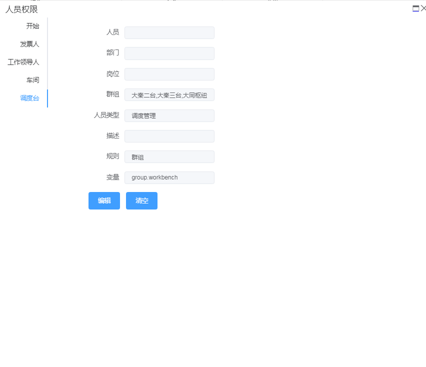
缺陷审核：配置固定的部门，规则群组


###

###

### 2.8 消息服务

#### 2.8.1 MQ 三种消息模式

```
RabbitMQ有三种主要消息模式，包括Fanout、Direct、Topic模式。
```

##### Fanout 模式

**Fanout 模式：即广播模式，生产者及消费者绑定相同的 Fanout 交换机，不需要路由键，多个消费者通过定义不同的队列来消费，以达到一个消息多个消费者目的。**

**HR 人力资源人员调动消息配置定义**

```java
@Configuration
public class RabbitConfiguration {

    public static final String DEFAULT_EXCHANGE = "hr.transfer.fanout.exchange";
    public static final String TRANSFER_KEY = "";


    static {
        EventPublisherService.registerType(EventBusinessType.HR_TRANSFER.name(), DEFAULT_EXCHANGE, TRANSFER_KEY);
    }

    @Bean
    public EventPublisherService publisherService() {
        return new EventPublisherService();
    }

    @Bean
    public FanoutExchange defaultExchange() {
        return new FanoutExchange(DEFAULT_EXCHANGE);
    }
}
```

**EventPublisherService 业务及交换机绑定方法**

```java
public static void registerType(String businessType, String exchange, String routeKey) {
        Objects.requireNonNull(businessType);
        Objects.requireNonNull(exchange);
        Objects.requireNonNull(routeKey);
        REGISTRY.put(businessType, new MessageRoute(exchange, routeKey));
    }

```

**EventPublisherService 消息发送方法**

```java
public void publish(Event event, String exchange, String routeKey, CorrelationData correlationData) {
        Objects.requireNonNull(event);
        Objects.requireNonNull(exchange);
        Objects.requireNonNull(routeKey);
        Objects.requireNonNull(correlationData);
        rabbitTemplate.convertAndSend(exchange, routeKey, event, correlationData);
    }

```

**HR 人员调动生产消息**

```java
   @Autowired
    private EventPublisherService eventPublisherService;

    @Transactional
    @Override
    public int save(Transfer entity) {
        if (StringUtil.isNotBlank(entity.getId()))
            throw new RuntimeException("调动记录不得编辑!");
        String userId = entity.getUserId();
        String transferDept = entity.getTransferDept();
        Objects.requireNonNull(userId);
        Objects.requireNonNull(transferDept);
        Objects.requireNonNull(entity.getTransferDate());
        entity.preInsert();
        dao.insert(entity);
        userDao.update(new SystemUser(userId, transferDept, entity.getTransferPosition(), entity.getTransferPersonalType()));
        // 更新证书
        electricService.updateNotNonByUserId(new LicenceElectric(userId, transferDept));
        guardService.updateNotNonByUserId(new LicenceGuard(userId, transferDept));
        // 更新成绩
        scoreService.changeDept(new LicenceElectricScore(userId, transferDept));
        TransferMessage message=new TransferMessage();
        BeanUtils.copyProperties(entity,message);
        eventPublisherService.publish(message.toString(),EventBusinessType.HR_TRANSFER.name(),entity.getUserId());//TODO 发布调动信息
        return 1;
    }
```

**COMP 派计工管理模块定义队列、交换机消费 HR 人员调动消息**

```java
@Configuration
public class RabbitConfiguration {

    public static final String DEFAULT_EXCHANGE = "hr.transfer.fanout.exchange";
    public static final String TRANSFER_QUEUE = "comp.transfer.queue";


    @Bean
    public TransferEventHandler transferEventHandler() {
        return new TransferEventHandler();
    }


    @Bean
    public EventSubscriberService subscriber() {
        EventSubscriberService subscriberService = new EventSubscriberService();
        subscriberService.registerEvent(EventBusinessType.HR_TRANSFER.name(), transferEventHandler());
        return subscriberService;
    }

    @Bean
    public FanoutExchange defaultExchange() {
        return new FanoutExchange(DEFAULT_EXCHANGE);
    }

    @Bean
    public Queue transferQueue() {
        return new Queue(TRANSFER_QUEUE);
    }

    @Bean
    public Binding transferBinding() {
        return BindingBuilder.bind(transferQueue()).to(defaultExchange());
    }

}
```

**COMP 人员调动监听器，监听队列名称**

```java
@Component
public class TransferEventListener {
    @Autowired
    private EventSubscriberService subscriberService;
    @RabbitListener(queues = {RabbitConfiguration.TRANSFER_QUEUE})
    public void transfer(Event event){
        subscriberService.persistAndHandleMessage(event);

    }
}

public class TransferEventHandler extends EventHandler {
    @Autowired
    private ScheduleUserService scheduleUserService;

    private Logger logger = LoggerFactory.getLogger(TransferEventHandler.class);

    @Override
    public void handle(EventSubscriber subscriber) {
        TransferMessage message = Jacksons.jsonToPojo(subscriber.getPayload(), TransferMessage.class);
        scheduleUserService.updateTransferEvent(new ScheduleUser(message.getUserId(), message.getDeptId(), message.getTransferDate(), message.getTransferDept()));
    }
}
```

**EventSubsriberService 消息业务类型及消费事件绑定**

```java

    private final ConcurrentMap<String, EventHandler> eventHandlerConcurrentHashMap = new ConcurrentHashMap<>();


    public void registerEvent(String businessType, EventHandler handler) {
        eventHandlerConcurrentHashMap.put(businessType, handler);
    }

```

**EventSubsriberService 消息消费及回调业务**

```java
  @Transactional(rollbackFor = Exception.class)
    public int persistAndHandleMessage(String serviceId, Event event) {
        Objects.requireNonNull(event);
        Objects.requireNonNull(serviceId);
        throwIfNotIncluded(event.getBusinessType());
        logger.error("rec rabbitmq-----------> serviceId:{}  msg: {}",serviceId,event);
        int influence = 0;
        final EventSubscriber subscriber = new EventSubscriber();
        subscriber.setId(event.getId());
        subscriber.setBusinessType(event.getBusinessType());
        subscriber.setPayload(event.getPayload());
        subscriber.setGuid(event.getGuid());
        subscriber.setLockVersion(0);
        subscriber.setEventStatus(EventStatus.NEW);
        subscriber.setCreateTime(event.getCreateTime());
        subscriber.setRecTime(new Date());
        subscriber.setServiceId(serviceId);
        HibernateValidators.throwsIfInvalid(subscriber);
        try {
            influence = subscriberMapper.insert(subscriber);
        } catch (DuplicateKeyException e) {
            logger.error("duplicate key in processing message serviceId:{} msgId:{} guid:{}", serviceId, event.getId(), event.getGuid());
        }
        if (influence > 0) {
            eventHandlerConcurrentHashMap.get(event.getBusinessType()).handle(subscriber);
            //todo update
            subscriberMapper.updateEventStatus(new EventSubscriber(serviceId,subscriber.getId(),EventStatus.DONE));
        }
        return influence;

    }
```

##### Direct 模式

**直连模式，生产者和消费者通过相同的 Direct Exchange、RouteKey、Queue 投递及消费消息，单一消费模式，一条消息只能被一个消费者消费。**

**HR 人员调动生产者消息配置。**

```java
@Configuration
public class RabbitConfiguration {

    public static final String DEFAULT_DIRECT_EXCHANGE = "hr.direct.exchange";
    public static final String TRANSFER_QUEUE = "hr.transfer.queue";
    public static final String DEAD_TRANSFER_QUEUE = "d.hr.transfer.queue";
    public static final String TRANSFER_KEY = "hr.transfer.route";
    public static final String DEAD_TRANSFER_KEY = "d.hr.transfer.route";


    static {
        EventPublisherService.registerType(EventBusinessType.HR_TRANSFER.name(), DEFAULT_DIRECT_EXCHANGE, TRANSFER_KEY);
    }

    @Bean
    public EventPublisherService publisherService() {
        return new EventPublisherService();
    }

    @Bean
    public DirectExchange defaultExchange() {
        return new DirectExchange(DEFAULT_DIRECT_EXCHANGE, true, false);
    }

    @Bean
    public Queue transferQueue() {
        final ImmutableMap<String, Object> args =
                ImmutableMap.of("x-dead-letter-exchange", DEFAULT_DIRECT_EXCHANGE,
                        "x-dead-letter-routing-key", DEAD_TRANSFER_KEY);
        return new Queue(TRANSFER_QUEUE, true, false, false, args);
    }

    @Bean
    public Binding transferBinding() {
        return BindingBuilder.bind(transferQueue()).to(defaultExchange()).with(TRANSFER_KEY);
    }

    @Bean
    public Queue deadTransferQueue() {
        return new Queue(DEAD_TRANSFER_QUEUE, true, false, false);
    }

    @Bean
    public Binding deadPointBinding() {
        return BindingBuilder.bind(deadTransferQueue()).to(defaultExchange()).with(DEAD_TRANSFER_KEY);
    }

}

```

**HR 生产者消息发送 Fanout**

**Comp 消费 HR 人员调动消息消费者配置，同生产者一致**

```java
@Configuration
public class RabbitConfiguration {

    public static final String DEFAULT_DIRECT_EXCHANGE = "hr.direct.exchange";
    public static final String TRANSFER_QUEUE = "hr.transfer.queue";
    public static final String DEAD_TRANSFER_QUEUE = "d.hr.transfer.queue";
    public static final String TRANSFER_KEY = "hr.transfer.route";
    public static final String DEAD_TRANSFER_KEY = "d.hr.transfer.route";


    @Bean
    public TransferEventHandler transferEventHandler() {
        return new TransferEventHandler();
    }


    @Bean
    public EventSubscriberService subscriber() {
        EventSubscriberService subscriberService = new EventSubscriberService();
        subscriberService.registerEvent(EventBusinessType.HR_TRANSFER.name(),transferEventHandler());
        return subscriberService;

    }

    @Bean
    public DirectExchange defaultExchange() {
        return new DirectExchange(DEFAULT_DIRECT_EXCHANGE, true, false);
    }

    @Bean
    public Queue transferQueue() {
        final ImmutableMap<String, Object> args =
                ImmutableMap.of("x-dead-letter-exchange", DEFAULT_DIRECT_EXCHANGE,
                        "x-dead-letter-routing-key", DEAD_TRANSFER_KEY);
        return new Queue(TRANSFER_QUEUE, true, false, false, args);
    }

    @Bean
    public Binding transferBinding() {
        return BindingBuilder.bind(transferQueue()).to(defaultExchange()).with(TRANSFER_KEY);
    }

    @Bean
    public Queue deadTransferQueue() {
        return new Queue(DEAD_TRANSFER_QUEUE, true, false, false);
    }

    @Bean
    public Binding deadPointBinding() {
        return BindingBuilder.bind(deadTransferQueue()).to(defaultExchange()).with(DEAD_TRANSFER_KEY);
    }
}
```

**消息监听及事件处理同 Fanout**

##### Topic 模式

**主题模式，类似 Direct 模式，生产者通过 TopicExchange、RouteKey 投递消息，消费者通过 TopicExchange、模糊匹配 RouteKey、绑定 Queue 消费消息。支持多个消费者消费相同消息。**

**人员调动生产者消息配置**

```
@Configuration
public class RabbitConfiguration {

    public static final String DEFAULT_EXCHANGE = "hr.topic.exchange";
    public static final String TRANSFER_KEY = "hr.transfer.route";


    static {
        EventPublisherService.registerType(EventBusinessType.HR_TRANSFER.name(), DEFAULT_EXCHANGE, TRANSFER_KEY);
    }

    @Bean
    public EventPublisherService publisherService() {
        return new EventPublisherService();
    }

    @Bean
    public TopicExchange defaultExchange() {
        return new TopicExchange(DEFAULT_EXCHANGE);
    }

}

```

**消费者消费人员调动及 HR 所有的消息配置**

```java
@Configuration
public class RabbitConfiguration {

    public static final String DEFAULT_EXCHANGE = "hr.topic.exchange";
    public static final String TRANSFER_QUEUE = "transfer.queue";
    public static final String TRANSFER_KEY="hr.transfer.*";
    public static final String HR_QUEUE = "hr.queue";
    public static final String HR_KEY="hr.#";


    @Bean
    public TopicExchange defaultExchange() {
        return new TopicExchange(DEFAULT_EXCHANGE);
    }

    @Bean
    public Queue transferQueue() {
        return new Queue(TRANSFER_QUEUE);
    }

    @Bean
    public Queue hrQueue() {
        return new Queue(HR_QUEUE);
    }

    @Bean
    public Binding transferBinding() {
        return BindingBuilder.bind(transferQueue()).to(defaultExchange()).with(TRANSFER_KEY);
    }
    @Bean
    public Binding hrBinding() {
        return BindingBuilder.bind(hrQueue()).to(defaultExchange()).with(HR_QUEUE);
    }

}
```

#### 2.8.2 API

**消息服务模块 togest-rabbitmq 模块下，包括事件发布、事件订阅两个接口类**

##### 事件发布(EventPublisherService)

**1) 注册函数，实现功能：业务类型及交换机、路由绑定，对于 Fanout 模式，路由参数可空**

```java
public static void registerType(String businessType, String exchange, String routeKey)
```

**2) 消息发布，payload:业务数据 json 格式，guid:业务数据主键**

```java
 public int publish(String payload, String businessType,String guid)
```

##### 事件订阅(EventSubscriberService)

**1) 注册函数，实现功能：业务类型和消息处理事件绑定**

```java
   public void registerEvent(String businessType, EventHandler handler)
```

**2) 消息处理函数。实现功能接收到的消息保存到数据表中防止重复接收消息及将消息输入到消息事件处理类中**

````java
public int persistAndHandleMessage(Event event)```
````

### 2.9 痕迹分析

平台审计框架，用于数据提交分析。分析的涵盖属性包括：

​ 1)IP

​ 2)用户

​ 3) 请求时间

​ 4）响应时间

​ 5）后台响应时间

​ 6）请求方法：PUT/GET/POST/DELETE

​ 7) 模块 URL

​ 8) 二级模块 URL

​ 9) 数据 API

​ 10) 提交请求内容

​ 11）响应内容

​ 13）后台执行 SQL 记录

​ 14）上传附件

​ 15）上传附件名称

​ 16）异常

​ 17）功能名称

​ 18）agent

​ 框架采用切面、 SQL 拦截器、线程池异步保存痕迹信息，附件存储在 MYSQL 中设计思想开发。审计框架包括 client、server 两个模块。

#### 2.9.1 数据表

```sql
CREATE TABLE `sys_mark` (
  `id` varchar(50) NOT NULL,
  `ip` varchar(30) NOT NULL COMMENT '用户IP',
  `user_id` varchar(32) NOT NULL COMMENT '用户ID',
  `request_time` datetime NOT NULL COMMENT '请求时间',
  `agent` varchar(10) DEFAULT NULL COMMENT '代理PC/APP',
  `method` varchar(10) NOT NULL COMMENT '请求方法',
  `api_desc` varchar(30) DEFAULT NULL COMMENT 'API描述',
  `module_url` varchar(20) NOT NULL COMMENT '模块路由',
  `function_url` varchar(50) DEFAULT NULL,
  `url` varchar(50) NOT NULL COMMENT 'api路由',
  `request_content` text COMMENT '请求内容',
  `upload_file_name` varchar(255) DEFAULT NULL COMMENT '上传附件名称',
  `upload_file_content` longblob COMMENT '上传附件内容',
  `response_content` text COMMENT '响应内容',
  `response_time` datetime DEFAULT NULL COMMENT '响应时间',
  `persist_time` int(11) NOT NULL DEFAULT '0' COMMENT '持续时间毫秒',
  `exception` text COMMENT '异常',
  `sql_log` text COMMENT 'SQL日志',
  `sort` bigint(20) NOT NULL AUTO_INCREMENT,
  PRIMARY KEY (`id`),
  KEY `sort` (`sort`),
  KEY `idx_query` (`module_url`,`function_url`,`sort`)
) ENGINE=MyISAM AUTO_INCREMENT=14 DEFAULT CHARSET=utf8
```

#### 2.9.2 注解

```java
@Retention(RetentionPolicy.RUNTIME)
@Target({ElementType.METHOD})
public @interface MarkAnnotation {
    /**
     * 模块中的小模块
     * @return
     */
    String functionUrl() default "";
}
```

​ functionUrl:二级模块，比如/C1/defect。默认可以空。空则用 API 的前两级填充。比如/C1/defect/imports 则 functionUrl=/C1/defect

#### 2.9.3 配置

| 属性名                                      | 功能                              |
| ------------------------------------------- | --------------------------------- |
| com.togest.mark.enabled                     | 切面是否启用，默认 true,启用      |
| com.togest.mark.sqlMaxLength                | 保留 SQL 长度，单位字节，默认 16M |
| com.togest.mark.threadPool                  | 线程池配置                        |
| com.togest.mark.threadPool.corePoolSize     |                                   |
| com.togest.mark.threadPool.maxPoolSize      |                                   |
| com.togest.mark.threadPool.queueCapacity    |                                   |
| com.togest.mark.threadPool.keepAliveSeconds |                                   |

#### 2.9.4 restful api

**1.mark/getDetail**

**功能：** 获取审计详细信息

**方法：** GET

**输入：**id

**输出：**

```json
{
  "data": {
    "agent": "string",
    "apiDesc": "string",
    "exception": "string",
    "functionUrl": "string",
    "id": "string",
    "ip": "string",
    "method": "string",
    "moduleUrl": "string",
    "persistTime": 0,
    "requestContent": "string",
    "requestTime": "2020-04-07T04:49:26.884Z",
    "requestTimeEnd": "2020-04-07T04:49:26.884Z",
    "requestTimeStart": "2020-04-07T04:49:26.884Z",
    "responseContent": "string",
    "responseTime": "2020-04-07T04:49:26.885Z",
    "responseTimeEnd": "2020-04-07T04:49:26.885Z",
    "responseTimeStart": "2020-04-07T04:49:26.885Z",
    "sqlLog": "string",
    "status": "string",
    "statusName": "string",
    "uploadFileName": "string",
    "url": "string",
    "userId": "string",
    "userName": "string"
  },
  "errorCode": 10000,
  "msg": "string"
}
```

**2./mark/{resourcesCode}/getMarkByFunction**

**功能：** 获取审计分页信息，按照 sort 倒序排

**方法：** GET

**输入：**resourcesCode、moduleUrl、functionUrl、pageSize、pageNo

**输出：**

```json
{
  "data": {
    "autoCount": true,
    "hasNext": true,
    "hasPre": true,
    "nextPage": 0,
    "orderBy": "CREATE_TIME DESC",
    "orderBySetted": true,
    "pageNo": 3,
    "pageSize": 30,
    "prePage": 0,
    "rows": [
      {
        "agent": "string",
        "apiDesc": "string",
        "exception": "string",
        "functionUrl": "string",
        "id": "string",
        "ip": "string",
        "method": "string",
        "moduleUrl": "string",
        "persistTime": 0,
        "requestContent": "string",
        "requestTime": "2020-04-07T04:49:26.896Z",
        "requestTimeEnd": "2020-04-07T04:49:26.896Z",
        "requestTimeStart": "2020-04-07T04:49:26.896Z",
        "responseContent": "string",
        "responseTime": "2020-04-07T04:49:26.896Z",
        "responseTimeEnd": "2020-04-07T04:49:26.896Z",
        "responseTimeStart": "2020-04-07T04:49:26.896Z",
        "sqlLog": "string",
        "status": "string",
        "statusName": "string",
        "uploadFileName": "string",
        "url": "string",
        "userId": "string",
        "userName": "string"
      }
    ],
    "total": 81,
    "totoalPage": 3
  },
  "errorCode": 10000,
  "msg": "string"
}
```

**3.mark/getUploadFile**

**功能：** 下载附件

**方法：** GET

**输入：**id

**输出：**ResponseEntity

**4.mark/{resourcesCode}/getEnclosureDetail**

**功能：** 获取元数据封装审计详情

**方法：** GET

**输入：**id、resourcesCode

**输出：**

```json
{
  "data": {},
  "errorCode": 10000,
  "msg": "string"
}
```

#### 2.9.5 框架使用

**依赖**

```xml
		<dependency>
			<groupId>com.togest</groupId>
			<artifactId>togest-mark-server</artifactId>
			<version>0.0.1-SNAPSHOT</version>
		</dependency>
	</dependencies>
```

**配置**

```properties
com:
  togest:
    mark:
      markEnabled: true
      sqlMaxLength: 20971520
      threadPool:
        core-pool-size: 8
        max-pool-size: 12
        queue-capacity: 500
        keep-alive-seconds: 300
```

**业务**

​ 业务中需要结合 Swagger 的 ApiOperation 注解实现 API 的描述。MarkAnnotation 的解释看上章节

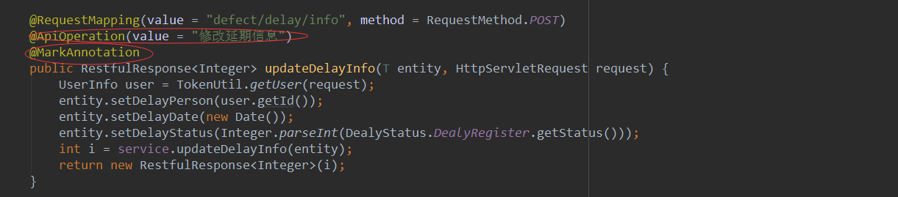

### 2.10 代码生成器

​ 为了提高后端工程师的开发效率，我们开发了 togest-cms-generator 模块，它目前是作为一个独立的微服务运行。利用这个服务，我们可以完成控制器、业务逻辑、dao、xml 的代码生成。生成完之后，针对业务做些修改定制开发即何。

​ **功能描述：**生成代码，返回 ZIP 压缩包

```Java
  @RequestMapping(value="/generator",method=RequestMethod.GET)@ApiOperation(value = "生成代码")
public void code(HttpServletRequest request, HttpServletResponse response,GeneratorRequest entity)
```

​ **输入：**GeneratorRequest

| 属性        | 类型   | 描述                                |
| ----------- | ------ | ----------------------------------- |
| tableName   | String | 表名                                |
| tablePrefix | String | 代码生成去除模块名称                |
| packageName | String | 包名                                |
| tag         | String | 树形应用/典型。1：树形 其它值：典型 |

​ **输出：**ZIP 文件，可直接拷贝到项目中

### 2.11 常用工具

​ 常用工具 togest-common 模块 util 包图如下，分别包括 JSON、文件、String、Word、XLS、日期、反射、集合、条形码、二维码常用的一些操作类。

​ util 定义了反射、日期、条形码、二维码、集合工具。其中 ListUtils、MapUtils、SetUtils 这些类可以使用

​ **com.google.common.collect**包中集合替代使用。

​ json 包定义了 JSON、实体间的转换。

​ file 包中定义文件拷贝、图片、ZIP、流、FTL 处理工具。

​ function 包定义了链式空处理、空值校验、集合的处理工具。

​ string 包定义了字符串的常用的一些处理方法。

​ xls 包定义了导入、导出的方法。

​ word 包定义了基于书签方式的详情替换、表格方式创建、详情替换+表格方式创


#### 2.11.1 校验

`com.togest.common.util.function.Check.java`

**带有 `check` 前缀的方法 设计思想接近{@link java.util.Objects} ，为空时会上抛异常，应当用于快速失败。**

`checkNotNull()` 前三个重载方法见参数列表可知，依次用来给 Collection、Map、String 类型对象进行判空。对于集合，会检查 size；对于字符串，会检查空串。

最后一个重载方法接受可变长参数，判空逻辑即通过 `instanceof` 与上面三种类型进行匹配，命中则调用对应方法。均不匹配时调用 `Objects.requireNonNull()` 。

```java
void checkNotNull(Collection collection);
void checkNotNull(Map map);
void checkNotNull(String str);
void checkNotNull(Object... params);
```

**`isEmpty()/isNotEmpty()` 方法用来判断对象是否为空，返回 boolean 。类似的，均为三个重载方法。**

```java
boolean isEmpty(Collection collection);
boolean isNotEmpty(Collection collection);
```

**`isNumber(Class<?> type)` 方法用来判断是否为数值类型，根据判断结果返回 boolean。所有的 `Number` 子类、Primitive 数值类型，以及其对应的 Wrapper 类型。**

```java
public static boolean isNumber(Class<?> type);
```

#### 2.11.2 日期

com.togest.common.util.LocalDateUtils.java`

```java
// 获得 yyyy-MM-dd 格式的 String
String getDateStr(Date date);
// 通过给定参数获得 Date
Date getDate(String dateStr); // yyyy-MM-dd 格式
Date getDate(int year, int month, int day);
Date getDate(int year, int month, int dayOfMonth, int hour, int minute);
Date getDate(int year, int month, int dayOfMonth, int hour, int minute, int second);
// 日期间隔天数
long daysBetween(Date begin, Date end);
// 当前年份
int getYear();
// 当前月份
int getMonth();
// 本年第一天
Date firstOfYear();
// 本年最后一天
Date lastOfYear();
// 本月第一天
Date firstOfMonth();
// 本月天数
int lengthOfMonth(Date date); // 日期所处年月
int lengthOfMonth(int year, int month);
int lengthOfMonth(String yearMonth); // yyyy-MM 的 String 年月表示
// 本月第几天
int getDay(Date date);
// 日期拆分
// 数组中依次为 年、月、日、时、分 的 "%02d" 表示
String[] splitDate(Date date);
// 自行指定 format 用于拆分后的 String 格式化规则
String[] splitDate(Date date, String format);
// 获得一个月的日期字符串表示 格式为 yyyy-MM-dd
List<String> getMonthDateStr(Date date);
// 给日期增加指定的天数 减少传负数即可
Date plusDays(Date date, long daysToAdd);
// 给日期增加指定的 年 月 周 日数  减少传负数即可
Date plus(Date date, long yearsToAdd, long monthsToAdd, long weeksToAdd, long daysToAdd);
// 判断一个日期是否处于当前月
boolean isDateInCurrMonth(Date date);
```

#### 2.11.3 集合处理

`com.togest.common.util.function.FunctionUtil.java`

此工具类基于以下类和方法进行封装，使用了较多 Java 8 引入的一些特性。

```java
java.util.function.*;
java.util.stream.Collector;
java.util.stream.Collectors.*;
java.util.stream.Stream;
```

其中较多方法参数接收的是 FunctionalInterface，这里简单给出常用的说明，下面就不在解释了。

| 接口             | 表示        | 描述                                   |
| ---------------- | ----------- | -------------------------------------- |
| `Predicate<T>`   | T → boolean | 对给定参数做判断，返回值必须为 boolean |
| `Consumer<T>`    | T → void    | 接收单个参数给接口“消费”用，无返回值   |
| `Function<T, R>` | T → R       | 接收单个参数，并返回结果               |
| `Supplier<T>`    | None → T    | 内容提供者，不接受参数，返回结果       |

```java
// 通过给定 Predicate 对容器中元素进行 过滤
<T> List<T> filter(Collection<T> data, Predicate<T> predicate);
// 通过给定 Function 对容器中元素进行 转换
<T, R> List<R> map(Collection<T> data, Function<T, R> function);
// 转换后是否去重 去重依赖 equals() 方法
<T, R> List<R> map(Collection<T> data, Function<T, R> function, boolean distinct)
// 对容器内元素 先通过 Predicate 过滤，再通过 Function 转换
<T, R> List<R> map(Collection<T> data, Predicate<T> predicate, Function<T, R> function);
// 通过 Function 结果作为去重依据 不依赖 equals() 方法
<T, V> List<T> distinct(Collection<T> data, Function<T, V> keyExtractor);
// 去重前先过滤 不依赖 equals() 方法
<T, V> List<T> distinct(Collection<T> data, Predicate<T> predicate, Function<T, V> keyExtractor);
// 将多个 Stream 合并为一个 Stream
<T, R> List<R> flatMap(Collection<T> data, Function<T,  Stream<R>> function);
// 拼接泛型为 String 的容器，默认 delimiter 为 ","
String joinings(Collection<String> data);
// 指定 delimiter
String joinings(Collection<String> data, String delimiter);
// 指定 delimiter 以及是否去重
String joinings(Collection<String> data, String delimiter, boolean distinct);
// 对容器内容元素使用 Function 进行转换，使用默认 delimiter 拼接
<T> String joinings(Collection<T> data, Function<T, String> function);
// 指定 delimiter 以及是否去重
<T> String joinings(Collection<T> data, Function<T, String> function, String delimiter, boolean distinct);
// List<Map<String, String> 为系统中通过 id找name 或 通过name找id 接口返回格式
// 通过指定的 key名称 与 value名称 规约为一个 HashMap
// List<Map<String, String> 中的 key 如果有重复，显然获得的 HashMap 可能出现覆盖的情况
Map<String, String> getHashMap(List<Map<String, String>> data, String keyName, String valueName);
// 容器中是否 存在 满足 Predicate 的元素
<T> boolean anyMatch(Collection<T> data, Predicate<? super T> predicate);
// 容器中是否 全部为 满足 Predicate 的元素
<T> boolean allMatch(Collection<T> data, Predicate<? super T> predicate);
// 容器中是否 全都为不满足 Predicate 的元素
<T> boolean noneMatch(Collection<T> data, Predicate<? super T> predicate);
// 通过 指定的 keyMapper 结果作为 key，元素作为值，将容器转换为 map，key 出现重复会上抛异常
<T, R> Map<R, T> toMap(Collection<T> data, Function<T, R> keyMapper);
// 同上 指定 BinaryOperator 作为 key duplicate 时的处理方式
<T, R> Map<R, T> toMap(Collection<T> data, Function<T, R> keyMapper, BinaryOperator<T> mergeFunction);
// 通过 指定的 keyMapper 结果作为 key，指定的 valueMapper 结果作为值，将容器转换为 map，key 出现重复会上抛异常
<T, K, V> Map<K, V> toMap(Collection<T> data, Function<T, K> keyMapper, Function<T, V> valueMapper);
// 同上 指定 BinaryOperator 作为 key duplicate 时的处理方式
<T, K, V> Map<K, V> toMap(Collection<T> data, Function<T, K> keyMapper, Function<T, V> valueMapper, BinaryOperator<V> mergeFunction);
// 对容器中元素求 double 和，从一个元素获取 double 的方式为 ToDoubleFunction
<T> double toDoubleSum(Collection<T> data, ToDoubleFunction<T> mapper);
// 获取前先过滤
<T> double toDoubleSum(Collection<T> data, Predicate<T> predicate, ToDoubleFunction<T> mapper);
// 对容器中元素求 int 和，从一个元素获取 int 的方式为 ToIntFunction
<T> int toIntSum(Collection<T> data, ToIntFunction<T> mapper);
// 获取前先过滤
<T> int toIntSum(Collection<T> data, Predicate<T> predicate, ToIntFunction<T> mapper);
```

#### 2.11.4 连续空值处理

`com.togest.common.util.function.OptionalUtils.java`

此工具类基于 `java.util.Optional` 封装，这里只介绍一个常用的方法:

```java
<T> T map(RestfulResponse<T> clientEntity)
```

系统服务间客户端调用时，返回的数据格式均为 `RestfulResponse<?> clientObj`。通常需要对 clientObj 判空，再调用 `getData()` 方法获得我们实际关心的业务数据，还要对业务数据判空。

上述方法直接返回我们实际关心的业务数据，转换过程中有一次出现空值，则获得数据为 null。

---

这个工具类了解这一个方法就可以了，**更多的用法应当去了解 Optional 类**。

在涉及对一个对象连续调用（或者叫做转换）时，其中每一步都有可能为空时，我们推荐使用 Optional 链去做这件事。

Optional 链起始于一个 `Optional<?>` 对象。获取这个对象有两种方法：

- `Optional.of(T value)` 链的起始 value 不可以为空，为空上抛异常
- `Optional.ofNullable(T value)` 链的起始 value 就可以为空。

Optional 链的中间部分即为 `<U> Optional<U> map(Function<? super T, ? extends U> mapper)`， map 方法的连续调用。

_假设有一个可能为空的字符串，我们的需求是把字符串的首字母变成大写。_

_为了体现“中间步骤”多，所以这里假设实现思路是：先转换成数组，数组首字母大写，转换成字符串。那么从起始到中间转换的过程代码如下。_

```java
Optional.ofNullable(str)
                .map(String::toCharArray)
                .map(x -> {x[0] = Character.toUpperCase(x[0]); return x;})
                .map(String::new);
```

注意这整个过程都是**惰性求值**的，我们最后结尾的一定是一个终止符，用来获得“结果”。

使用 `get()` 方法，代表你非常确信能够获得结果，如果获取不到，就会上抛异常。

```java
final String rst = Optional.ofNullable(str)
                .map(String::toCharArray)
                .map(x -> { x[0] = Character.toUpperCase(x[0]); return x; })
                .map(String::new)
                .get();
```

使用 `orElse(T other)` 方法，指定一个出现空值时的默认值，如果整个链式转换过程中出现空值，则即可停止，返回这里你指定的值。

```java
final String rst = Optional.ofNullable(str)
                .map(String::toCharArray)
                .map(x -> { x[0] = Character.toUpperCase(x[0]); return x; })
                .map(String::new)
                .orElse("default");
```

使用 `orElseGet(Supplier<? extends T> other)` 方法，与上面含义相同，无非你提供的不是具体的默认值，而是一个内容提供者 Supplier。

```java
final String rst = Optional.ofNullable(str)
                .map(String::toCharArray)
                .map(x -> { x[0] = Character.toUpperCase(x[0]); return x; })
                .map(String::new)
                .orElseGet(String::new);
```

使用 `ifPresent(Consumer<? super T> consumer)` 方法，传入 Consumer ，整个转换过程中都没有问题出现的话，直接消费掉最终结果，无返回值。

```java
Optional.ofNullable(str)
                .map(String::toCharArray)
                .map(x -> { x[0] = Character.toUpperCase(x[0]); return x; })
                .map(String::new)
                .ifPresent(rst -> {
                    // do whatever you want
                    System.out.println("rst:" + rst);
                });
```

### 2.12 日志使用

​ 日志使用时，输出信息要使用占位符的方式，实例如下。


​ 日志使用时，输出异常堆栈信息，实例如下，便于追踪异常。


​ 谨慎地记录日志。生产环境禁止输出 debug 日志；有选择地输出 info 日志；如果使用 warn 来记录刚上线时的业务行为信息，一定要注意日志输出量的问题，避免把服务器磁盘撑爆，并记得及时删除这些观察日志。

说明：大量地输出无效日志，不利于系统性能提升，也不利于快速定位错误点。

## 3.平台服务

### 3.1 注册服务

​ 平台注册 togest-register 模块，为服务注册中心，独立服务运行,默认端口 8762，目前单点运行。


### 3.2 网关


​ 平台 togest-gateway 模块，为所有后台网关转发服务，独立服务运行，目前单点运行,默认端口 50001。网关的功能如下：

​ 1、登录鉴权。所有经过网关的请求都会获取 TOKEN 拦截。TOKEN 校验通过 REDIS 完成

​ 2、白名单鉴权。对于第三方系统需要访问我们的系统，我们会通过配置文件，配置些固定的 KEY 及秘钥。用户携带这些固定秘钥进行白名单鉴权

​ 3、路由功能。通过路由配置规则，进行转发。配置定义参考以下文件：

```properties
routes:
    file:
      path: /file/**
      serviceId: file-service
      stripPrefix: true
    download:
      path: /download/**
      serviceId: file-service
      stripPrefix: true
    code:
      path: /code/**
      serviceId: code-service
      stripPrefix: true
    dict:
      path: /dict/**
      serviceId: dict-service
      stripPrefix: true
    base:
      path: /base/**
      serviceId: base-service
      stripPrefix: true
    workflow:
      path: /workflow/**
      serviceId: workflow-service
      stripPrefix: true
    jcwBase:
      path: /jcw/base/**
      serviceId: jcwBase-service
      stripPrefix: true
    jcwEqu:
      path: /jcw/equ/**
      serviceId: jcwEqu-service
      stripPrefix: true
    jcwProduce:
      path: /jcw/produce/**
      serviceId: jcwProduce-service
      stripPrefix: true
```

### 3.3 监控服务

​ 平台 togest-admin 模块，为服务监控模块，完成平台所有微服务的监控，默认端口 8090。通过该监控可以看到服务的在线状态、CPU、内存、健康检查情况、日志查看。

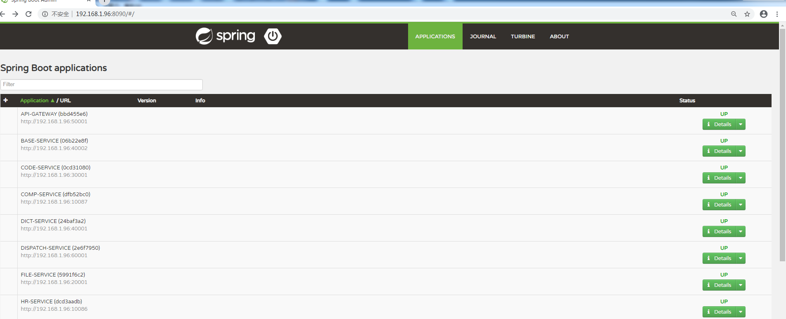

### 3.4 配置管理

​ 配置管理服务管理平台所有服务的配置文件，配置文件的管理目前有三种方式 ,包括配置管理本地存储、GIT、SVN 管理。服务的配置文件一旦有变动，配置管理服务会通知关联的服务进行重启。目前平台一些 IP 的配置，采用的都是 HOST，配置不经常变化，估暂时未启用该服务。

​ 以下为配置管理服务使用本地文件管理服务配置，文件名要对应微服务名称。


### 3.5 字典

​ 字典服务管理平台所有的字典，微服务之间通过 feignClient 聚合。


​ 字典开发了客户端模块，在上面聚合中已经详细介绍了，不再做描述，字典服务经常被服务调用的 restful api 如下：

1. **[GET](http://192.168.1.96:40001/swagger-ui.html#!/dictionary-item-resource/getNameByIdsUsingGET) [/dictionaryItem/ids/names](http://192.168.1.96:40001/swagger-ui.html#!/dictionary-item-resource/getNameByIdsUsingGET)**

   **输入：** id,多个

​ **输出：**

```json
{
  "data": [
    {
      "name": "基本信息",
      "id": "1"
    },
    {
      "name": "男",
      "id": "2"
    }
  ],
  "errorCode": 10000,
  "msg": "ok"
}
```

2.[GET](http://192.168.1.96:40001/swagger-ui.html#!/dictionary-item-resource/findDictionaryItemsUsingGET) [/dictionary/dictionaryName/dictionaryItems](http://192.168.1.96:40001/swagger-ui.html#!/dictionary-item-resource/findDictionaryItemsUsingGET)

**输入：** 字典名称,多个

**输出：**

```json
{
  "data": [
    {
      "id": "2",
      "name": "男",
      "code": "1",
      "sort": 2,
      "dictionaryId": "1",
      "dictionaryEname": "sex",
      "dictionaryName": "性别",
      "dictionaryParentId": null
    },
    {
      "id": "3",
      "name": "女",
      "code": "2",
      "sort": 3,
      "dictionaryId": "1",
      "dictionaryEname": "sex",
      "dictionaryName": "性别",
      "dictionaryParentId": null
    }
  ],
  "errorCode": 10000,
  "msg": "ok"
}
```

### 3.6 元数据

​ 元数据服务管理了平台所有的 Crud、导入、导出元数据模型。


​ 所有业务都是基于元数据驱动，我们针对聚合的应用，设计了 togest-cms-code-client 模块，在导入导出中有些介绍。togest-cms-code-client 中设计了 MetadataConfigClient、ImportConfigClient、MetadataClient 三个类实现元数据服务的调用。

**MetadataConfigClient：获取元数据配置相关接口**

```java
@FeignClient(value = FeignServerConfig.codeServerName)
public interface MetadataConfigClient {

	@RequestMapping(value = "/systemResources/share", method = RequestMethod.POST)
	RestfulResponse<List<SystemResourcesDTO>> getSystemPropertyResources(@RequestBody List<String> ids);

	@RequestMapping(value = "/systemResources/customCode", method = RequestMethod.GET)
	RestfulResponse<String> getCustomCode(@RequestParam("id") String id);

	@GetMapping("/systemPropertyResources/resourcesCode")
	RestfulResponse<List<SystemPropertyResourcesDTO>> getSystemPropertyResources(@RequestParam("resourcesCode") String resourcesCode, @RequestParam("allocationTag") Integer allocationTag);

	@GetMapping("/systemPropertyResources/resourcesCode/record")
	@ApiOperation(value = "获取配置归档字段信息")
	RestfulResponse<List<SystemPropertyResourcesDTO>> getRecordProperty(@RequestParam("resourcesCode") String resourcesCode);

	@RequestMapping(value = "/systemResources/share/{code}", method = RequestMethod.GET)
	@ApiOperation(value = "获取资源")
	RestfulResponse<SystemResoucesResponse> getSystemResources(@PathVariable("code") String code);

	@RequestMapping(value = "/systemPropertyResources/ids/codes", method = RequestMethod.POST)
	@ApiOperation(value = "通过code集合获取信息")
	RestfulResponse<List<Map<String, String>>> getIdsByCustomCodes(@RequestBody List<String> codes);

	@RequestMapping(value = "/systemPropertyResources/code/id", method = RequestMethod.GET)
	@ApiOperation(value = "通过id获取code")
	RestfulResponse<String> getCodeById(@RequestParam("id") String id);

	@RequestMapping(value = "/systemPropertyResources/systemResourcesCodes", method = RequestMethod.POST)
	@ApiOperation(value = "通过code集合获取信息, TAG_SELECTED")
	RestfulResponse<Map<String, List<SystemPropertyResourcesDTO>>> getSystemResourcesByCodeList(@RequestBody List<String> systemResourcesCodeList);

	@RequestMapping(value = "/systemPropertyResources", method = RequestMethod.GET)
	@ApiOperation(value = "获取数据字段信息")
	RestfulResponse<SystemPropertyResourcesDTO> getSystemPropertyResources(@RequestParam("id") String id);

	@RequestMapping(value = "template/suffix", method = RequestMethod.GET)
	@ApiOperation(value = "通过模板数据id获取关联文件后缀名")
	RestfulResponse<String> getFileSuffix(@RequestParam("id") String id);

}

```

**MetadataClient：对 MAP 集合数据经过元数据加工**

```java
@Service
public class MetadataClient {
   @Autowired
   private MetadataConfigClient client;
   @Autowired
   private MetadataUtil util;

   public Map<String, List<Map<String, Object>>> enclosure(Map<String, Object> obj, String systemResourceCode,
         String dictName) {
      return enclosure(obj, systemResourceCode, dictName, false);
   }

   public Map<String, List<Map<String, Object>>> enclosure(Map<String, Object> obj, String systemResourceCode,
         String dictName, boolean isShowRelation) {
      RestfulResponse<List<SystemPropertyResourcesDTO>> result = client.getSystemPropertyResources(systemResourceCode,1);
      if (result == null || result.getData() == null) {
         return null;
      } else {
         return util.enclosure(obj, result.getData(), dictName, isShowRelation);
      }
   }
}
```

**ImportConfigClient：获取导入导出配置**

```java

@FeignClient(value = FeignServerConfig.codeServerName)
public interface ImportConfigClient {

	@RequestMapping(value = "importExcelConfigs/share/{id}", method = RequestMethod.GET)
	public RestfulResponse<ImportExcelConfigResponse> getImportExcelConfigResponse(@PathVariable("id") String id);

	@RequestMapping(value = "importExcelConfigs/share", method = RequestMethod.POST)
	public RestfulResponse<List<ImportExcelConfigResponse>> getImportExcelConfigResponse(@RequestBody List<String> ids);

	@RequestMapping(value = "importExcelConfigs/share", method = RequestMethod.GET)
	public RestfulResponse<List<ImportExcelConfigDTO>> getImportExcelConfigResponseByData(
			@RequestParam("dataName") String dataName);

	@RequestMapping(value = "sysUser/userHeader", method = RequestMethod.POST)
	public RestfulResponse<List<ExcelHeaderData>> getUserConfiguration(@RequestParam("userId") String userId,
			@RequestParam("systemResourcesCode") String systemResourcesCode);

	@RequestMapping(value = "template/share/file/{id}", method = RequestMethod.GET)
	public RestfulResponse<String> getFileId(@PathVariable("id") String id);

}
```

### 3.7 文件

​ 文件服务管理平台所有的文件，文件系统支持 ftp、disk、fastdfs 三种方式。所有的功能包括：大小文件上传、下载功能。

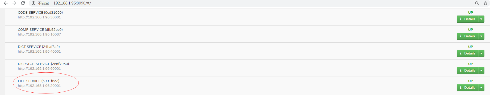

​ 文件服务相关的 API，可查看http://192.168.1.96:20001/swagger-ui.html#/。

​ 业务服务可能会需要调用文件服务，例如 Excel 中解析的图片需要上传至文件服务器上面。针对这么一种场景，我们设计了`togest-file-client`模块，便于内部服务上传文件。`togest-file-client`中是通过`feignClient`调用的，效率会较低，如果存在大量的文件上传的话，建议使用`togest-file-system-service`模块，直接操作文件系统。直接使用文件系统的话，需要考虑的是如果使用 disk 的方式，就需要考虑挂载的方式。

​ **`FileClient`**

```java
@FeignClient(FeignServerConfig.fileServerName)
public interface FileClient {

	@RequestMapping(value = "files/client", method = RequestMethod.POST)
	public RestfulResponse<String> uploadFileByClient(@RequestBody FileBlobDTO blob);

	@RequestMapping(value = "files/client/{id}", method = RequestMethod.GET)
	public RestfulResponse<FileDataDTO> download(@PathVariable("id") String id);

	@DeleteMapping("files/{id}/real")
	public RestfulResponse<Boolean> deleteFile(@PathVariable("id") String id);

	@RequestMapping(value = "files/{id}", method = RequestMethod.GET)
	@ApiOperation(value = "获取文件信息")
	public RestfulResponse<FileBlobDTO> getFile(@PathVariable("id") String id);

	@RequestMapping(value = "files/client/uploads", method = RequestMethod.POST)
	@ApiOperation(value = "批量上传文件")
	public RestfulResponse<Map<String, List<String>>> uploadByClient(@RequestBody List<FileBatchData> list);

	@RequestMapping(value = "files/client/downloads", method = RequestMethod.POST)
	@ApiOperation(value = "批量下载文件")
	public RestfulResponse<Map<String, FileDataDTO>> downloadByFileId(@RequestBody List<String> fileIds);

	@PostMapping(FileURL.UPLOAD_FILE_URL)
	public RestfulResponse<String> uploadFile(FileUploadDTO fileUploadRequest);

	@GetMapping(FileURL.DOWNLOAD_FILE_URL)
	public ResponseEntity downloadFile(@PathVariable("id") String id);

	@RequestMapping(value = "files/client/office/pdf", method = RequestMethod.POST)
	public RestfulResponse<byte[]> conventToPdf(@RequestBody FileDataDTO entity);

	@RequestMapping(value = "files/adds", method = RequestMethod.POST)
	@ApiOperation(value = "文件批量新增")
	public RestfulResponse<Boolean> inserts(@RequestBody List<FileBlobDTO> blobs);

	@RequestMapping(value = "files/datas", method = RequestMethod.POST)
	@ApiOperation(value = "批量获取文件信息")
	public RestfulResponse<List<FileBlobDTO>> getByIds(@RequestBody List<String> ids);
```

### 3.8 CMS

​ CMS 平台门户基础，实现功能包括登录、人员、组织结构、权限、站点设置等功能。 API，可查看http://192.168.1.96:40002/swagger-ui.html#/。


### 3.9 业务基础

​ 业务基础，平台业务基础服务，涵盖的功能包括铁路线路、站区、桥隧、接触网管辖范围、供电臂、所亭。 API，可查看http://192.168.1.96:30002/swagger-ui.html#/。


### 3.10 消息推送


​ 消息推送模块采用了 MQ 和 WebSocket 技术，实现消息的及时推送。整体设计思想： 生产者通过 MQ 点对点的方式将业务产生的消息发送给消息推送服务，消息推送服务通过绑定队列消费生产者的消息，消息服务一旦监听到消息之后，保存到数据库中，然后判断该消息是否满足在线用户的推送条件，如果满足，则及时推送。如果用户不在线，则用户登录时，会调用消息推送模块的 API 把最近的消息推送出去。

​ 消息推送模块包括 togest-cms-msg-model、togest-cms-msg-push 模块，togest-cms-msg-push 及业务服务可依赖 togest-cms-msg-model 模块。togest-cms-msg-model 定义了消息结构，传输的消息 ActMsgEnvelope 结构如下

**ActMsgEnvelope**

```Java
@Data
@NoArgsConstructor
public class ActMsgEnvelope implements Serializable {
   private ActMessage content;
   private  MsgTarget target;
}
```

**ActMessage**

```java
@Data
@NoArgsConstructor
public class ActMessage implements Serializable {
    private String id;
    private String content;
    private String dataId;
    private String businessType;
    private String payLoad;
    @DateTimeFormat(pattern = "yyyy-MM-dd")
    private Date createTime;
    private Long sort;
    private String href;
}
```

**MsgTarget**

```java
@AllArgsConstructor
@NoArgsConstructor
@Data
public class MsgTarget implements Serializable {
    private String userId;
    private String groupId; // 此处groupId含部门及群组
}
```

**绑定队列：**消息推送 MQ 和消息生产者通过这两个队列进行点对点消费

```java
public static final String SYSTEM_MQ_QUEUE="com.tg.sys.msg.queue";
public static final String SYSTEM_MQ_BATCH_QUEUE="com.tg.sys.msg.batch.queue";
```

**WEB 端 API：**

**1.功能：** 获取未读消息

```java
@RequestMapping(value = "getMessageList", method = RequestMethod.GET)
@ApiOperation(value = "消息列表")
  public RestfulResponse<List<ActMessageDTO>> actMessageList(ActMessageRequest vo)
```

**输入：**

| 属性   | 类型     | 描述                               |
| ------ | -------- | ---------------------------------- |
| userId | String   | 用户 ID，必填                      |
| deptId | String[] | 部门、群组，选填                   |
| maxNum | long     | 读取条数，按照创建时间倒序排，必填 |

**2.功能：**读某条消息标志成已读

```java
@RequestMapping(value = "readMessage", method = RequestMethod.POST)
@ApiOperation(value = "读消息")public RestfulResponse<Integer> readMessage(String msgId, String userId)
```

**输入：**消息 ID、用户 ID

**3.功能：**消息分页

```java
@RequestMapping(value = "getAllMessageList", method = RequestMethod.GET)
@ApiOperation(value = "全部消息列表")
public RestfulResponse<Page<ActMessageDTO>> allActMessageList(ActMessageRequest vo)
```

​ **输入：**

| 属性      | 类型     | 描述                   |
| --------- | -------- | ---------------------- |
| userId    | String   | 用户 ID，必填          |
| deptId    | String[] | 部门，群组，选填       |
| startDate | Date     | 消息创建开始日期，选填 |
| endDate   | Date     | 消息创建结束日期，选填 |
| pageSize  | int      | 选填                   |
| pageNo    | int      | 选填                   |

### 3.11 定时任务


​ 平台开发了 togest-schedule 模块来实现平台所有定时任务的需要，由定时任务服务统一执行定时。定时任务服务包括的功能：

​ 1)配置所有的定时任务

​ 2)可启动、停止、手动执行

​ 2)可查看历史运行的日志

**配置界面：**


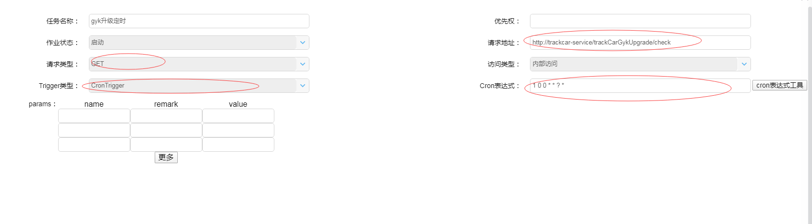

**运行日志：**


## 4.编码规范

### 4.1 命名风格

1. 代码中的命名均不能以下划线或美元符号开始，也不能以下划线或美元符号结束。

2. 代码中的命名**尽可能避免**使用拼音与英文混合的方式，不允许直接使用中文的方式。

由于我们的业务经常会涉及接触网、变电或者其他铁路相关的设备名称，这些专业名称难以翻译，不推荐直接使用在线工具翻译，因为翻译后的英语单词不论正确与否，往往都不易于理解，对于这类情况，可以使用拼音或者缩写并加以注释。

3. 类名使用 UpperCamelCase 风格，但以下情形例外：DO / BO / DTO / VO / AO / PO / UID 等。

4. 方法名、参数名、成员变量、局部变量都统一使用 lowerCamelCase 风格，必须遵从驼峰形式。

5. 常量命名全部大写，单词间用下划线隔开，力求语义表达完整清楚，不要嫌名字长。

6. 抽象类命名使用 Abstract 或 Base 开头；异常类命名使用 Exception 结尾；测试类命名以它要测试的类的名称开始，以 Test 结尾。

7. 数组声明方式请使用类型与中括号紧挨相连的方式，如 int[] intArray; 而不是 int intArray[];

8. POJO 类中布尔类型的变量，都不要加 is 前缀，否则部分框架解析会引起序列化错误。

反例：定义为基本数据类型 Boolean isDeleted 的属性，它的方法会自动生成为 isDeleted()，RPC 框架(或者其他涉及读取、设置 Bean 属性的框架，比如 MyBatis)在反向解析的时候，“误以为”对应的属性名称是 deleted，导致属性获取不到，进而抛出异常。

9. 包名统一使用小写，点分隔符之间有且仅有一个自然语义的英语单词。包名统一使用单数形式，但是类名如果有复数含义，类名可以使用复数形式。

10. 如果模块、接口、类、方法使用了设计模式，在命名时需体现出具体模式。 说明：将设计模式体现在名字中，有利于阅读者快速理解架构设计理念。

11. 接口类中的方法不要加任何修饰符号（public 也不要加），保持代码的简洁性，并加上有效的 Javadoc 注释。

Java interface 中方法默认即为 public，推荐在接口中对方法声明加上注释，而不是在实现类中。

12. 对于 Service 和 DAO 类，基于 SOA 的理念，暴露出来的服务一定是接口，内部的实现类用 Impl 的后缀与接口区别。如果是形容能力的接口名称，取对应的形容词为接口名（通常是–able 的形式）。

比如说我们的自定义实体类想要使用 clone 方法，那么就必须实现 Cloneable 接口，这类接口往往只是起到了 Marker interface 的作用，而不需要实现具体方法。

13. 枚举类名建议带上 Enum 后缀，枚举成员名称需要全大写，单词间用下划线隔开。

枚举其实就是特殊的类，由编译器保证单例，域成员均为常量，且构造方法被默认强制是私有。

### 4.2 常量定义

1. 不允许任何魔法值直接出现在代码中。

反例： String key = "Togest*" + equName;  
正例： String prefix = "Togest*"; String key = prefix + equName;

2. 在 long 或者 Long 赋值时，数值后使用大写的 L，不能是小写的 l，小写容易跟数字 1 混淆，造成误解。

说明：Long a = 2l; 写的是数字的 21，还是 Long 型的 2?

3. 不要使用一个常量类维护所有常量，要按常量功能进行归类，分开维护。

说明：大而全的常量类，杂乱无章，使用查找功能才能定位到修改的常量，不利于理解和维护。

4. 如果变量值仅在一个固定范围内变化用 enum 类型来定义。

5. 不要定义**不必要**的常量。

当我们在 service 中处理业务逻辑时，比较常见的情景就是我们需要使用 equals 进行字符串判等，比如 "test".equals(str);  
诸如"test"的这类字符串，不要遇到一个就在类中以静态常量方式声明一个，静态常量不参与垃圾回收。

### 4.3 代码格式

前六条都属于非常好保证的格式，如果短期内难以改正，可以在提交前进行 Reformat Code，或者勾选提交代码前自动进行 Reformat Code。
后面的几条需要由编码者来保证。

1. 注意大括号的使用约定及换行习惯。

2. 留字与括号之间都必须加空格。

3. 任何二目、三目运算符的左右两边都需要加一个空格。 说明：运算符包括赋值运算符=、逻辑运算符&&、加减乘除符号等。

4. 采用 4 个空格缩进，禁止使用 tab 字符。

如果使用 tab 缩进，则必须设置 1 个 tab 为 4 个空格。

5. 注释的双斜线与注释内容之间有且仅有一个空格。

6. 方法参数在定义和传入时，多个参数逗号后边必须加空格。

7. IDE 的文件编码设置为 UTF-8; IDE 中文件的换行符使用 Unix 格式，不要使用 Windows 格式。

8. 没有必要增加若干空格来使某一行的字符与上一行对应位置的字符对齐。不同逻辑、不同语义、不同业务的代码之间插入一个空行分隔开来以提升可读性。

9. 合理使用括号，不要盲目依赖操作符优先级。

反例： 2 << 7 - 2 _ 3  
大多数语言中位移预算的优先级都低于你的“直觉”认知。很多人误以为这个表达式相当于(2 << 7) - (2 _ 3)，所以等于 250。然而实际上<<的优先级比加法+还要低，所以这表达式其实相当于 2 << (7 - 2 \* 3)，所以等于 4。

不是要每个人去把操作符优先级表给硬背下来，而是合理的加入括号。比如上面的例子，最好直接加上括号写成 2 << (7 - 2 \* 3)。虽然没有括号也表示同样的意思，但是加上括号就更加清晰，读者不再需要死记<<的优先级就能理解代码。

10. 永远不要省略花括号。

很多语言允许你在某种情况下省略掉花括号，比如 C，Java 都允许你在 if 语句里面只有一句话的时候省略掉花括号：

```java
if (...)
  action1();
```

咋一看少打了两个字，多好。可是这其实经常引起奇怪的问题。比如，你后来想要加一句话 action2()到这个 if 里面，于是你就把代码改成：

```java
if (...)
  action1();
  action2();
```

为了美观，你很小心的使用了 action1()的缩进。咋一看它们是在一起的，所以你下意识里以为它们只会在 if 的条件为真的时候执行，然而 action2()却其实在 if 外面，它会被无条件的执行。  
理论上每个程序员都应该可以发现这个错误，然而实际上却容易被忽视。

那么你问，谁会这么傻，我在加入 action2()的时候加上花括号不就行了？可是从设计的角度来看，这样其实并不是合理的作法。  
首先，也许你以后又想把 action2()去掉，这样你为了样式一致，又得把花括号拿掉，烦不烦啊？  
其次，这使得代码样式不一致，有的 if 有花括号，有的又没有。况且，你为什么需要记住这个规则？  
如果你不问三七二十一，只要是 if-else 语句，把花括号全都打上，就可以想都不用想了，就当 C 和 Java 没提供给你这个特殊写法。  
这样就可以保持完全的一致性，减少不必要的思考。由于花括号的存在，使得代码界限明确，让我的眼睛负担更小了。

11. if 中布尔表达式的处理。

IDE 的自动格式化之后可能产生这样的代码：

```java
if (someLongCondition1() && someLongCondition2() && someLongCondition3() &&
 someLongCondition4()) {
 ...
}
```

由于 someLongCondition4()超过了行宽限制，被编辑器自动换到了下面一行。虽然满足了行宽限制，换行的位置却是相当任意的，它并不能帮助人理解这代码的逻辑。这几个 boolean 表达式，全都用&&连接，所以它们其实处于平等的地位。为了表达这一点，当需要折行的时候，你应该把每一个表达式都放到新的一行，就像这个样子：

```java
if (someLongCondition1() &&
   someLongCondition2() &&
   someLongCondition3() &&
   someLongCondition4()) {
 ...
}
```

如果 if 中 boolean 表达式过长，也可以单独定义意义明确的 boolean 变量，力求含义清晰：

```java
boolean success = ......
if (success) {
    ...
} else {
    ...
}
```

如果有更加直接，更加清晰的写法，就选择它，即使它看起来更长，更笨，也一样选择它。我们应该都知道&&、||具有短路特性。

```bash
# 当command1成功，才会执行command2，当command2成功，才会执行command3。
command1 && command2 && command3
# 如果command1成功，那么command2和command3都不会被执行。如果command1失败，command2成功，那么command3就不会被执行。
command1 || command2 || command3
```

但是如果 if 中出现这样的运算：

```java
if (action1() || action2() && action3()) {
  ...
}
```

你看得出来这代码是想干什么吗？action2 和 action3 什么条件下执行，什么条件下不执行？  
也许稍微想一下，你知道它在干什么：“如果 action1 失败了，执行 action2，如果 action2 成功了，执行 action3”。  
然而那种语义，并不是直接的“映射”在这代码上面的。比如“失败”这个词，对应了代码里的哪一个字呢？你找不出来，因为它包含在了||的语义里面，你需要知道||的短路特性，以及逻辑或的语义才能知道这里面在说“如果 action1 失败……”。每一次看到这行代码，你都需要思考一下，这样积累起来的负荷，就会让人很累。

其实，这种写法是滥用了逻辑操作&&和||的短路特性。这两个操作符可能不执行右边的表达式，原因是为了机器的执行效率，而不是为了给人提供这种“巧妙”的用法。

这两个操作符的本意，只是作为逻辑操作，它们并不是拿来给你代替 if 语句的。也就是说，它们只是碰巧可以达到某些 if 语句的效果，但你不应该因此就用它来代替 if 语句。如果你这样做了，就会让代码晦涩难懂。

上面的代码写成笨一点的办法，就会清晰很多：

```java
if (!action1()) {
  if (action2()) {
    action3();
  }
}
```

### 4.4 OOP 规约

1. 避免通过一个类的对象引用访问此类的静态变量或静态方法，无谓增加编译器解析成本，直接用类名来访问即可。

2. 所有的覆写方法，必须加@Override 注解。

3. 相同参数类型，相同业务含义，才可以使用 Java 的可变参数，避免使用 Object。可变参数必须放置在参数列表的最后。

4. 不能使用过时的类或方法。

接口提供方既然明确是过时接口，那么有义务同时提供新的接口(JDK，或者我们使用的第三方框架中都是如此，我们自己的工具类也要能够做到)；作为调用方来说，有义务去考证过时方法的新实现是什么。

5. 所有的局部变量使用基本数据类型。所有的 POJO 类属性必须使用包装数据类型。

6. Object 的 equals 方法容易抛空指针异常，应使用常量或确定有值的对象来调用 equals。

正例："test".equals(object);  
反例：object.equals("test");

7. 所有的相同类型的包装类对象之间值的比较，全部使用 equals 方法比较。

对于 Integer var = ? 在-128 至 127 范围内的赋值，Integer 对象是在 IntegerCache.cache 产生，会复用已有对象，这个区间内的 Integer 值可以直接使用==进行判断，但是这个区间之外的所有数据，都会在堆上产生，并不会复用已有对象，这是一个大坑，推荐使用 equals 方法进行判断。

```java
Integer a = 10;
Integer b = 10;
System.out.println(a == b); // true
Integer c = 1000;
Integer d = 1000;
System.out.println(c == d); // false
System.out.println(c.equals(d)); // true
```

8. 定义 DO/DTO/VO 等 POJO 类时，不要设定任何属性默认值。

9. 禁止在 POJO 类中，同时存在对应属性 xxx 的 isXxx()和 getXxx()方法。

框架在调用属性 xxx 的提取方法时，并不能确定哪个方法一定是被优先调用到。

10. 当一个类有多个构造方法，或者多个同名方法，这些方法应该按顺序放置在一起，便于阅读。

11. 内方法定义的顺序依次是：公有方法或保护方法 > 私有方法 > getter/setter 方法。

公有方法是类的调用者和维护者最关心的方法，首屏展示最好；保护方法虽然只是子类关心，也可能是“模板设计模式”下的核心方法；而私有方法外部一般不需要特别关心，是一个黑盒实现；因为承载的信息价值较低，所有 Service 和 DAO 的 getter/setter 方法放在类体最后。

12. setter 方法中，参数名称与类成员变量名称一致，this.成员名 = 参数名。在 getter/setter 方法中，不要增加业务逻辑，增加排查问题的难度。

13. 字符串拼接。

在一个方法体中，普通的字符串拼接可以不做处理，如 String str = str1 + str2 + str3; 在编译期会被优化为使用 StringBuilder 的 append 方法进行扩展。

下例中循环中，反编译出的字节码文件显示每次循环都会 new 出一个 StringBuilder 对象，然后进行 append 操作，最后通过 toString 方法返回 String 对象，造成内存资源浪费。所以循环拼接字符串应该由编码者主动实例化、使用 StringBuilder。

```java
String str = "start";
for (int i = 0; i < 100; i++) {
	str = str + "hello";
}
```

14. 方法模块化。

避免写太长的方法。如果方法太长，应当拆分成几个更小的，通常一屏为 40-50 行，在此范围内最佳。  
提出工具方法。如果你仔细观察代码，就会发现其实里面有很多的重复。这些常用的代码，不管它有多短，提取出去做成方法，都可能是会有好处的。有些帮助方法也许就只有两行，然而它们却能大大简化主要方法里面的逻辑。  
每个方法只做一件简单的事情。

根据系统是否为“MacOS”来做不同的事情。

```java
public void foo() {
  if ("MacOS".equals(getOS())) {
    a();
  } else {
    b();
  }
  c();
  if ("MacOS".equals(getOS())) {
    d();
  } else {
    e();
  }
}
```

你可以看出这个方法里，其实只有 c()是两种系统共有的，而其它的 a(), b(), d(), e()都属于不同的分支。

这种“复用”其实是有害的。如果一个方法可能做两种事情，它们之间共同点少于它们的不同点，那你最好就写两个不同的方法，否则这个方法的逻辑就不会很清晰，容易出现错误。其实，上面这个方法可以改写成两个方法：

```java
public void fooMacOS() {
  a();
  c();
  d();
}


public void fooOther() {
  b();
  c();
  e();
}
```

如果你发现两件事情大部分内容相同，只有少数不同，多半时候你可以把相同的部分提取出去，做成一个辅助方法。比如，如果你有个方法是这样：

```java
public void foo() {
  a();
  b()
  c();
  if ("MacOS".equals(getOS())) {
    d();
  } else {
    e();
  }
}
```

其中 a()，b()，c()都是一样的，只有 d()和 e()根据系统有所不同。那么你可以把 a()，b()，c()提取出去，然后制造两个方法：

```java
public void preFoo() {
  a();
  b()
  c();
}

public void fooMacOS() {
  preFoo();
  d();
}

public void fooOther() {
  preFoo();
  e();
}
```

这样一来，我们既共享了代码，又做到了每个方法只做一件简单的事情。这样的代码，逻辑就更加清晰。

15. 考虑并发与线程安全问题。

在 service 或是其他由 Spring 管理的 Bean 中，对于涉及操作成员属性的逻辑一定要考虑并发，做好同步机制处理。

16. 方法的参数检查。

我们实现一个方法，并对方法的入参进行非空，或者其他合法性检查后，再去进行业务逻辑操作，这种习惯称之为防御性编程。
这个习惯涉及两方面问题，第一，如果非空或者合法性检查失败了，我们要做怎么做；第二，我们实现的方法中如果调用了其他方法，那么返回值是否需要非空或者合法性检查。

如果某个参数为空或者不合法，程序就无法完成逻辑，此时检查不通过应该主动上抛异常，来达到“快速失败”的目的，而不是 return 或者 return null;

对于调用的方法，需要考虑方法的返回值可能为 null，防止 NPE 是调用者的责任。即使被调用方法返回空集合或者空对象，对调用者来说，也并非高枕无忧，必须考虑到调用失败、序列化失败、运行时异常等场景返回 null 的情况。

### 4.5 集合使用

1. 注意自定义实体类是否要重写 hashCode 和 equals

如果使用的集合涉及主动调用 contains、或者隐式调用(Set、作为 Map 的 Key)的地方，以及 Stream 容器调用 distinct 等操作，则自定义对象必须重写 equals，只要重写 equals，就必须重写 hashCode。

2. Comparator 实现类。

在 JDK7 版本及以上，Comparator 实现类要满足如下三个条件，不然 Arrays.sort，Collections.sort 会报 IllegalArgumentException 异常。
x，y 的比较结果和 y，x 的比较结果相反。x>y，y>z，则 x>z。x=y，则 x，z 比较结果和 y，z 比较结果相同。

3. 选择合适的数据结构，集合初始化时，指定集合初始值大小。

结合业务情况，考虑什么数据结构是最合适的，使用栈还是队列还是双向链表。如果业务上对于数据量范围比较清晰，则应当设置初始化大小，避免多次扩容带来的性能损失。

4. 集合泛型定义时，在 JDK7 及以上，使用 diamond 语法或全省略。

diamond 即菱形泛型，直接使用<>来指代前边已经指定的类型，即类型推断。

反例: `List<String> list = new ArrayList<String>(); Map<String, String> userCache = new HashMap<String, String>()`;  
正例: `List<String> list = new ArrayList<>(); Map<String, String> userCache = new HashMap<>()`;

5. 不要把 null 放进“容器数据结构”里面。

所谓容器（collection），是指一些对象以某种方式集合在一起，所以 null 不应该被放进 Array，List，Set 等结构，不应该出现在 Map 的 key 或者 value 里面。把 null 放进容器里面，是一些莫名其妙错误的来源。因为对象在容器里的位置一般是动态决定的，所以一旦 null 从某个入口跑进去了，你就很难再搞明白它去了哪里，你就得被迫在所有从这个容器里取值的位置检查 null。你也很难知道到底是谁把它放进去的，代码多了就导致调试极其困难。

6. 尽可能避免容器本身是 null。

比如某个方法声明返回一个 `List<MyObject>`，如果没有符合条件的返回值，不要返回 null，不要给调用者带来不必要的繁琐检查。  
这里也不要 return new ArrayList<>(); 每次实例化一个容器也会造成内存开销。
这里推荐 return Collections.emptyList(); 同理也可以 Collections.emptyMap();
这个方法返回的容器均为 Collections 类的一个静态内部类。

7. 当我们只有一个对象需要放入容器时，使用 Collections.singletonList(T o)代替 Arrays.asList(T... a)；

因为我们的聚合服务没有提供单个对象聚合的接口，这种情况常见于我们想要为单个对象进行聚合，而非一个集合，此时使用 Collections.singletonList(T o)；去“包裹”你的对象。

### 4.6 日志使用

1. 日志中需要记录信息时，学会使用占位符的方式。

反例：logger.debug("Processing trade with id: " + id + " and symbol: " + symbol);
正例：logger.debug("Processing trade with id: {} and symbol : {} ", id, symbol);

2. 日志记录异常信息时，使用正确的 api。

正例：logger.error(各类参数或者对象 toString() + "\_" + e.getMessage(), e);

即使用 error(String msg, Throwable t); 在日志中记录完整的异常堆栈信息，而不是只记录 e.getMessage()。

​

### 4.7 异常处理

1. try 块中代码应当尽可能少。尽可能避免在循环中进行 try-cache。如果可以对各种异常做对应处理，就不要直接 catch (Exception e)。

2. cache 块中如有可能，则可以进行再次尝试，如果需要上抛异常，尽可能表达出更多信息。

如 throw new IllegalArgumentException(e); 表达的信息要优于 throw new RuntimeException(e.getMessage());

3. 捕获异常是为了处理它，不要捕获了却什么都不处理而抛弃之，如果不想处理它，请将该异常抛给它的调用者。最外层的业务使用者，必须处理异常，将其转化为用户可以理解的内容。

4. 有 try 块放到了事务代码中，catch 异常后，如果需要回滚事务，一定要注意手动回滚事务。

5. finally 块必须对资源对象、流对象进行关闭，有异常也要做 try-catch。如果 JDK7 及以上，可以使用 try-with-resources 方式。

6. 不要在 finally 块中使用 return。finally 块中的 return 返回后方法结束执行，不会再执行 try 块中的 return 语句。

### 4.8 数据库

#### 4.8.1 建表规约

1. 【强制】表达是与否概念的字段，必须使用 is_xxx 的方式命名，数据类型是 unsigned tinyint

（ 1 表示是，0 表示否）。

说明：任何字段如果为非负数，必须是 unsigned。

正例：表达逻辑删除的字段名 is_deleted，1 表示删除，0 表示未删除。

2. 【强制】表名、字段名必须使用小写字母或数字，禁止出现数字开头，禁止两个下划线中间只出现数字。数据库字段名的修改代价很大，因为无法进行预发布，所以字段名称需要慎重考虑。

说明：MySQL 在 Windows 下不区分大小写，但在 Linux 下默认是区分大小写。因此，数据库名、表名、字段名，都不允许出现任何大写字母，避免节外生枝。

正例：aliyun_admin，rdc_config，level3_name

反例：AliyunAdmin，rdcConfig，level_3_name

3. 【强制】表名不使用复数名词。

说明：表名应该仅仅表示表里面的实体内容，不应该表示实体数量，对应于 DO 类名也是单数

形式，符合表达习惯。

4. 【强制】禁用保留字，如 desc、range、match、delayed 等，请参考 MySQL 官方保留字。

5. 【强制】主键索引名为 pk*字段名；唯一索引名为 uk*字段名；普通索引名则为 idx\_字段名。

说明：pk* 即 primary key；uk* 即 unique key；idx\_ 即 index 的简称。

6. 【强制】小数类型为 decimal，禁止使用 float 和 double。

说明：float 和 double 在存储的时候，存在精度损失的问题，很可能在值的比较时，得到不

正确的结果。如果存储的数据范围超过 decimal 的范围，建议将数据拆成整数和小数分开存储。

7. 【强制】如果存储的字符串长度几乎相等，使用 char 定长字符串类型。

8. 【强制】varchar 是可变长字符串，不预先分配存储空间，长度不要超过 5000，如果存储长

度大于此值，定义字段类型为 text，独立出来一张表，用主键来对应，避免影响其它字段索引效率。

9. 【强制】表必备八字段：id, del_flag，create_date,create_by,update_date,update_by,delete_by,delete_date

10) 【推荐】表的命名最好是加上“业务名称\_表的作用”。

正例：alipay_task / force_project / trade_config

11. 【推荐】库名与应用名称尽量一致。

12. 【推荐】如果修改字段含义或对字段表示的状态追加时，需要及时更新字段注释。

13. 【推荐】字段允许适当冗余，以提高查询性能，但必须考虑数据一致。冗余字段应遵循：

1）不是频繁修改的字段。

2）不是 varchar 超长字段，更不能是 text 字段。

正例：商品类目名称使用频率高，字段长度短，名称基本一成不变，可在相关联的表中冗余存

储类目名称，避免关联查询。

14. 【推荐】单表行数超过 500 万行或者单表容量超过 2GB，才推荐进行分库分表。

说明：如果预计三年后的数据量根本达不到这个级别，请不要在创建表时就分库分表。

15. 【参考】合适的字符存储长度，不但节约数据库表空间、节约索引存储，更重要的是提升检索速度。

正例：如下表，其中无符号值可以避免误存负数，且扩大了表示范围。


16.【强制】主键统一使用 UUID，长度 varchar(32)。

#### 4.8.2 索引规约

1. 【强制】业务上具有唯一特性的字段，即使是多个字段的组合，也必须建成唯一索引。

说明：不要以为唯一索引影响了 insert 速度，这个速度损耗可以忽略，但提高查找速度是明显的；另外，即使在应用层做了非常完善的校验控制，只要没有唯一索引，根据墨菲定律，必然有脏数据产生。

2. 【强制】超过三个表禁止 join。需要 join 的字段，数据类型必须绝对一致；多表关联查询时，保证被关联的字段需要有索引。

说明：即使双表 join 也要注意表索引、SQL 性能。

3. 【强制】在 varchar 字段上建立索引时，必须指定索引长度，没必要对全字段建立索引，根据实际文本区分度决定索引长度即可。

说明：索引的长度与区分度是一对矛盾体，一般对字符串类型数据，长度为 20 的索引，区分度会高达 90%以上，可以使用 count(distinct left(列名, 索引长度))/count(\*)的区分度来确定。

4. 【强制】页面搜索严禁左模糊或者全模糊。

说明：索引文件具有 B-Tree 的最左前缀匹配特性，如果左边的值未确定，那么无法使用此索引。

5. 【推荐】如果有 order by 的场景，请注意利用索引的有序性。order by 最后的字段是组合索引的一部分，并且放在索引组合顺序的最后，避免出现 file_sort 的情况，影响查询性能。

正例：where a=? and b=? order by c; 索引：a_b_c

反例：索引中有范围查找，那么索引有序性无法利用，如：WHERE a>10 ORDER BY b; 索引 a_b 无法排序。

6. 【推荐】利用覆盖索引来进行查询操作，避免回表。

说明：如果一本书需要知道第 11 章是什么标题，会翻开第 11 章对应的那一页吗？目录浏览

一下就好，这个目录就是起到覆盖索引的作用。

正例：能够建立索引的种类：主键索引、唯一索引、普通索引，而覆盖索引是一种查询的一种效果，用 explain 的结果，extra 列会出现：using index。

7. 【推荐】利用延迟关联或者子查询优化超多分页场景。

说明：MySQL 并不是跳过 offset 行，而是取 offset+N 行，然后返回放弃前 offset 行，返回 N 行，那当 offset 特别大的时候，效率就非常的低下，要么控制返回的总页数，要么对超过特定阈值的页数进行 SQL 改写。

正例：先快速定位需要获取的 id 段，然后再关联：

SELECT a.\* FROM 表 1 a, (select id from 表 1 where 条件 LIMIT 100000,20 ) b where a.id=b.id

8. 【推荐】SQL 性能优化的目标：至少要达到 range 级别，要求是 ref 级别，如果可以是 consts 最好。

说明：

1）consts 单表中最多只有一个匹配行（主键或者唯一索引），在优化阶段即可读取到数据。

2）ref 指的是使用普通的索引（normal index）。

3）range 对索引进行范围检索。

反例：explain 表的结果，type=index，索引物理文件全扫描，速度非常慢，这个 index 级

别比较 range 还低，与全表扫描是小巫见大巫。

9. 【推荐】建组合索引的时候，区分度最高的在最左边。

正例：如果 where a=? and b=? ，a 列的几乎接近于唯一值，那么只需要单建 idx_a 索引即可。

说明：存在非等号和等号混合判断条件时，在建索引时，请把等号条件的列前置。如：where a>?

and b=? 那么即使 a 的区分度更高，也必须把 b 放在索引的最前列。

10. 【推荐】防止因字段类型不同造成的隐式转换，导致索引失效。

11. 【参考】创建索引时避免有如下极端误解：

1）宁滥勿缺。认为一个查询就需要建一个索引。

2）宁缺勿滥。认为索引会消耗空间、严重拖慢更新和新增速度。

3）抵制惟一索引。认为业务的惟一性一律需要在应用层通过“先查后插”方式解决。

12 .【推荐】查询条件中少用 OR，OR 使用不了索引。尽量使用 union all 来替代

#### 4.8.3 SQL

1. 【强制】不要使用 count(列名)或 count(常量)来替代 count(_)，count(_)是 SQL92 定义的标准统计行数的语法，跟数据库无关，跟 NULL 和非 NULL 无关。

说明：count(\*)会统计值为 NULL 的行，而 count(列名)不会统计此列为 NULL 值的行。

2. 【强制】count(distinct col) 计算该列除 NULL 之外的不重复行数，注意 count(distinct col1, col2) 如果其中一列全为 NULL，那么即使另一列有不同的值，也返回为 0。

3. 【强制】当某一列的值全是 NULL 时，count(col)的返回结果为 0，但 sum(col)的返回结果为 NULL，因此使用 sum()时需注意 NPE 问题。

正例：可以使用如下方式来避免 sum 的 NPE 问题：SELECT IF(ISNULL(SUM(g)),0,SUM(g))FROM table;

4. 【强制】使用 ISNULL()来判断是否为 NULL 值。

说明：NULL 与任何值的直接比较都为 NULL。

1） NULL<>NULL 的返回结果是 NULL，而不是 false。

2） NULL=NULL 的返回结果是 NULL，而不是 true。

3） NULL<>1 的返回结果是 NULL，而不是 true。

5. 【强制】在代码中写分页查询逻辑时，若 count 为 0 应直接返回，避免执行后面的分页语句。

6. 【强制】不得使用外键与级联，一切外键概念必须在应用层解决。

说明：以学生和成绩的关系为例，学生表中的 student_id 是主键，那么成绩表中的 student_id 则为外键。如果更新学生表中的 student_id，同时触发成绩表中的 student_id 更新，即为级联更新。外键与级联更新适用于单机低并发，不适合分布式、高并发集群；级联更新是强阻塞，存在数据库更新风暴的风险；外键影响数据库的插入速度。

7. 【强制】禁止使用存储过程，存储过程难以调试和扩展，更没有移植性。

8. 【强制】数据订正时，删除和修改记录时，要先 select，避免出现误删除，确认无误才能执 行更新语句。

9. 【推荐】in 操作能避免则避免，若实在避免不了，需要仔细评估 in 后边的集合元素数量，控制在 1000 个之内。

10. 【参考】如果有全球化需要，所有的字符存储与表示，均以 utf-8 编码，注意字符统计函数的区别。

说明：

SELECT LENGTH("轻松工作")； 返回为 12

SELECT CHARACTER_LENGTH("轻松工作")； 返回为 4

如果需要存储表情，那么选择 utfmb4 来进行存储，注意它与 utf-8 编码的区别。

11. 【参考】TRUNCATE TABLE 比 DELETE 速度快，且使用的系统和事务日志资源少，但 TRUNCATE

无事务且不触发 trigger，有可能造成事故，故不建议在开发代码中使用此语句。

说明：TRUNCATE TABLE 在功能上与不带 WHERE 子句的 DELETE 语句相同。

#### 4.8.4 ORM

1. 【强制】在表查询中，一律不要使用 \* 作为查询的字段列表，需要哪些字段必须明确写明。

说明：1）增加查询分析器解析成本。2）增减字段容易与 resultMap 配置不一致。

2. 【强制】POJO 类的布尔属性不能加 is，而数据库字段必须加 is\_，要求在 resultMap 中进行

字段与属性之间的映射。

说明：参见定义 POJO 类以及数据库字段定义规定，在`<resultMap>`中增加映射，是必须的。

在 MyBatis Generator 生成的代码中，需要进行对应的修改。

3. 【强制】不要用 resultClass 当返回参数，即使所有类属性名与数据库字段一一对应，也需
   要定义；反过来，每一个表也必然有一个与之对应。

说明：配置映射关系，使字段与 DO 类解耦，方便维护。

4. 【强制】sql.xml 配置参数使用：#{}，#param# 不要使用\${} 此种方式容易出现 SQL 注入。

5. 【强制】不允许直接拿 HashMap 与 Hashtable 作为查询结果集的输出。
   说明：resultClass=”Hashtable”，会置入字段名和属性值，但是值的类型不可控。

6. 【强制】更新数据表记录时，必须同时更新记录对应的 update_date 字段值为当前时间、update_by 当前删除人。删除操作，必须同时更新 del_flag、delete_by、delete_date。创建操作，必须同时记录 create_date、create_by。

7. 【推荐】不要写一个大而全的数据更新接口。传入为 POJO 类，不管是不是自己的目标更新字段，都进行 update table set c1=value1,c2=value2,c3=value3; 这是不对的。执行 SQL 时，不要更新无改动的字段，一是易出错；二是效率低；三是增加 binlog 存储。

8. 【推荐】不要写一个大而全的查询接口。传入为 POJO 类，不管是不是自己的查询条件，里面全部做 if 判断，来添加条件。应该按照具体的业务具体分析，抽出业务独立的接口。

9. 【参考】@Transactional 事务不要滥用。事务会影响数据库的 QPS，另外使用事务的地方需要考虑各方面的回滚方案，包括缓存回滚、搜索引擎回滚、消息补偿、统计修正等。

10. 【参考】`<isEqual>`中的 compareValue 是与属性值对比的常量，一般是数字，表示相等时带上此条件；`<isNotEmpty>`表示不为空且不为 null 时执行；`<isNotNull>`表示不为 null 值时执行。
