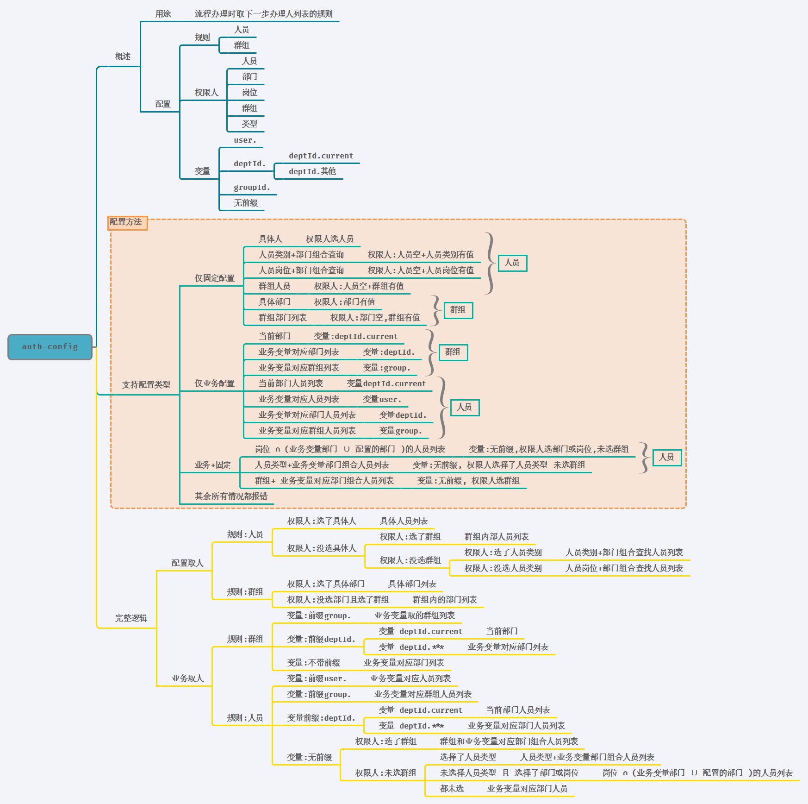

# 流程配置

> 状态型流程相对于activity更加轻量,效率更高

[[toc]]
## 1. 添加流程,字段说明

> 流程的基础数据


## 2. 节点配置

> 流程里每个节点的详细配置

### 2.1 先画出流程图
#### 2.1.1 节点
+ 任务节点: 节点的唯一标识
+ 任务名称:
+ 任务类型: `Task/Start/End`
+ 表达式: 后端执行的JavaScript表达式,决定流程的流向(如果配置此项则此步骤流程图为条件形式) 
+ 顺序号: 自动生成,串行流程据此找下一步节点

#### 2.1.2 连接

+ 决策: 流程图之间的连接,JSON形式
> json数据类型规则
```js
[{
        //核心数据
        "name": String,     //连接的名称 必填
        "to":   String,         //指向的节点ID 必填
        "value":String,  //路径选择,节点变量提交值(文本型) 有表达式时必填
        "desc": String     //路径选择,界面渲染值 有表达式时必填

        //业务办理表单相关,配置自定义表单页面路由
        "handleRoute":String,//业务表单页面,可选,默认没有业务表单,参考示例 /workflow/statusHandle/handle
        
        //意见相关配置
        "defaultComment":String,//默认意见,默认除了驳回不通过时显示不同意,其余显示同意,可以配置一个 null 来替换默认的意见
        "hideComment":Boolean, //隐藏意见,默认是false,可选


        //办理人相关配置
        "multipleActor":Boolean, 多选下一步办理人,默认是false,可选
        "hideTaskUser":Boolean,//隐藏下一步办理人,默认是false,可选
        "actorLabel":"下一步办理人", //下步办理人提示输入标签
    	"commentLabel":"办理意见"
        "anyActor":false ,//任意角色选择
        "anyActorIndependent":false, //任意角色选择是否独立,默认系统推荐选人与自由选人是互斥的,配置此项则两个选人方式独立存在
        //部门选择树配置JSON scheme
        "anyActorDeptScheme":{
        },
        //人员选择弹窗配置JSON scheme
        "anyActorUserScheme":{
        }

        
    }]
```
> 一个典型的双流向的节点
```JSON

[
    //以当前节点为起点
    {
        "name": "c1",     //连接的名称 必填
        "to": "usertask4",//指向的节点ID 必填
        "value": "true",  //路径选择,节点变量提交值(文本型) 有表达式时必填
        "desc": "通过"     //路径选择,界面渲染值 有表达式时必填

        "defaultComment":"测试默认意见"
        "handleRoute":""//业务表单页面,可选,默认没有业务表单
        "hideTaskUser":true//是否隐藏下一步办理人,默认是false,可选
        "hideComment":true //是否隐藏意见,默认是false,可选
    },
    {
        "name": "c2",
        "to": "usertask4",
        "value": "false",
        "desc": "不通过"
    }
]
```

### 2.2 定义流程办理相关的页面和API

- 办理路由:办理页面路由(**此配置不再使用,仅用作详情**)
:::danger
**发起** 的办理页面配置 将变为 流程数据(详情标签)的路由
:::

- 提交API: 办理提交的API
:::tip

 通用发起API: ~~/base~~`/statusFlowEngine/starts`
::: 
:::tip
 通用办理API: ~~/base~~`/statusFlowEngine/complete`
:::
:::danger
 ~~/base~~删除线部分应该用模块前缀替换, 例如`/jcw/nc/produce`
::: 

- 变量名称:表达式里提交的变量
- 是否驳回(可选): 
:::danger
 **驳回**代表可以驳回到之前任意步骤,**不通过**代表退回到上一步
::: 
- 驳回API(可选)
:::tip
 通用驳回API: ~~/base~~`/statusFlowEngine/reject`
:::
### 2.3 配置节点权限
> 节点配置保存后才可以配置权限

:::tip
 通用从业务内取人API: ~~/base~~`/statusFlowEngine/getBusinessActor`
:::

