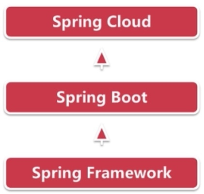
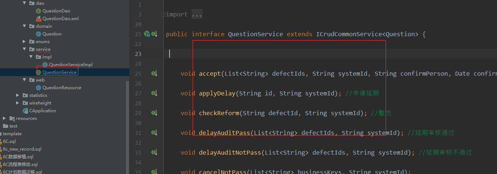
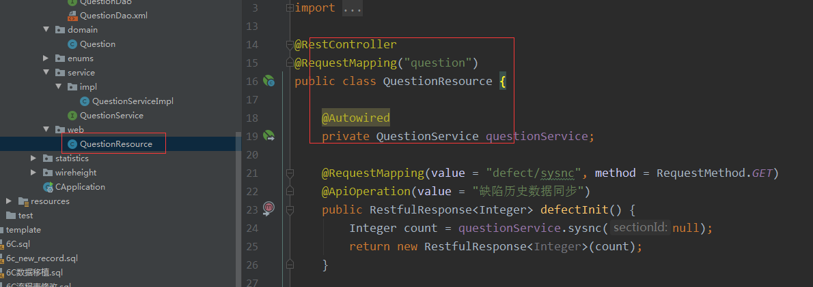

# 后端入门教程

[[TOC]]

## 1、准备

### 1.1、前置知识

1. 熟练使用掌握java知识
2. 熟悉数据库mysql、PostgreSQL等
3. 熟悉使用springboot+mybatis+maven框架
4. 熟悉使用svn、maven打包

### 1.2、环境配置

1. 安装jdk1.8 
2. 安装svn
3. 安装idea
4. 安装maven
5. 下载Lombok插件
6. 使用svn下载项目
7. idea导入项目

## 2、知识简介

### 1.1、Java 教程

> https://www.runoob.com/java/java-basic-datatypes.html

<iframe src="https://www.runoob.com/java/java-basic-datatypes.html" width="100%" height="800px"></iframe>

### 1.2、Maven 教程

> https://www.runoob.com/maven/maven-tutorial.html

<iframe src="https://www.runoob.com/maven/maven-tutorial.html" width="100%" height="800px"></iframe>

### 1.3、MySQL 教程

> https://www.runoob.com/mysql/mysql-tutorial.html

<iframe src="https://www.runoob.com/mysql/mysql-tutorial.html" width="100%" height="800px"></iframe>

### 1.4、spring boot简介

1、SpringBoot简介

```
SpringBoot是由Pivotal团队在2013年开始研发、2014年4月发布第一个版本的全新开源的轻量级框架。它基于Spring4.0设计，不仅继承了Spring框架原有的优秀特性，而且还通过简化配置来进一步简化了Spring应用的整个搭建和开发过程。另外SpringBoot通过集成大量的框架使得依赖包的版本冲突，以及引用的不稳定性等问题得到了很好的解决。 
```

2、特点

SpringBoot所具备的特征有：

```
（1）可以创建独立的[Spring]应用程序，并且基于其Maven或Gradle插件，可以创建可执行的JARs和WARs；
（2）内嵌Tomcat或Jetty等Servlet容器；
（3）提供自动配置的“starter”项目对象模型（POMS）以简化[Maven]配置；
（4）尽可能自动配置Spring容器；
（5）提供准备好的特性，如指标、健康检查和外部化配置；
（6）绝对没有代码生成，不需要XML配置。
```

3、Spring Boot 在应用中的角色

```
Spring Boot 是基于 Spring Framework 来构建的，Spring Framework 是一种 J2EE 的框架
Spring Boot 是一种快速构建 Spring 应用
Spring Cloud 是构建 Spring Boot 分布式环境，也就是常说的云应用
Spring Boot 中流砥柱，承上启下
```



### 1.5、spring could简介

1、什么是SpringCloud

```
Spring Cloud是一系列框架的有序集合。它利用Spring Boot的开发便利性巧妙地简 化了分布式系统基础设施的开发，如服务发现注册、配置中心、消息总线、负载均衡、 熔断器、数据监控等，都可以用Spring Boot的开发风格做到一键启动和部署。Spring并 没有重复制造轮子，它只是将目前各家公司开发的比较成熟、经得起实际考验的服务框 架组合起来，通过Spring Boot风格进行再封装屏蔽掉了复杂的配置和实现原理，最终给 开发者留出了一套简单易懂、易部署和易维护的分布式系统开发工具包。
Spring Cloud项目的官方网址：http://projects.spring.io/spring-cloud/
```

2、SpringCloud与SpringBoot的关系

```
Spring Boot 是 Spring 的一套快速配置脚手架，可以基于Spring Boot 快速开发单 个微服务，Spring Cloud是一个基于Spring Boot实现的云应用开发工具；Spring Boot专 注于快速、方便集成的单个微服务个体，Spring Cloud关注全局的服务治理框架； Spring Boot使用了默认大于配置的理念，很多集成方案已经帮你选择好了，能不配置就 不配置，Spring Cloud很大的一部分是基于Spring Boot来实现，可以不基于Spring Boot 吗？不可以。
Spring Boot可以离开Spring Cloud独立使用开发项目，但是Spring Cloud离不开 Spring Boot，属于依赖的关系。
```

3、SpringCloud主要框架

    服务的发现 —— Netflix Eureka
    服务的调用 ——Netflix Feign
    熔断器 —— Netflix Hystrix
    服务网关 —— Netflix Zuul
    分布式配置 —— Spring Cloud Config
    消息总线 —— Spring Cloud Bus


## 3、业务实例

### 3.1、代码生成

#### 3.1.1、生成代码


直接放到项目中使用


#### 3.1.2、生成资源


生成的excel可以在资源管理中导入（聚合表达式[配置详情](https://kromalee.github.io/vuepress-demo/data-service/sc.html#_2-3-%E8%81%9A%E5%90%88)）


### 3.2、业务层次

1. 层次结构：domain（实体）、dao（ 数据访问层 ）、service（ 业务逻辑层 ）、web（控制层）

   

2. domain（实体）

   

3. dao（ 数据访问层 ）

   

   

4. service（ 业务逻辑层 ）：可以补充其他业务操作

   

   

5. web（控制层）

   

6. swagger（测试接口）--（ip+端口+swagger-ui.html；如：http://192.168.1.98:40006/swagger-ui.html）

   

   

   

### 

### 