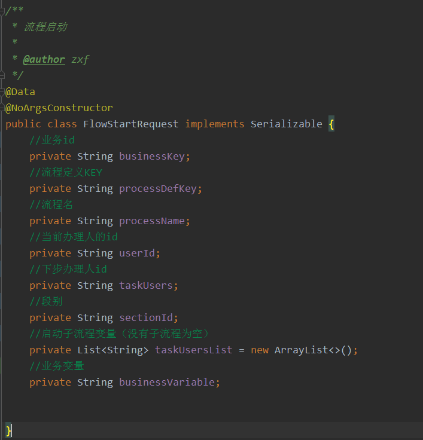
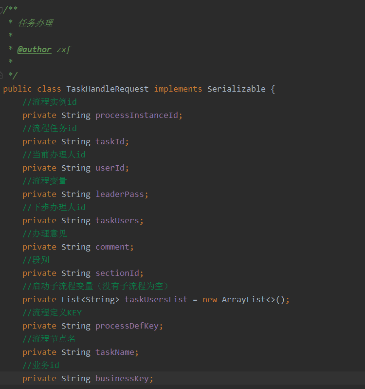
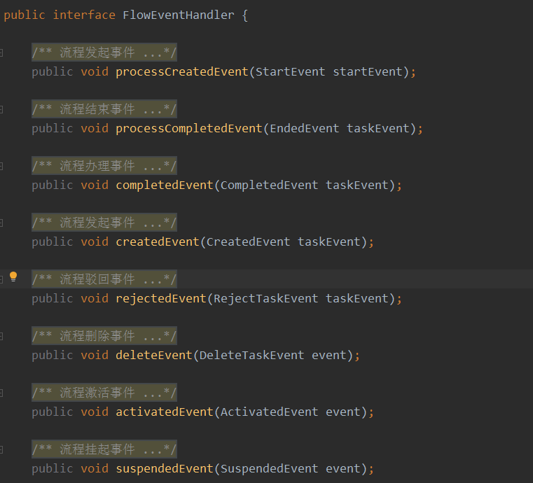

# 流程入门教程

[[TOC]]

## 1、流程

### 1.1、流程字段

流程在数据库表中添加字段

```sql
 `task_user` varchar(300) DEFAULT NULL COMMENT '下步办理人',
  `process_instance_id` varchar(50) DEFAULT NULL COMMENT '流程实例ID',
  `task_id` varchar(50) DEFAULT NULL COMMENT '流程业务ID',
  `form_key` varchar(50) DEFAULT NULL COMMENT 'formKey',
  `task_name` varchar(50) DEFAULT NULL COMMENT '流程节点名称',
  `process_def_key` varchar(255) DEFAULT NULL COMMENT '流程定义key',
```

### 1.2、流程实体

1. 流程启动实体

   

2. 流程任务办理实体

   

3. 流程驳回实体

   

4. 流程删除实例

   

5. 流程挂起、激活实例

   

6. 

### 1.3、流程事件



### 1.4、流程接口


## 2、状态流程

1. 流程在数据库表中添加字段

   ```sql
     `task_user` varchar(300) DEFAULT NULL COMMENT '下步办理人',
     `process_instance_id` varchar(50) DEFAULT NULL COMMENT '流程实例ID',
     `task_id` varchar(50) DEFAULT NULL COMMENT '流程业务ID',
     `form_key` varchar(50) DEFAULT NULL COMMENT 'formKey',
     `task_node` varchar(50) DEFAULT NULL COMMENT '流程节点名称',
     `task_name` varchar(50) DEFAULT NULL COMMENT '流程节点名称',
     `process_def_key` varchar(255) DEFAULT NULL COMMENT '流程定义key',
   ```

   

2. [详细](https://kromalee.github.io/vuepress-demo/data-service/sc.html#_2-7-%E6%B5%81%E7%A8%8B%E5%BC%95%E6%93%8E)

   