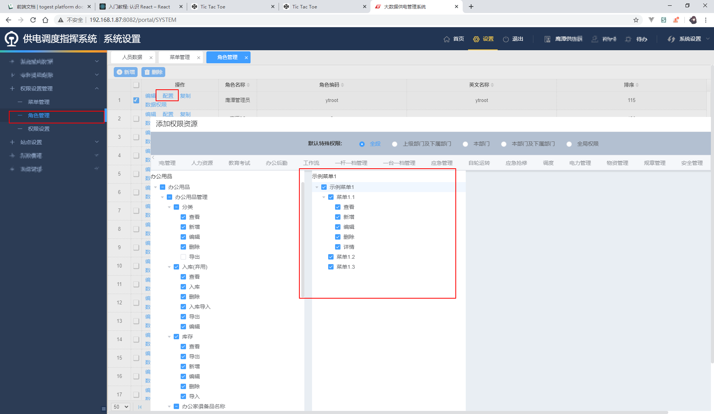
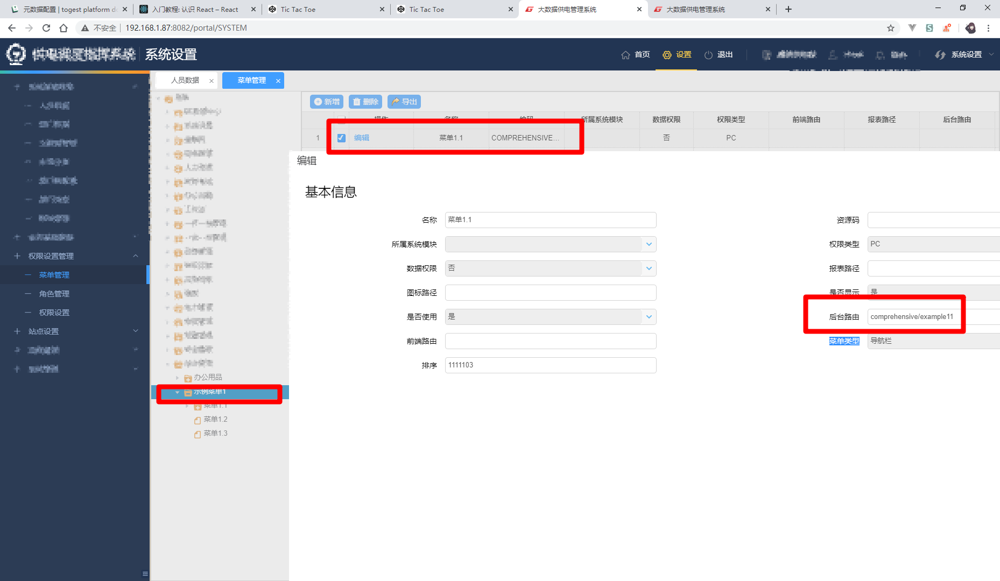

# EMIS8000系统-前端入门教程

[[TOC]]

## 1. 课前准备
### 1.1 我们会做出什么东西?
- 常见的业务CURD 页面,包括但不限于列表,新增,编辑,详情等页面

### 1.2 前置知识
- [x] 了解spring boot 路由系统 
- [x] 了解requirejs AMD规范
- [x] 熟悉easyui的datagrid,dialog组件API
- [x] 熟悉vue基础API
- [x] 熟悉element-ui 常见组件的API
## 2. 环境准备
- 安装jdk1.8 
- 安装svn小乌龟
- 安装idea
- 下载Lombok插件
- 使用svn小乌龟下载项目
- idea导入项目
- 配置idea热更新


## 3. 添加一个业务功能
### 3.1 需求定义(由业务人员提供)
- 明确的菜单设计,包括模块归属及左侧菜单树的结构和各个按钮的设计
- 明确的字段设计,需要知道列表,新增,编辑,详情等各个状态字段的状态及其中的关联逻辑

### 3.2 配置菜单和按钮权限树->后端路由

> `系统设置>权限设置管理>菜单管理`

#### 3.2.1 新增菜单和权限结构
- 例:在综合管理种新增示例功能菜单
- 例:增加列表查看权限
- 增加其他按钮
- 在角色管理例中给登陆人配置刚才的菜单权限
- 配置完成退出重新进入业务功能查看,发现菜单已经正常显示了
- 菜单1.2 和1.3由于内部**没有任何可用的权限**,因此是隐藏的
- 简化方案:新增功能点

#### 3.2.2 指定一个嵌入的页面
- 菜单树里页面对应右侧空白区域一个嵌入的iframe页面,这个页面通过后端路由地址渲染出来
- 该地址通过 菜单表单里的**后端路由**来设置指定的页面

### 3.3 后端路由->路由控制器->模板HTML->脚本JS

#### 3.3.1 新建路由控制器文件
> 在`src/main/java/com.togest.web`添加控制器文件,按照功能模块位置决定代码文件的位置

-  注意:模板html页面一定不能是绝对路径,部署在Linux服务器上时,会找不到模板文件

```java
package com.togest.web.comprehensive;

import com.togest.entity.request.FormParamRequest;
import com.togest.util.HandleParamsUtil;
import org.springframework.stereotype.Controller;
import org.springframework.ui.Model;
import org.springframework.web.bind.annotation.RequestMapping;

@Controller
public class example {

    //示例页面 列表页
    @RequestMapping(value = "/comprehensive/example")
    public String ProActiveIndex(Model model) {
        return "comprehensive/example/index";
    }

    //示例页面 新增编辑页面
    @RequestMapping(value = "/comprehensive/example/save")
    public String ProActiveSave(Model model, FormParamRequest entity) {
        model.addAttribute("data", HandleParamsUtil.formParamRequestTryData(entity));
        return "comprehensive/example/save";
    }

    //示例页面 详情页面
    @RequestMapping(value = "/comprehensive/example/detail")
    public String detail(Model model, FormParamRequest entity) {
        model.addAttribute("data", HandleParamsUtil.formParamRequestTryData(entity));
        return "comprehensive/example/detail";
    }
}
```

#### 3.3.2 `thymeleaf` 模板
- 模板文件放在`src/main/resources/templates`下与功能对应的目录下
- script使用require.js引入对应的功能JavaScript代码
- 注意script使用特殊的`thymeleaf`语法处理JavaScript代码的缓存问题

```html
<!DOCTYPE html>
<html lang="en"
      xmlns:th="http://www.thymeleaf.org">
<head>
    <meta charset="UTF-8">
    <meta name="viewport"
          content="width=device-width, initial-scale=1, maximum-scale=1, user-scalable=no">
    <meta http-equiv="X-UA-Compatible"
          content="ie=edge,chrome=1">
    <meta name="renderer"
          content="webkit">
    <meta http-equiv="pragma"
          content="no-cache">
    <meta http-equiv="expires"
          content="0">
    <meta http-equiv="pragma"
          content="no-cache">
    <meta http-equiv="Cache-Control"
          content="no-cache, must-revalidate">
    <meta http-equiv="expires"
          content="0">
    <script th:src="@{/plugs/require.js}"
            th:data-main="@{/js/module/comprehensive/example/index.js}"></script>
    <title></title>
    <style>
        [v-cloak] {
            display: none
        }
    </style>
</head>
<body>
<div id="app"
     v-cloak>
     <h1>页面页面</h1> 
</div>
</body>
    
</html>
```

#### 3.3.3  `javascript` 脚本

> 写大部分业务逻辑的位置

- AMD模块化语法

- 常见的依赖: 

  | 依赖名称                                        | 描述                     |
  | ----------------------------------------------- | ------------------------ |
  | service/api/ajax                                | 数据请求相关的封装       |
  | vue/loadsh/moment                               | 第三方js库               |
  | 组件库 element/MyVue/单个组件                   | 界面ui可以使用自定义标签 |
  | EasyDialog/EasyTable                            | easyui封装的js库         |
  | method/formMethod/statusFlowMethod/handleMethod | 自定义的工具库           |
  | userInfo/appConfig                              | js配置/全局变量信息      |

  

```javascript
require(['/js/config/requireConfig.js'], function (config) {
    require([/*依赖*/], function (/*依赖导入一个变量(可选)*/) {
    });
});
```

### 3.5 获取数据:api,service,元数据,主数据介绍

>  处理与后端的交互,按模块分开,一般不需要根据业务细分,同一个模块写在一起

#### 3.5.1 swagger接口文档

#### 3.5.2 API 文件
- 位置:`/src/main/resources/static/js/api/`
- 标准格式如下
```javascript
  define(['appConfig', 'userInfo'], function (appConfig, userInfo) {
  
      var user = userInfo.getUser();
      var IP = appConfig.getIP();
      var moduleCode = '/statusflow/';  //模块前缀
  
  
      return {
          //规范对象名称:method+接口地址拼接成驼峰式
          getCheckTaskIfExistByTaskId: {
         
              method: 'get',  
              url: IP + moduleCode + 'statusFlowEngine/checkTaskIfExistByTaskId'
          }
  
      }
  });
```

| method          | 意义                   |
| --------------- | ---------------------- |
| get             |                        |
| post            |                        |
| postJson        |                        |
| postFile        | 文件提交               |
| postWithLoading | 带有loading的post提交  |
| postNotTips     | 不带提示的post提交     |
| postJsonNoTips  | 不带提示的postJson提交 |


#### 3.5.3 service 文件

- 位置:`/src/main/resources/static/js/service/`
- 根据api文件生成可以执行的函数,函数签名与api的对象名称一致

### 3.6 典型列表页

> 基于`EasyTable`组件的元数据驱动的新增编辑页面

#### 3.6.1 模式一 标准单表列表及检索

- html模板

```html

```

- 构建表格配置数据对象

```javascript

//env 环境数据

//tableConfig
	
```

- vue实例渲染表格和搜索组件

```javascript

```

#### 3.6.2 其他模式:详见 [列表页-最佳实践](../web-application/business/list-page-best-practice.md)


### 3.7 典型新增编辑页

#### 3.7.1 基于`TgElSave`组件的元数据驱动的新增编辑页面

### 3.8 典型详情页

#### 3.8.1 基于`TgCompDetail`组件的元数据驱动的详情页面

### 3.9 其他页面
- 应该使用以下资源来构建功能
    - [抽象功能]()
    - [平台服务]()
    - [流程框架]()
    - [数据大屏]() 

## 4. 打包发布

### 4.1 本地打包

### 4.2 发布到开发服务器

### 4.3 提交测试

### 4.4 追踪缺陷
