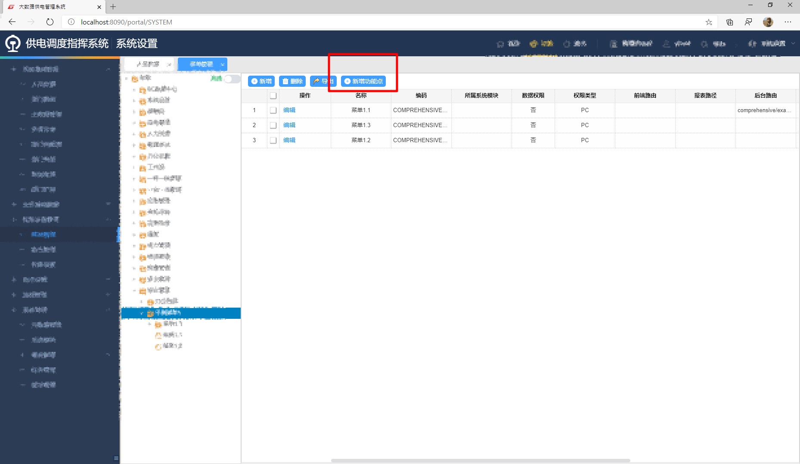

# EMIS8000 系统-前端入门教程

[[TOC]]

## 1. 课前准备

### 1.1 我们会做出什么东西?

- 常见的业务 CURD 页面,包括但不限于列表,新增,编辑,详情等页面

### 1.2 前置知识

- 了解 spring mvc 的 controller [手册](https://www.w3cschool.cn/spring_mvc_documentation_linesh_translation/spring_mvc_documentation_linesh_translation-7z6u27rb.html)
- 了解 requirejs AMD 规范 [入门](https://www.ruanyifeng.com/blog/2012/11/require_js.html) [API](https://requirejs.org/docs/api.html)
- 熟悉 easyui 的 datagrid,dialog 组件 API [下载链接](https://pan.baidu.com/s/1d0bct3_Pwwcb7XlAkUAEEQ) 提取码：aug3

- 熟悉 vue 基础 API [教程](https://cn.vuejs.org/v2/guide/)
- 熟悉 element-ui 常见组件的 API [官网](https://element.eleme.cn/#/zh-CN/component/installation)

## 2. 环境准备

- 安装 jdk1.8 [下载](https://pan.baidu.com/s/1sjnP8QTEnYKGFEoDvu9S2g) 提取码：s8b4
- 安装 svn 小乌龟 [下载](https://tortoisesvn.net/downloads.zh.html) 安装时一定要勾选命令行接口
- 安装 idea [下载](https://pan.baidu.com/s/1KpRN9T_X2KFwhTVjSeW3mQ) 提取码：43hy
- 下载 Lombok 插件
- 使用 svn 小乌龟下载项目
- idea 导入项目
- 配置 idea 热更新

## 3. 添加一个业务功能

### 3.1 需求定义(由业务人员提供)

- 明确的菜单设计,包括模块归属及左侧菜单树的结构和各个按钮的设计
- 明确的字段设计,需要知道列表,新增,编辑,详情等各个状态字段的状态及其中的关联逻辑

### 3.2 配置菜单权限树->后端路由

> `系统设置>权限设置管理>菜单管理`

#### 3.2.1 新增菜单和权限结构

- 例:在综合管理种新增示例功能菜单

- 例:增加列表查看权限

- 增加其他按钮

- 在角色管理例中给登陆人配置刚才的菜单权限

- 配置完成退出重新进入业务功能查看,发现菜单已经正常显示了

- 菜单 1.2 和 1.3 由于内部**没有任何可用的权限**,因此是隐藏的

- **简化方案:新增功能点,一键生成常用的合乎规范的标准菜单**

  


### 3.3 代码生成器生成初始代码

1. 全局安装代码生成器 plop `npm install -g plop`

2. 安装完成后在项目根目录打开命令行,执行命令 `plop`

3. 输入业务特征变量及相应路径即可生成通用代码,以下是模板`module`的特征参数

   | 特征变量          | 说明                                                   |
   | ----------------- | ------------------------------------------------------ |
   | 你的模块名称      | 生成注释,界面文字等                                    |
   | 你的模块编码      | 资源码,后端提供                                        |
   | 你的模块菜单Code  | 模块按钮的父级菜单编码                                 |
   | 生成文件的路径    | 目标路径,相对于`src/main/resources/static/js/module`   |
   | 生成api所在的文件 | 修改目标文件,相对于`src/main/resources/static/js/api/` |

### 3.4 指定一个嵌入的页面

- 菜单树里页面对应右侧空白区域一个嵌入的 iframe 页面,这个页面通过后端路由地址渲染出来
- 该地址通过 菜单表单里的**后端路由**来设置指定的页面

## 4. 修改和完善功能

### 3.3 理解后端路由到JS脚本

> 理解页面系统是如何运作的

#### 3.3.1 路由控制器文件

> 在`src/main/java/com.togest.web`添加控制器文件,按照功能模块位置决定代码文件的位置

- 注意:模板 html 页面一定不能是绝对路径,部署在 Linux 服务器上时,会找不到模板文件

```java
package com.togest.web.comprehensive;

import com.togest.entity.request.FormParamRequest;
import com.togest.util.HandleParamsUtil;
import org.springframework.stereotype.Controller;
import org.springframework.ui.Model;
import org.springframework.web.bind.annotation.RequestMapping;

@Controller
public class example {

    //示例页面 列表页
    @RequestMapping(value = "/comprehensive/example")
    public String ProActiveIndex(Model model) {
        return "comprehensive/example/index";
    }

    //示例页面 新增编辑页面
    @RequestMapping(value = "/comprehensive/example/save")
    public String ProActiveSave(Model model, FormParamRequest entity) {
        model.addAttribute("data", HandleParamsUtil.formParamRequestTryData(entity));
        return "comprehensive/example/save";
    }

    //示例页面 详情页面
    @RequestMapping(value = "/comprehensive/example/detail")
    public String detail(Model model, FormParamRequest entity) {
        model.addAttribute("data", HandleParamsUtil.formParamRequestTryData(entity));
        return "comprehensive/example/detail";
    }
}
```

#### 3.3.2 `thymeleaf` 模板

- 模板文件放在`src/main/resources/templates`下与功能对应的目录下
- script 使用 require.js 引入对应的功能 JavaScript 代码
- 注意 script 使用特殊的`thymeleaf`语法处理 JavaScript 代码的缓存问题

```html
<!DOCTYPE html>
<html lang="en" xmlns:th="http://www.thymeleaf.org">
  <head>
    <meta charset="UTF-8" />
    <meta
      name="viewport"
      content="width=device-width, initial-scale=1, maximum-scale=1, user-scalable=no"
    />
    <meta http-equiv="X-UA-Compatible" content="ie=edge,chrome=1" />
    <meta name="renderer" content="webkit" />
    <meta http-equiv="pragma" content="no-cache" />
    <meta http-equiv="expires" content="0" />
    <meta http-equiv="pragma" content="no-cache" />
    <meta http-equiv="Cache-Control" content="no-cache, must-revalidate" />
    <meta http-equiv="expires" content="0" />
    <script
      th:src="@{/plugs/require.js}"
      th:data-main="@{/js/module/comprehensive/example/index.js}"
    ></script>
    <title></title>
    <style>
      [v-cloak] {
        display: none;
      }
    </style>
  </head>
  <body>
    页面内容
  </body>
</html>
```

#### 3.3.3 `javascript` 脚本

> 写大部分业务逻辑的位置

- AMD 模块化语法

- 常见的依赖:

  > 所有这些依赖名称都注册在 `static/js/config/require.config.js`

| 依赖名称                                        | 描述                       |
| ----------------------------------------------- | -------------------------- |
| service/api/ajax                                | 数据请求相关的封装         |
| vue/loadsh/moment                               | 第三方 js 库               |
| 组件库 element/MyVue/单个组件                   | 界面 ui 可以使用自定义标签 |
| EasyDialog/EasyTable                            | easyui 封装的 js 库        |
| method/formMethod/statusFlowMethod/handleMethod | 自定义的工具库             |
| userInfo/appConfig                              | js 配置/全局变量信息       |

```javascript
require(["/js/config/requireConfig.js"], function(config) {
  require([
    /*依赖*/
  ], function(/*依赖导入一个变量(可选)*/) {});
});
```

### 3.4 理解如何与服务端交互

> - api,service,元数据,主数据介绍
> - 处理与后端的交互,按模块分开,一般不需要根据业务细分,同一个模块写在一起

#### 3.4.1 swagger 接口文档

- 在开发服务器找到对应的微服务 http://开发服务器IP:8090
  
- 微服务有一个对应的 IP+端口拼接 swagger 页面地址即可例如上图的接口文档地址
  `http://192.168.1.98:40006/swagger-ui.html`

#### 3.4.2 API 文件

- 位置:`/src/main/resources/static/js/api/`
- 标准格式如下

```javascript
define(["appConfig", "userInfo"], function(appConfig, userInfo) {
  var user = userInfo.getUser();
  var IP = appConfig.getIP();
  var moduleCode = "/statusflow/"; //模块前缀

  return {
    //规范对象名称:method+接口地址拼接成驼峰式
    getStatusFlowEngineCheckTaskIfExistByTaskId: {
      method: "get",
      url: IP + moduleCode + "statusFlowEngine/checkTaskIfExistByTaskId",
    },
  };
});
```

| method          | 意义                      |
| --------------- | ------------------------- |
| get             |                           |
| post            |                           |
| postJson        |                           |
| postFile        | 文件提交                  |
| postWithLoading | 带有 loading 的 post 提交 |
| postNotTips     | 不带提示的 post 提交      |
| postJsonNoTips  | 不带提示的 postJson 提交  |

#### 3.4.3 service 文件

- 位置:`/src/main/resources/static/js/service/`
- 根据 api 文件生成可以执行的函数,函数签名与 api 的对象名称一致


### 3.6 完善列表页

> 基于`EasyTable`组件的元数据驱动的新增编辑页面

#### 3.6.1 模式一 标准单表列表及检索

#### 3.6.2 其他模式

> 详见 [列表页-最佳实践](../web-application/business/list-page-best-practice.md)

### 3.7 完善新增编辑页

> 基于`TgElSave`组件的元数据驱动的新增编辑页面

### 3.8 补充详情页

> 基于`TgCompDetail`组件的元数据驱动的详情页面


### 3.9 其他页面

- 应该使用以下资源来构建功能
  - [抽象功能]()
  - [平台服务]()
  - [流程框架]()
  - [数据大屏]()


## 4. 打包发布

### 4.1 本地打包

### 4.2 发布到开发服务器

### 4.3 提交测试

### 4.4 追踪缺陷
