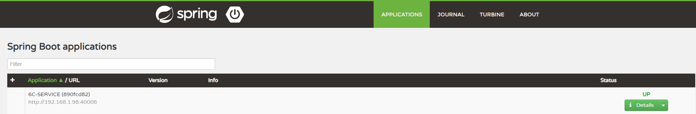

# 平台工具:与服务端交互

> - api,service,元数据,主数据介绍
> - 处理与后端的交互,按模块分开,一般不需要根据业务细分,同一个模块写在一起

## 1. swagger 接口文档

- 在开发服务器找到对应的微服务控制台 `http://开发服务器IP:8090`
  

- 微服务有一个对应的 IP+端口拼接 swagger 页面地址即可例如上图的接口文档地址
  `http://192.168.1.98:40006/swagger-ui.html`

  

## 2. API 文件

- 位置:`/src/main/resources/static/js/api/`
- 标准格式如下

```javascript
define(["appConfig", "userInfo"], function(appConfig, userInfo) {
  var user = userInfo.getUser();
  var IP = appConfig.getIP();
  var moduleCode = "/statusflow/"; //模块前缀

  return {
    //规范对象名称:method+接口地址拼接成驼峰式
    getStatusFlowEngineCheckTaskIfExistByTaskId: {
      method: "get",
      url: IP + moduleCode + "statusFlowEngine/checkTaskIfExistByTaskId",
    },
  };
});
```

| method          | 意义                      |
| --------------- | ------------------------- |
| get             | 常规 get                  |
| post            | 常规 post                 |
| postJson        | 常规 postJson             |
| postFile        | 文件提交                  |
| postWithLoading | 带有 loading 的 post 提交 |
| postNotTips     | 不带提示的 post 提交      |
| postJsonNoTips  | 不带提示的 postJson 提交  |

## 3. service 文件

- 位置:`/src/main/resources/static/js/service/`
- 根据 api 文件生成可以执行的函数,函数签名与 api 的对象名称一致
