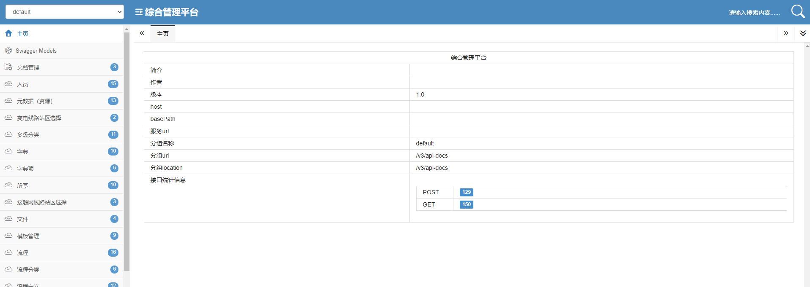
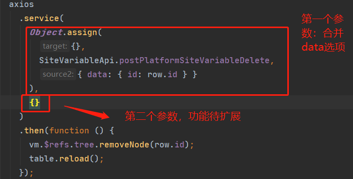

# 平台工具:与服务端交互及API工具(地铁信息化)

> ajax工具修改为<a href="http://www.axios-js.com/">axios.js</a>
>
> 取消之前的服务层处理，直接使用封装的axios作为服务层

## 后台swagger文档地址

> http://开发服务器:60006/doc.html

> 推荐配置如下：

### Api接口管理

- 接口生成工具 ./apiService.js

- 使用方式：根目录执行命令：node apiService.js（使用前限制性npm i)

- 结果如图所示：生成文件名规则为(后台controller转为api，例如FileController->FileApi)

  

  - 生成文件如图：(命名规则：method开头，后面跟地址，/转驼峰)

    

  - 后期优化：此处集成到genkins中，前端工具页面提供相关命令；（待开发）

## static/utils/axios.js服务文件使用说明

- 暴露方法：service(axiosOptions,customOptions)
- 返回值：Promise
- 参数：
  - axiosOptions：axiosjs库的配置参数（支持所有配置，其中get方法支持通过data传参）
  - customOptions：自定义相关配置（属于扩展功能，暂未开发）

### 使用案例(API文件和axios结合使用案例)

