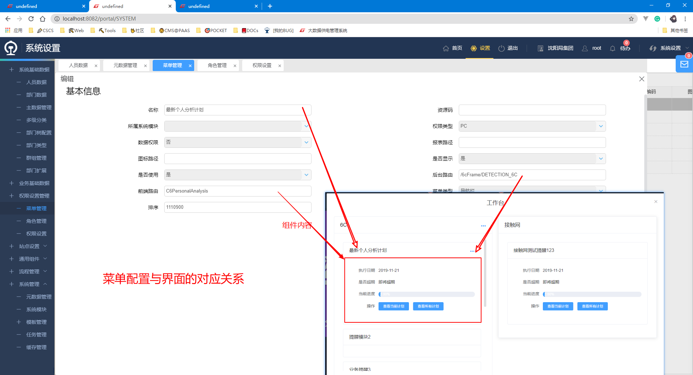

# 业务提醒框架 开发者文档

## Ⅰ.使用教程guide

> 适用于写具体提醒业务的开发者

### 1. 配置菜单和权限




### 2. 写业务组件

- 组件写在对应的业务模块内

  ```javascript
  // 示例及模板
  // static/js/module/6c/analysis/plan/pPlan/C6PersonalAnalysisBusinessReminder.js
  define(['vue', 'ELEMENT'], function (vue, ELEMENT) {
      return {
          template: '',
          data: function () {
              return {
  
              };
          },
          created: function () {
  
          },
          methods: {
  
          }
      };
  });
  
  ```

### 3. 将业务组件注册到业务提醒组件包

- 在文件 `static/js/config/BusinessReminderRegistrar.js` 注册

  ```javascript
  define(['/js/module/6c/analysis/plan/pPlan/C6PersonalAnalysisBusinessReminder.js'],
      function (C6PersonalAnalysis) {
          return {
              'C6PersonalAnalysis': C6PersonalAnalysis //菜单配置中的组件名称与组件配置对象的映射
          };
      }
  );
  ```

### 4. 测试

- 临时关闭只有登陆时显示,仅需要注释代码 `ElmWorkBench.service()` 之后的代码片段 `window.localStorage.setItem('HAD_SHOW_WORKBENCH', '1')`

  

## Ⅱ.API Reference

> 适用于修改首页,调用工作台service的开发者

### 工作台Service API

```typescript
// 类型说明

// service 调用的参数类型
interface WorkBenchServiceInitData{
    workBenchBlocksMeta:WorkBenchBlocksMeta,//树形结构的渲染数据
    ChildrenComponentSet:ChildrenComponentSet//组件集合
}

// 树形结构的渲染数据
interface WorkBenchBlocksMeta{
    name:String, //模块名称
    key:String,  //功能对应全局唯一key
    componentName:String, //组件集合中的key
    linkUrl:String, // 标题右侧跳转的模块路由地址
    children:WorkBenchBlocksMeta[] //类型可嵌套,目前仅支持两层
}

// 组件集合类型
interface ChildrenComponentSet{
    [propName: string]: Object //vue组件的配置对象
}

// 最终service 调用接口
interface ElmWorkBenchService{(workBenchServiceInitData:WorkBenchServiceInitData):undefined;}//接收一个初始化数据,返回一个undefined
```

### 创建标识使服务只一次登陆调用一次
- 登陆之后写入状态 `window.localStorage.setItem('HAD_SHOW_WORKBENCH', '0');`
- 调用服务之后,写入状态 `window.localStorage.setItem('HAD_SHOW_WORKBENCH', '1');`


## Ⅲ.设计思想SPEC

> 适用于深入理解本框架与修改框架的开发者

### 1. 平台组件ElmWorkBench组件,平台,业务的解耦

- ElmWorkBench组件 是与业务完全无关的,有独立的类型声明,只要保持接口稳定,可以单独维护;
- 业务组件集合以配置的形式使用 具体业务组件以配置的形式生成,方便统一管理生态;
- 平台调用菜单服务时,并不是在组件内部完成,而是将菜单数据转换为ElmWorkBench组件接口约定的数据,与菜单服务完全解耦
- 最终调用业务组件库采用对象的形式全部在参数注入到ElmWorkBench初始化配置中,使用约定的配置选择到合适的组件渲染,至此业务,平台,组件完全解耦