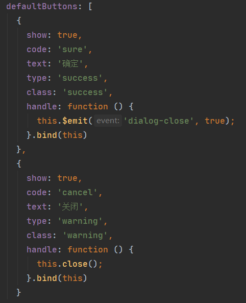
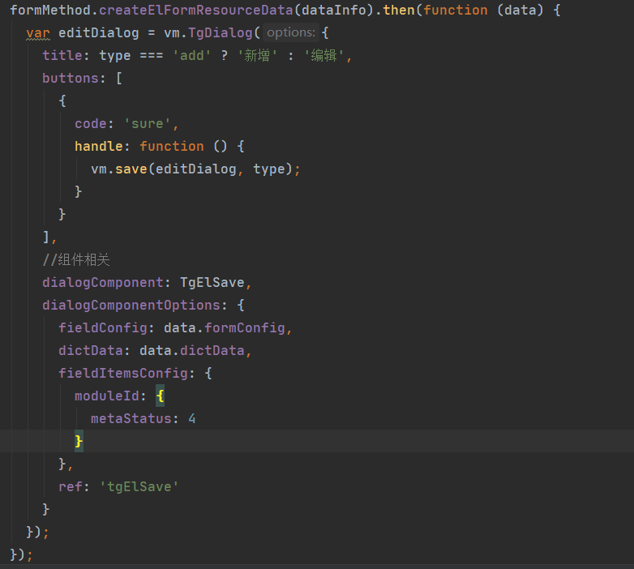

# 平台服务：弹框服务

> 新的弹框服务依据elementUI的dialog组件进行封装；以vue组件为弹框代码组织方式
>
> 新的弹框服务依赖vue实例

## 弹框服务接口

- 暴露的方法：vm.TgDialog(options)

- options:配置参数

  - title:标题
  - buttons:数组，按钮配置，默认两个按钮，此配置会和默认配置合并；
  - dialogComponent:弹框中组件配置，可以是vue组件，也可以是已经祖册了的组件名字符串；
  - dialogComponentOptions:弹框中组件的配置信息
  - ref：弹框中组件的ref，外部按钮进行操作时可通过ref的形式找到内部组件调用方法

- 按钮数组配置项

  - 默认配置如图

    

- 案例：这里实现的是一个新增或编辑的功能；

