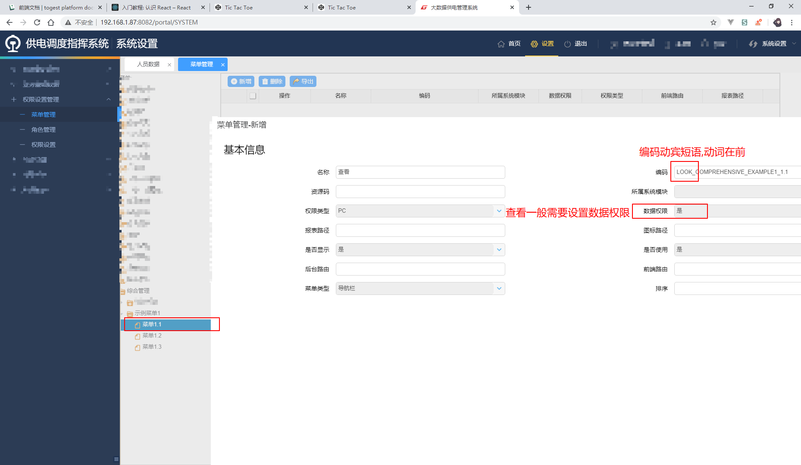

# 平台服务:权限管理

> - 基于 RBAC
> - `系统设置>权限设置管理>菜单管理`

## 1. 新增菜单和权限结构

- 例:在综合管理种新增示例功能菜单

- 例:增加列表查看权限

- 增加其他按钮

## 2. 给角色分配权限

- 在角色管理例中给登陆人配置刚才的菜单权限

- 配置完成退出重新进入业务功能查看,发现菜单已经正常显示了

- 菜单 1.2 和 1.3 由于内部**没有任何可用的权限**,因此是隐藏的

## 3. 简化:新增功能点

- **简化方案:新增功能点,一键生成常用的合乎规范的标准菜单**

  

## 4. 数据权限与特殊数据权限

### 4.1 数据权限

- 查询列表时根据配置来向用户展示相应的数据
- 一般使用按钮里的查看按钮权限码
- 使用时给对应的功能配置相应的权限

### 4.2 特殊数据权限

- `CURRENT_DEPT_CODE` 当前部门
- `SECTION_AUTH` 全段权限
- `ALL_AUTH` 全局权限

## 5. 菜单服务的其他用途(进阶,入门跳过)

> 有些功能的实现与菜单模型和权限模型基本一致,因此直接借用了菜单服务的功能里的数据来实现一些其他功能

### 5.1 多子表结构的 tab 页

### 5.2 首页快捷方式

### 5.3 业务提醒功能

### 5.4 切换模块
